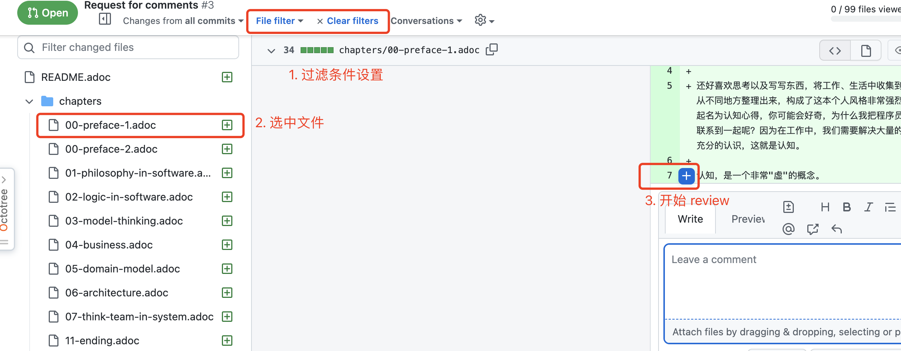

= 《程序员的认知心得》电子书

== 写作说明

我有幸在一家非常有趣的公司工作，这家公司的同事都很爱思考，我从中学习到很多新颖的观点和深刻的洞见。

这些见解从另外的角度看待软件开发的过程、逻辑、方法论以及团队，这些内容让我收获甚多。

工作之余，把和同事们交流的过程中的心得写成了博客发表在微信公众号吸引了一些感兴趣的小伙伴。

这本电子书将这些博客和交流所得整理出来，让它初具结构和逻辑并分享出来。

有缘看到这本电子书并产生兴趣的朋友可以一起交流，希望获得您宝贵的意见。

HTML 版本访问地址：https://renzhi.shaogefenhao.com/

PDF 下载地址：https://github.com/linksgo2011/a-programmer-s-cognitive-experience/releases/tag/v1.0.0

== 电子书校对和批注正在进行中

虽然是一本简单的电子书，但是还是希望能严肃的对待，所以开启了一个 PR 来收集相关问题和反馈。

配合HTML、PDF 阅读方式后，在 PR 中提交问题即可。

PR 地址：[https://github.com/linksgo2011/a-programmer-s-cognitive-experience/pull/3/files?file-filters%5B%5D=.adoc&show-deleted-files=false&show-viewed-files=false]

上面的 PR 连接带有过滤条件，可以更聚焦，过滤条件如下：

== 电子书构建指南

这本电子书最初使用 Markdown 构建，但是后来发现 Asciidoctor 相比 Markdown 更适合多章节的内容结构，因此切换为 Asciidoctor 构建。

参考本项目，您也可以构建出自己的电子书（HTML、PDF），参考命令如下。

=== Mac 原生命令

Mac 安装 Asciidoctor：

 $ brew install asciidoctor

生成 HTML：

 $ asciidoctor -vwt -o output/a-programmer-s-cognitive-experience.html index.adoc

生成 PDF：

 $ asciidoctor-pdf -a pdf-theme=./themes/cjk-theme.yml -a pdf-fontsdir="./themes;GEM_FONTS_DIR" -a scripts=cjk -o output/a-programmer-s-cognitive-experience.pdf index.adoc

生成多页 HTML：

$ gem install asciidoctor-multipage

$ asciidoctor-multipage -D  output index.adoc

=== Docker 容器命令

Docker 安装

 $ docker pull asciidoctor/docker-asciidoctor

启动命令

 $ docker run -it --rm -v $PWD:/documents asciidoctor/docker-asciidoctor

运行命令和本地一致。

== 版权说明

本电子书为非盈利性质项目，采用 CC-BY-SA-4.0 license 协议发布。该协议保留版权，您可以分享、复制和修改本电子书的内容，但请声明署名信息和来源地址（本电子书署名为网络 ID：少个分号），谢谢支持。

image::https://licensebuttons.net/l/by-sa/4.0/88x31.png[copyright]

== 印刷需求

根据 cjk-theme.yml 配置，最佳印刷需求为：B5、双面、黑白、牛皮纸胶装、首页封面。

== 参考资料

- https://docs.asciidoctor.org
- Asciidoctor PDF Theming Guide for CJK issue https://github.com/asciidoctor/asciidoctor-pdf/blob/v1.5.0.beta.7/docs/theming-guide.adoc#custom-fonts
- https://github.com/akosma/eBook-Template
