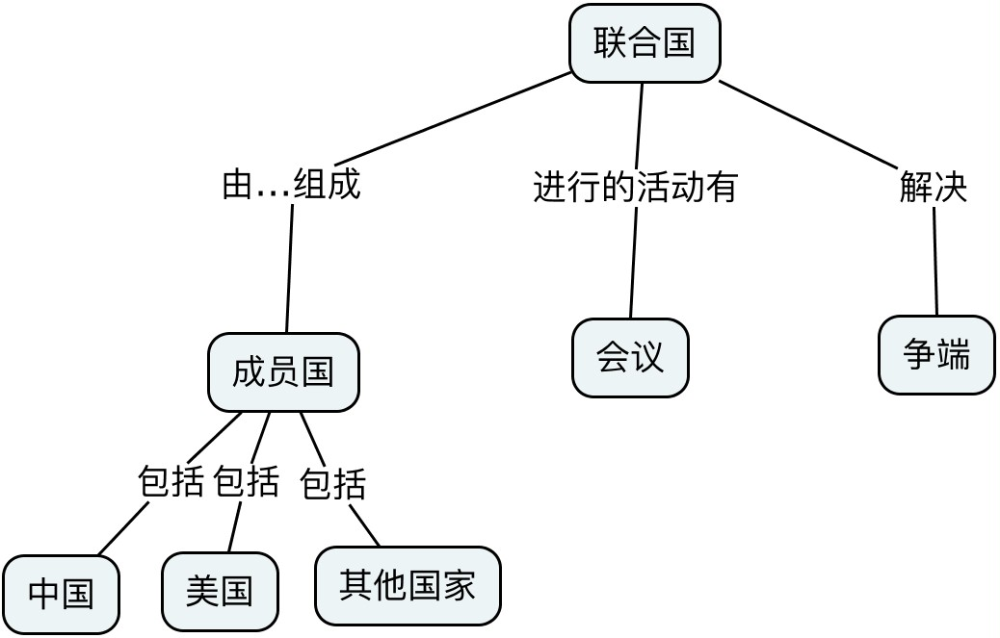
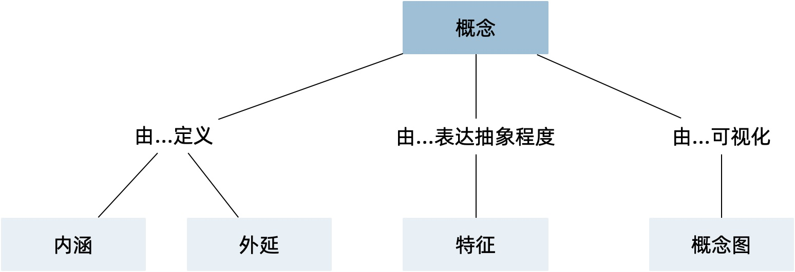
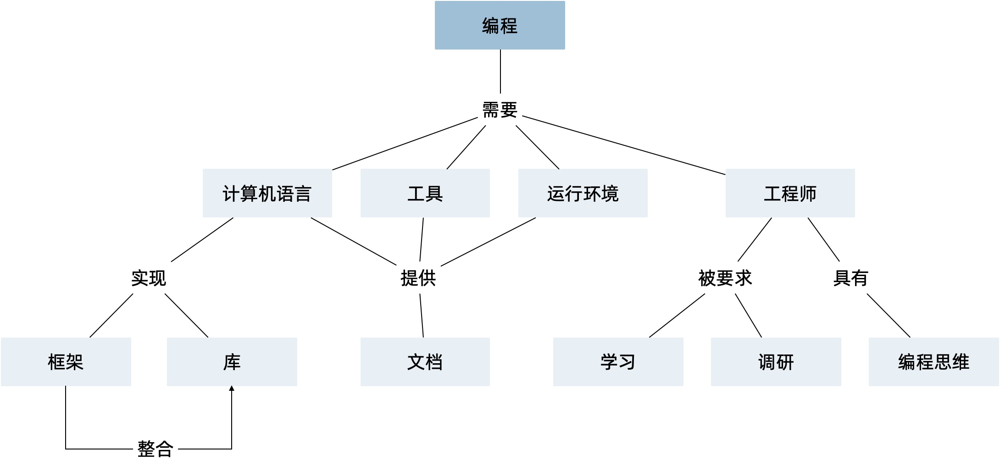
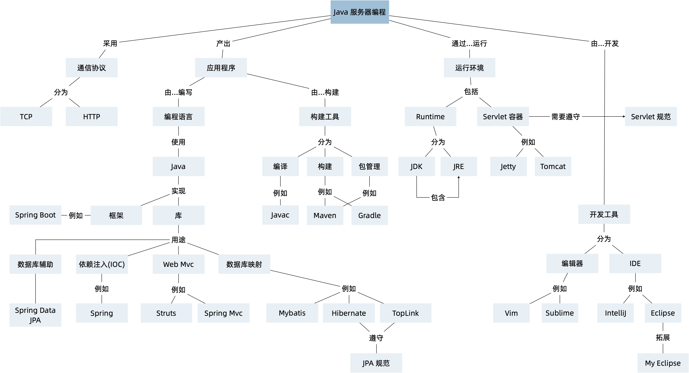
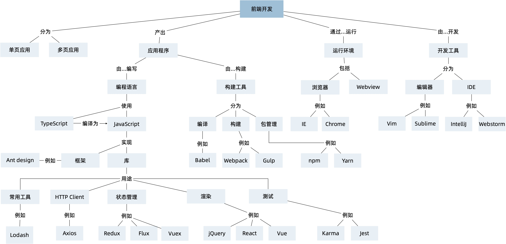
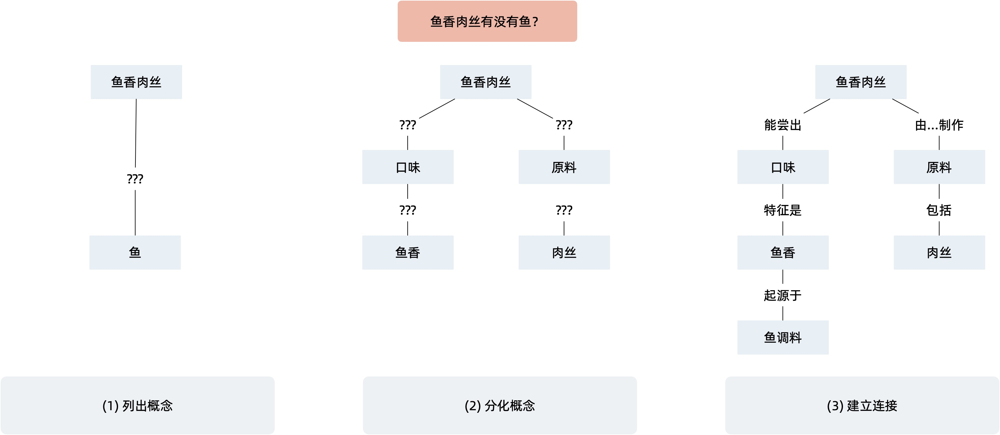

== 第 2 章 软件工程中的逻辑学

破除诡辩的方法是系统的学习逻辑学，比较可惜的是学校教育中系统性的逻辑学课程已经很少见了。另外在软件工程中，很多人也并不重视逻辑学。

大多数有经验的开发者、系统分析师都具备一定的辩证思维和方法，要说谁没有逻辑，这件事情很难说得过去。如果每个人都是用自己的思维方式和 “逻辑”，让沟通过程变得非常困难。我疑惑的是每个人都相信逻辑是很重要的，但几乎没有文章讨论过在软件设计和开发过程中如何使用现代逻辑学，以及解决诡辩的问题。

这里讨论几个能在软件工程中使用的逻辑学基础，尤其是业务分析、领域建模和架构设计中。公认的逻辑学之父是亚里士多德，但我们现在使用的逻辑学基础来源于弗雷格、黑格尔以及莱布尼茨等人的工作。

=== 3.1 理解概念

曾经参与一个物联网系统的设计，“设备” 这个词在不同的开发者眼里有不同的概念，为此，讨论 “设备” 这个词花费了不少的功夫，最终依然没有怎么定义清楚。

有些开发者认为“设备”是现实中看得见摸得着的物品，另外的开发者将服务器上用于映射物理设备的实例，也叫做“设备”。于是，他们在沟通时非常混乱。

另外一个例子是“用户”这个概念。在不同的场景（上下文）下，“用户”这个概念可以是使用软件的大活人，也可以是数据库中的一条记录，也可以是服务中的用户对象，有时候也将用户服务类叫做用户。

这样就非常混乱，不仅无法交流和沟通，而且开发者对系统的认知也变得困难，很多东西处于混沌状态。

在咨询的工作中，我发现非常有意思的是，将软件中的概念一一定义清楚，整个系统的设计工作差不多就完成了。所以设计软件的过程和现实中人们相互交流非常类似。英国哲学家维特根斯坦把人们交流的过程叫做“语言的游戏”，当我们描述事物的时候实际上就是将有清晰边界的元素贴上标签，这个标签就是我们说的概念。

朴素的概念是来源于个人背景和理解，因此概念难以统一。正是于此不同语言之间准确的翻译也不太可能，不同文化背景难以找到合适的概念互相映射。后来哲学家认识到人们认识概念是由一些更为基础的属性构成的，那可以认为概念就是由属性组成的。比如 “人” 这个概念，属性有四肢、直立行走的行为、皮肤光滑等属性。

这些基本的属性又是一些更基本的概念，如果我们对这些基本的概念达成共识，那么我们就有机会对概念进行统一。类似于面向对象语言中的类，类有各种属性，这些属性最终都可以通过 8 种基本的数据结构描述。

因此属性是认识概念非常重要的一方面。属性包含了事物自身的性质、行为，比如黑白、高矮、是否能飞行、是否独立行走。事物除了自身的性质外，还与其他事物发生一定的关系，比如大于、相等、对称、属于等。事物的性质、行为以及和其他事物的关系，统称为事物的属性。

**通过属性就能找到概念的边界。**具有相同属性的概念是同一个概念，即使是叫法不同也不应该分为不同的概念。比如土豆、马铃薯，一旦属性的增加和移除都算作不同的概念，比如小土豆是土豆吗？通过属性就能发现生活中的命名谬误，比如小熊猫并不是小的熊猫，而是单独的一种动物。

=== 3.2 形式语言和非形式语言

概念只是我们对所认识的事物起的一个名字，词语是概念的自然语言形式，概念是词语的思想内容。

一个概念可以具有多种表达方法，对于软件设计来说，我们可以用自然语言描述概念。也可以通过定义一个类来描述，并在程序运行时实例化这个概念。通过数学或者数理逻辑，我们可以使用集合来描述一个概念。

比如 “商品” 这个概念，可以通过不同的方法表达。

自然语言中，商品是指可以通过货币或者其他物品交易的物品，可以是自然实体，也可以是虚拟物品。这是社会经济中对商品的描述，商品具有一个核心属性就是价格，有价格意味着可以交易。

自然语言中，概念和词语之间并不是一一对应的，这是需要日常特别注意的。

. 自然语言中，任何概念都必须通过词语来表达，但不是所有的词语都表达概念。在语言中，基本上都会将词分为虚词和实词两大类，只有实词（注意不是名词）可以表达概念。
. 同一个概念可以由不同的词语表达，比如前面提到的土豆、马铃薯。
. 一个词在不同的的情况下（上下文），可以用来表达几个不同的概念，多义词就是这样，同一个词表达不同的概念，叫做这个词的词项。

自然语言（Natural Language）就是人类讲的语言，它是自然人类发展中自然形成的，比如汉语、英语。

这类语言不是经过特别设计的，而是通过自然进化的。它的特点是**语法规则只是一种规律，并非需要严格遵守的规则**，这种语言含有大量的推测，以及对话者本身的认知背景（比如东西方不同的文化背景形成了大量的哩语）。认知背景赋予了词汇、概念的不同含义，比如，豆腐脑这个词，不说东西方差异，就是国内南北都会有争议。

著名的白马非马争论在于自然语言的不确定性：

* 从概念上说，白马这个概念不是马这个概念，所以白马非马。
* 从谓词（“是” 这个谓词）逻辑来说，白马这个概念代表的事物集合属于马这个概念代表的事物集合。所以白马是马（白马属于马，但是白马这个概念不是马这个概念）。

正因为如此，才会产生大量的诡辩，让交流效率降低。

逻辑学中的形式语言开始发挥作用。形式语言（Formal Language）是用精确的数学或机器可处理的公式定义的语言 footnote:[参考维基百科对于形式语言的定义 https://zh.wikipedia.org/wiki/%E5%BD%A2%E5%BC%8F%E8%AF%AD%E8%A8%80]。例如数学家用的数字和运算符号、化学家用的分子式等，以及编程语言中的一些符号（Token）。计算机编程也是一种形式语言，是专门用来表达计算过程的形式语言，来操作的计算机。

形式语言需要严格遵守语法规则，例如 `1+1=2` 是数学中一种形式语言，

形式语言来源于形式逻辑，特别是形式逻辑中的符号逻辑。亚里士多德的《工具论》为形式逻辑奠定了基础，中国古代的周易的卦爻可以看做一种朴素的形式逻辑，而也是后来很多人牵强附会将计算机的起源和二进制关联到周易上。虽然中国古代有了形式逻辑的朴素思想，但是遗憾的是没有脱离朴素的辩证法。中国古代哲学不缺乏更有价值的内容，但是周易的形式逻辑和计算机并无关系。

形式逻辑的含义用一句话表述为：用一套特别的（形式的含义）、显示的规则来约束逻辑推理规则。

由于形式逻辑也在不断演化，现代形式逻辑和古希腊也不太一样。19 世纪以前的形式逻辑主要是传统逻辑，19 世纪中叶以后发展起来的现代形式逻辑，通常称为数理逻辑，也称为符号逻辑。

莱布尼兹倡导建立“普遍的符号语言”，通过推理演算和机械化的思想一步一步严谨的完成逻辑推理。如果需要建立符号推理系统，就需要定义符号、推理规则作为系统的要素。

弗雷格完成了《概念文字》footnote:[参考文献：杨海波. 弗雷格《概念文字》理解的两点注记[J\]. 逻辑学研究, 2012, 5(4):10.]一书建立了一个初步的逻辑体系（一阶逻辑体系），通过概念系统来消除二义性，避免偷换概念，并通过推理结构来完成严格的推理。

这个时候的概念依然是通过定义完成的，直到康托尔创立了集合论，通过集合来描述概念，集合中的元素就是概念的内涵，集合能被用到的地方就是外延。集合论的建立，标志现代形式逻辑的建立，也就是符号逻辑。

实际上，弗雷格建立的一阶逻辑体系可以看做一套逻辑体系模板，用它可以拓展出更多的逻辑体系，在人们认识到概率前，认为逻辑推理是确定的，当引入概率后就不行了，因此哲学家们有发展出来概率归纳逻辑。

总之，知道形式语言和自然语言之间的区别，可以避免无意义的争论。*软件工程师就是一个对现实业务形式化的工作岗位，将需求这种自然语言转变为代码这种形式语言。*

正因为如此，需求和沟通的矛盾不可能避免，除非提出需求的人也是用形式语言，那么软件工程师的价值也就没有了。

使用形式语言可以精确的定义一个概念，并使用精确的语义规则和计算机沟通，这就是软件工程师编写软件的过程。如果通过计算机语言来描述一个概念，其实就是面向对象中的一个类，这里定义商品有两个属性名称和价格：

[source,java]
----
public class Goods {
  private String name;
  private int price;
}
----

如果用集合的枚举法来表述就是商品就是：

[source,java]
----
Goods{name,price}
----

计算机语言和数学语言是一种形式化的语言，可以精确的描述一个概念，但是自然语言只能通过模糊的给出概念的描述。自然语言翻译成计算机语言的不确定性，带来了无休无止的争吵，但这也是软件设计者的主要工作。

=== 3.3 概念的内涵和外延

正是因为自然语言的这种模糊性，为了更加具体的描述一个概念。哲学上概念的共识是概念有两个基本的逻辑特征，即内涵和外延。概念反应对象的特有属性或者本质属性，同时也反映了具有这种特有属性或者本质属性的对象，因而概念有表达属性的范围。

*概念的内涵是指反映在概念中的对象特有属性或本质属性。概念的外延是指具有这些属性的所有对象，即囊括对象的范围。*

例如商品这个概念的内涵是 “能进行交换的商品”，本质属性是能进行交换，从本质上区别产品。它的外延就是投入市场能卖的所有事物。

对概念的外延的清晰描述对我们设计软件产品的定位非常有帮助，我们购买软件服务无非两种情况，生活娱乐使用，或者工作使用。马克思社会经济学精妙的描述为生产资料、生活资料。这其中的逻辑完全不同，按照生活资料的逻辑设计一款生产资料的产品注定要走弯路。

概念的内涵和外延在一定条件下或者上下文中被确定的，这取决于参与人的共识。严格锁定概念的内涵和外延，不能帮助我们讨论问题和改进软件模型。随意修改内涵和外延这是典型的偷换概念和诡辩。

概念的内涵和外延是一个此消彼长的兄弟。当内涵扩大时，外延就会缩小，概念就会变得越具体。当内涵缩小时，外延就会扩大，反映的事物就会越多。

在面向对象软件建模中的影响非常明显。对象特有属性或者本质属性越少，那么这个对象能被复用的场景越多，也就是内涵越小。反之，特有属性越多，能被复用的情况就越少了。软件建模过程中随意修改概念往往意识不到，但是每一次属性的添加和移除都带来概念的内涵和外延发生变化。

非常典型的一个例子发生在订单模型中。一般来说，我们会把支付单和订单分开设计，订单的概念中没有支付这个行为，但有时候觉得支付单的存在过于复杂，会将支付单的属性放到订单中，这个时候订单的内涵和外延变了。

内涵和外延发生变化但是设计人员没有意识到，会使用同一个词语。一旦使用同一个词语就会产生二义性，二义性的存在对软件建模是致命性打击。比如用户维护的地址、地址库中的地址、订单中的地址，这三个 “地址” 虽然名字相同，但是内涵和外延不同。

意识不到概念的内涵和外延，是无法设计好逻辑良好的软件模型的。

=== 3.4 定义一个概念

变量命名和缓存失效是编程中最让人头疼的两件事。

变量命名其实就是在给一个概念下定义。定义是揭示概念的内涵和外延的逻辑方法，一个准确的定义需要反映出对象的本质属性或特有属性。下定义困难普遍有两个痛点：

. 不懂好的下定义的逻辑方法。
. 对业务概念或者领域不熟悉。

对于第一个痛点，根据概念的属性、内涵和外延，逻辑学中有一些很好地下定义方法。

*属加种差定义法。*这种下定义的方法通俗来说就是先把某一个概念放到另一个更广泛的概念中，逻辑学中将这个大的概念叫做 “属概念”，小的概念叫做 “种概念”。从这个属概念中找到一个相邻的种概念，进行比较，找出差异化本质属性，就是“种差”。比如，对数学的定义，数学首先是一种科学，和物理学处于同类，它的本质属性是研究空间形式和数量关系。于是可以得到数学这个概念定义：

[source]
--------------------------------------
数学是一种研究现实世界的空间形式和数量关系的科学。
--------------------------------------

用这种方法给订单、支付单、物流单下一个定义：

[source]
--------------------------------------
订单是一种反映用户对商品购买行为的凭据。属概念是“凭据”，种差是“反映用户对商品购买行为”。

支付单是一种反映用户完成某一次支付行为的凭据。属概念是“凭据”，种差是“用户完成某一次支付行为”。

物流单是一种反映管理员完成某一次发货行为的凭据。属概念是“凭据”，种差是“管理员完成某一次发货行为”。
--------------------------------------

在逻辑中可以参考下面的公式：

[source]
--------------------------------------
被定义的概念 = 种差 + 属概念
--------------------------------------

对于第二个痛点，这不是软件建模能解决的问题，需要充分和领域专家讨论，获取足够的业务知识。人们对概念的定义或者认识是随着对事物的认识不断加深而变化的。一个完全对某个领域没有基本认识的软件工程师很难做出合理的软件建模，例如银行、交易所、财会等领域的软件需要大量的行业知识。

我们做消费者业务的互联网开发时，往往因为和我们的生活相关，所以这种感受并不明显。当做行业软件时，领域知识对软件模型的影响甚至是决定性的。

=== 3.5 同一律、矛盾律、排中律

概念只是语言的元素，如果需要建立逻辑思维，还需要一些逻辑规律。逻辑学的三个基本规律可以让沟通更加准确，避免无意义的争论，减少逻辑矛盾，让讨论有所产出。这三个重要的规律是：同一律、矛盾率、排中律。

==== 同一律

在同一段论述（命题和推理）中使用的概念含义不变，这个规律就是同一律。形式化的表述是 A → A。同一律描述的是在一段论述中，需要保持概念的稳定，否则会带来谬误。在辩论赛中可以利用这个规律，赢取辩论。

比如论题是“网络会让人的生活更美好吗？”，两个论点主要的论点是：

* 网络让人们的生活更方便。
* 网络让人们沉溺虚拟世界。

假如我们选择的论点是 “网络让人们的生活更方便”。在辩论赛的前期，另外一方为了论证 “网络让人们沉溺虚拟世界”，描述了打电话、写信也可以让人生活很美好，并不会沉溺。这刚好落入我们的逻辑陷阱。我们指出，邮政、电话网络也是网络的一种，对方的逻辑不攻自破。

这属于典型的 “偷换概念”，我们偷换了“计算机网络”和“网络”这几个概念。

==== 矛盾律

矛盾律应用的更为普遍，几乎所有人都能认识到矛盾律。它的含义是，在一段论述中，互相否定的思想不能同时为真。形式化的描述是： “A 不能是非 A”。

矛盾律这个词的来源就是很有名的 “矛和盾” 的典故，出自《韩非子·难势》中。说有一个楚人卖矛和盾，牛吹的过大，说自己的盾在天底下没有矛能刺破，然后又说自己的矛，天底下的盾是不能穿透的。前后矛盾是一个众所周知的逻辑规律，但是并不是一开始马上就能看出来，需要多推理几步才能看出来。即使如此，在同一个上下文中，出现了矛盾的逻辑论述也被认为是不可信的。

具有矛盾的论述有时候又被称为悖论。尤其是宗教领域充满了大量的悖论，例如，是否存在一个万能的神，做一件自己不能完成的事情。

矛盾律的用处可以驳斥不合理的论断，也可以用于反证法。在软件开发过程中，我们时常遇到这种情况，需要开发过程中才能发现矛盾。这个很难避免，除非有充足经验的工程师。

需要注意的是逻辑学中的矛盾律和毛泽东思想中的矛盾论不是一回事，前者是逻辑学规律，后者是辨证唯物的一种方法。

==== 排中律

排中律是逻辑规律中最难理解的一个规律。它的表述是：同一个思维过程中，两个互相否定的思想必然有一个是真的。用形式化的表述就是：“A 或者非 A”。

排中律的意义在于，明确分析问题的时候不能含糊其辞，从中骑墙。比如有人讨论：人是不是动物。不能最终得到一个人既是动物又不是动物，这种讨论是没有意义的。

比如在一次技术会议中，需要选择使用的数据库，只能使用一种数据库。如果采用了 MySQL 就不能说没有采用 MySQL。

排中律看起来好像没有意义，但具有非常大的价值，让讨论最终有结论，而不是处于似是而非的中间状态。

=== 3.6 诡辩

在沟通中，人们会下意识的引入谬误，从而主动或者被动的诡辩。诡辩的方法非常多，下面是常见的几种诡辩方法，认识到诡辩的存在，让讨论的输出更可信。

==== 偷换概念

偷换概念是一种利用同一律的诡辩方法。往往是利用一个词语的多义性来制造诡辩，这种例子相当常见，再一次日常对话中：

[source]
--------------------------------------
朋友：为了让自己的判断和认知更为客观，我们应该同时学习多个学科的东西。
我（故意抬杠）：人不能同时学习多个学科的东西。
朋友：为什么，学生不都是同时学习数学、语文、英语么。
我：你现在正在看手上这本书，能同时看我手上这本么。
朋友：。。。（感觉被套路）
--------------------------------------

我偷换了概念，把 “同时” 这个词的时间精度调低了，导致这次对话变了味。

偷换概念在生活中无处不在。《武林外传》中的秀才利用 “我”这个概念的偷换，让姬无命莫名其妙并自杀了。

==== 相关性不等于因果性

最经典的例子是，很多父母信佛，然后娃高考的时候天天去求神问佛。如果小孩考上了大学，那么就是拜佛的功劳，如果没有考上，那就是小孩不努力。多么完美的逻辑闭环，完全无懈可击。

同样的桥段在各种电视、电影中存在。某一伙人闯入了一个村子，然后这个村子发生了瘟疫，群众认为是这些人带来了不详。

程序员圈子也会有类似的议论，因为大公司都用的 Java 而不是 PHP，所以 PHP 是一个垃圾语言，我们要成为大公司，所以要把 PHP 换成 Java。所以很多公司明明可以苟一下，然后因为折腾死掉了。

我们需要时刻记住，**相关性不等于因果性**，才能认识到一些微妙的逻辑关系。

==== 因果倒置

“可怜之人必有可恨之处。” 这是很多人挂到嘴边的话，支持者甚多。

我小的时候对这句话记忆深刻。小学的时候被年长的同学欺负，后来因为打架老师知道了，其他同学都表明我是个被欺负的可怜鬼，老师还是对我们都做出同样的处罚。说出了一句举世名言：“为什么欺负你，不欺负别人”。

为什么只欺负你，不欺负别人，所以你也不对，同样要受到惩罚。这是典型的强盗逻辑，从结果推导出原因，但是这个原因并不成立，因为我们知道原命题为真，逆命题不一定为真。

==== 归纳法的局限

逻辑学上把个别的知识推广到一般的知识规律叫做归纳推理。归纳推理是一种朴素的认识方法，在逻辑学中，归纳推理有其意义，但是需要注意的是逻辑学从来没有把归纳法得出的结论当做真理。

归纳法的问题和类比谬误类似。古人认识的到了一个规律，鸡叫三遍天会亮，但是后来出去旅游发现其他地方的鸡不是这样的，真的是应了那句，“东方不亮西方亮，黑了南方有北方。”

中国太大了，甚至二十四节气的规律都不能适用于每一个地方。归纳法只能有限的反应某种规律，不能广泛、绝对的得到真理，也不能从个体推出一般。

算命先生希望从四柱八字、面相分析、掌纹、笔迹这些中归纳真理，如果认识到归纳法的局限性，就不会平白无故交这些智商税了。

==== 责任转移

证明神存不存在，保健品有没有功效，壮阳药有没啥作用是科学界三大难题。

从逻辑上证明有其实很容易，只需要找出一个例子即可，比如证明天鹅是白色的，只需要找出一个白色的天鹅即可。但是证明黑色的天鹅不存在，是非常困难的，除非穷举世界上所有的天鹅，才能得出这个结论。

人们的思维中，天生偷懒，所以人们才会有 “宁可信其有，不可信其无”。

所以有一种诡辩，我姑且称之为责任转移，就是在辩论中把举证的责任推给别人，然后再来挑对方的毛病。这是一种非常高级且隐晦的诡辩手段。

比如有神论要求无神论者给出证据，证明神不存在，但是证明无非常困难。对方只能举出一些例子，但是这些例子非常脆弱，如果再结合偷换概念就更无懈可击了。

[source]
--------------------------------------
大师：神会保佑你的。
无神论者：神不存在。
大师：你怎么证明神不存在呢。
无神论者：我从来没看到过神。
大师：没看到过神，不代表神不存在。
无神论者：看都没看见，怎么能说神存在呢。
大师：神是一种信念，它无处不在，慢慢体悟吧。
无神论者：。。。
--------------------------------------

责任转移大法是不断把举证的责任推给对方，然后在挑错，让对方自顾不暇。

=== 3.7 逻辑工具：概念图

在实际使用逻辑学中，我们可以借助一些思维工具。

概念图是指用图表的方法梳理概念之间的关系，不仅可以加深对概念的理解，还能避免因为概念混乱带来的诡辩。尤其是偷换概念是诡辩中最容易出现的一种，

学计算机的人大多有被人要求修电脑的经历。“你一个学计算机的修个电脑都不会”这种“大妈式”的暴力辩论逻辑实际上是一种典型的偷换概念，计算机维修和学计算机完全是不同的概念。

所以通过梳理概念之间的关系，可以清晰得到一个概念，可以通过使用概念图来描述概念的层次关系，上面使用的图即是概念图。

美国著名教育学家诺瓦克遇到了同样的问题，他需要一种清晰地方式给学生解释一些课程中需要用到的概念。同时，也需要了解学生在理解概念上的变化。他们的研究小组从拓扑分类学和语义学方面得到灵感，创造出“概念图”这一思维工具来表达概念。诺瓦克在他的著作《学习、创造与使用知识——概念图促进企业和学校的学习变革》一书中详细阐明了概念图相关的内容。

例如一个常见的逻辑问题是：联合国是否是一个国家？

因为“联合国”这个词的结尾有一个国字，而且中国在是联合国成员国，所以有人想当然的认为联合国也是 “国”。这种谬误不仅发生在对世界不理解的少年儿童身上，甚至会出现在成年人的对话中。联合国是一个又国家构成的组织，而中国才是一个国家，为了避免谬误，合适的表述是“中国是联合国成员国”。

下面这张图为使用联合国为概念出发绘制的概念图，用来描述概念和概念之间的关系。

当然，你会发现“成员”的概念下面只有中国和美国，这是因为全球 200 个左右的国家和地区也画不下。到目前为止，概念图也没有标准，那么也不存在概念图的“对错”。

[NOTE]
.概念图的绘制工具
=====================================================================
上面关于"联合国"的概念图就是一个典型的概念图。绘制概念图的工具非常多，也并不受限于何种工具绘制。
IHMC（Human & Machine Cognition）提供了一套专业的概念图绘制工具，也是诺瓦克书中推荐的绘制工具，上面风格的图片就是通过该软件绘制。
在实际使用中，IHMC 提供的工具并不易用(难以对齐和美化)，为了便于管理可以参考其他工具：

1. PPT
2. Keynote
3. 在线绘图工具，例如：https://www.draw.io/

后续的示例采用其他工具绘制。
=====================================================================

==== 3.7.1 “概念”的概念图

使用概念图的目的是为了将复杂的概念清晰的表述出来，因此甚至可以使用概念图表达“概念”这个概念本身。

在前面我们已经讨论过“概念”本身的内容了，如果通过概念图来表达就更清晰。概念图的发明者罗瓦克对概念的定义非常朴素：从事件或对象中感知到的规律或模式，可以打上一个标签，这个标签就是概念。

那么为了描述这个标签就可以用概念的“内涵”、“外延”来描述，这个概念就可以在日常对话中阐述被描述对象的特征。当一个人无法清晰的描述概念时，可以通过概念图可视化表达出来。

==== 3.7.2 常见的概念图

为了说明概念图的意义，下面给出了几个编程中常用的概念图，来梳理日常并不是那么容易理解的概念。

==== 编程

有一天我回到办公室，有两个同事在讨论编程语言相关的内容。

同事 A：“我是做 Python 的，我现在想转 Java。”

同事 B：“编程思想都是一样的，什么语言都一样。”

同事 A 陷入迷惑中。A 想从 Python 转到 Java ，可能是市场对 Java 的接受程度更高，但有时候会有人说“编程语言都一样”。看起来 B 说的很有道理，但他们说的是同一回事吗？

实际上 A 是想表达对编程职业生涯的担忧，“Java” 在他的意识里是指的相关整套技术体系，B 想说的只是用来完成编码的计算机语言。我们用概念图看下“编程”这个概念，再来看他们讨论的是不是同一个东西：

我们真的只是缺乏编程思想吗？

我们要完成编程这个活动，需要了解编程语言、框架、库以及阅读相关的文档、书籍和开源代码。切换技术栈的成本是巨大的，不只是具有编程思想这么简单。

往往我们在谈论 Java 时，谈的不仅仅是一个编程语言的 Java，我们还在谈 JDK、JVM、Spring 等内容。甚至我们在谈论 Spring 的时候我们在谈论 Spring IOC、Spring Mvc 以及 Spring Boot。

谈论数据库的时候也会谈论 DBMS、SQL、JDBC、Driver、ORM 等概念，甚至包含了数据库连接的客户端工具例如 DBeaver，有时候也会谈数据库的具体实现：MySQL、Oracle 或者其他 NoSQL 数据库。

甚至谈论数据库这个概念本身往往都包含了多个含义：数据库管理系统（DBMS）、一个数据库实例（DB）。

==== Java 服务器编程

我在刚刚学习 Java 技术栈做 Web 服务器开发时对很多概念非常困惑，Java 的生态非常完善，带来的概念也非常多包括：JPA、Servlet容器、Tomcat 等，它们的关系对于初学者来说相当的微妙。在使用 PHP 开发网站时，往往只需要查阅 PHP 的文档和一个框架的文档，而 Java 生态圈充斥着大量陌生概念。

我整理了一份侧重于 Java、Servlet、Spring 家族一系列概念的概念图，这里主要关注几个比较难以分清的概念，真实的 Java 服务器开发领域所涉及的概念还非常多。

作为语言的 Java 衍生出来的概念是相关的运行环境、库和框架。Java 字节码运行在由 JRE 运行环境提供的 JVM 虚拟机之上的，Tomcat 是一个 Java 应用程序，并提供了 Servlet 容器负责处理 HTTP 的请求和响应进行，而我们做的应用程序（WAR）只是一个寄生兽，挂靠在 Servlet 容器上负责处理业务逻辑。

库最具有代表性的是 Spring。Spring 这个词本身只是只一个 IOC 库，后来不断发展，Spring 实际上衍生成 Spring IOC、Spring Mvc、Spring Data 等库的一个集合。最终由 Spring Boot 整合成一个完整的框架。

而对数据库的操作又是一堆概念。Java 程序使用 JDBC 的驱动（数据库具体的 Driver）连接数据库，人们又希望使用 ORM 技术让对象和数据库记录同步，这一实现主要有 Hibernate、TopLink，Java 社区做了规范称为 JPA。Spring data JPA 又对 JPA 做了封装使之在 Spring 环境下更易用。

通过梳理这些概念可以给学习 Java 编程的新人推荐一个合适的学习路线：计算机基础 → 计算机网络 → Java 基础 → Servlet → Spring IOC → Spring MVC → Spring Boot。没有前置概念的铺垫，直接学习 Spring Boot 是相当痛苦的。

==== 前端开发

最近很火的 Vue 是一个框架还是一个库，亦或者是一个开发体系？

随着前端开发工程化的发展，现代前端开发体系爆炸性的增长，每天都在出现新概念，那么学习前端到底该学些什么呢。下面我整理了一个前端常见概念点的概念图：

前端开发在 Nodejs 出现之前还是非常简单和容易理解的，在浏览器中运行的页面无非是 HTML、CSS、JavaScript。Nodejs 把 Chrome 的 JavaScript 引擎单独拿出来运行 JavaScript 脚本，并提供了很多操作系统的 API，形成独立的运行平台。JavaScript 的应用场景从浏览器中脱离出来，变得无比开阔。

Nodejs 提供了网络相关的 API，于是 JavaScript 便可以通过通过 TCP 协议编写 Socket 代码，从而进一步实现 HTTP 协议，得到 WEB 服务编程的能力。

Nodejs 也提供了文件相关的 API，JavaScript 便能够具备文件生成、JavaScript 的压缩、Less 到 CSS 的转换等前端工程构建的相关能力。于是 JavaScript 可以反过来对 JavaScript 代码文本处理，构建 JavaScript 项目（无论前端还是后端）。从最开始利用 grunt 对JavaScript 代码进行简单的压缩、混淆、模板替换等，到后面的 gulp 更灵活的构建工程，以及现在的 webpack 对前端资源彻底的整合。

Nodejs 平台上也可以运行包管理程序来对各种依赖管理，这就是 npm 和 yarn，这就是 Nodejs、npm、JavaScript 的概念关系。

同理，对于前端各种库来说，它们的关系通过概念图也能表达的更为清晰。React 和 Vue 都只是发布在 npm 中的一个库，前端项目需要这些各种库作为原料，并通过构建工具来做成蛋糕，并放到浏览器中呈现给用户。

以上就是前端开发生态发展的基本逻辑。

==== 3.7.3 构建概念图的过程

想要表达对概念的理解，你可以很容易的构建出自己的概念图。

一个典型的概念图主要有节点、连接线两种元素构成，分别对应了概念、概念的联系，两个相连的概念之间可以构成逻辑命题，命题应该能通过节点和连接线读出。

绘制概念的方法非常简单，你只需要在纸上或者绘图软件上罗列出相关概念然后使用连接点标记出概念的关系即可。诺瓦克给出了一个非常详细的构建概念图的流程，这非常适用于教育专家来处理日常遇到的大量复杂的信息和概念，但对于大众来说稍显冗长。我做了一点简化和改进，归纳如下：

. *确定概念图需要解决的焦点问题。* 例如我需要解决“鱼香肉丝里面有没有鱼”的问题，或介绍 “鱼香肉丝” ，围绕着鱼、动物、鱼香、调料、烹饪、口味、肉丝、鱼香肉丝、川菜等概念来构建概念图，然后得到命题 “鱼香是一种口味”，“鱼香的调料起源是用来烹鱼”，从图中我们得不到 “鱼香有鱼” 这样的命题。在解决这个问题的过程中，鱼生活在池塘中，池塘、水草等概念就没有意义了。

. *罗列关键概念。* 围绕着焦点为题来寻找概念，但是概念不宜多，在罗列概念时，尝试对概念进行定义，使用- 更准确地词替换模糊的词。例如讨论编程时大家喜欢用”语言“这个词，尽量使用”编程语言“这类准确地词

. *寻找概念的冲突和二义性，分化概念。* 《公孙龙子》在三脚鸡的辩论中，“鸡有脚，数数时，鸡有两只脚，加起来有三只脚”。这里的鸡的概念有集合个体两个内涵。可以分为“鸡”和“一只鸡”两个概念。

. *构建联系，得到命题。* 将分化后的概念，通过连接线连接起，连接过程中给出一个合理的连接词，概念+连接词+概念成为一个完整的命题。例如 ”鱼香是一种口味“。

上面是从操作流程上归纳创建概念图的方法，另外在构建的逻辑上，概念的关系一般有下面两条线索：

. *概念的抽象程度。* 这种思考方画出来的图往往是一个树状，从上到下是概念抽象层次的逐渐收敛的过程。例如计算机科学→计算机硬件 → CPU → Inter CPU → I5。概念从从抽象逐渐到具体，这是一种理想的概念图构建方法，读者能从上到下找到清晰地逻辑关系和明确的命题。

. *概念的联系紧密程度。* 画出来的图往往是一个网状，从上到下是概念联系逐渐从紧密到疏远的过程。Java → 编程语言 → 编译型语言，可能两个概念没有直接关联了。这是现实中很正常的情况，一术语往往具有多个概念，概念之间又不断延伸和交叉。

概念图和思维导图的最大区别就在这两条线索上。概念图是用来表达概念的关系，节点之间应该具有逻辑关系，可以说是收敛的；思维导图是用来促进创造性思维的，条目之间具有引导的关系，可以说是发散的。

==== 3.7.4 使用概念图的常见问题

==== 主题范围失控，概念图没有焦点

做出取舍，解决该解决的问题，解决不了的问题收敛主题，并再画一张图。例如我想要辨析的主要内容是：Java、JVM、Spring 等几个概念的逻辑关系，我开始想绘制一个非常大的主题“服务器编程”，这样的话我就必须把 PHP、Go 等其他语言纳入了，但这些内容和我想要辨析的主题关系并不大。于是我最终选择收敛主题到 “Java服务器编程”，把焦点聚焦到 Java 和 Spring 上。

如果需要表达 Java、PHP 概念之间的关系，我需要发散主题 “服务器编程” 然后进行绘制，但是不会加入 Spring 相关的内容，概念图的深度也可能不会到达 Spring mvc、Zend PHP 这样层次的深度。

概念图不必追求大而全。

==== 概念层次不清晰

把概念图绘制成流程图是最容易犯的错误。概念图是表达概念的抽象层次关系，用概念图表达多个时间关系不同但抽象层次相同的概念没有意义，你应该使用一个流程图来表达。

在电商领域中，购物车、订单、支付记录，下单流程中的几个关键概念。这几个概念在抽象上是类似的。上图的左边部分是一个不好的示例，虽然表达了概念之间的生成关系，但是这些概念的内涵和外延无法在图中表达。

诺瓦克在《概念图》一书中给出评价概念图的方法之一是利用拓扑分类学，主题应该体现出 “渐进分化”的特点。

==== 语义描述不当

概念图节点是概念，概念是认知世界的元素，按照诺瓦克定义来说，就是给印象中的事物打一个标签。概念应该有名词（包括抽象名词）、动名词、形容词，而概念之间的关系可以为动词、介词、副词。

好的概念图还需要对读者友好，阅读者能组合概念和概念的联系变成条有意义的命题，例如 “马分为白马“。虽然不一定具有语法上的完整性，但是逻辑关系非常重要。
