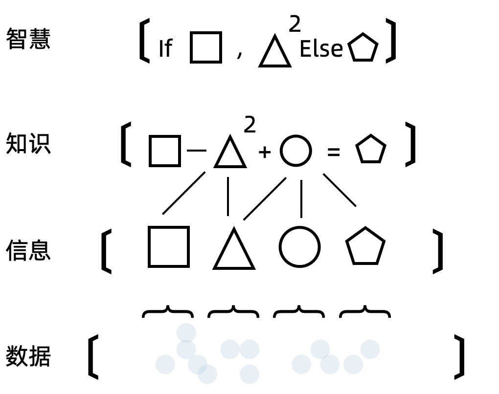
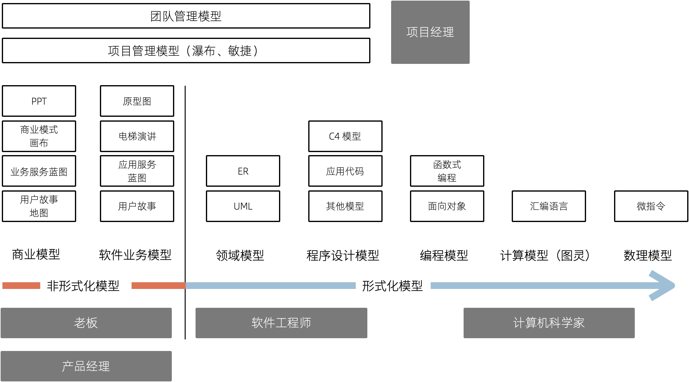
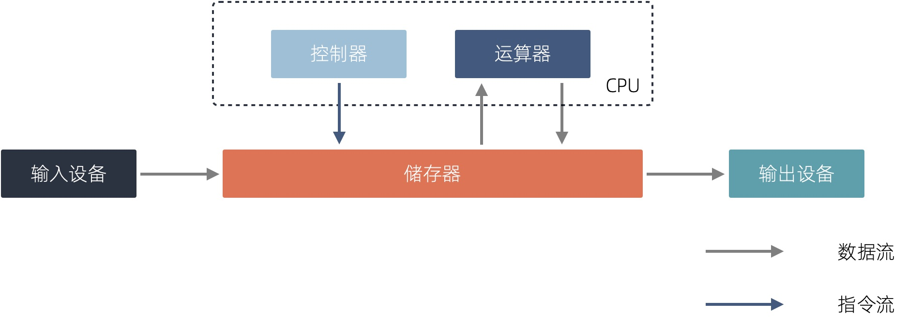
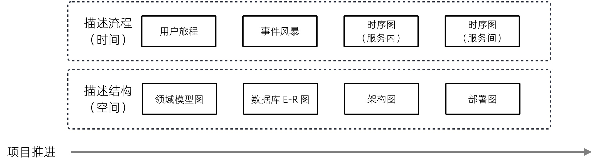

== 第 3 章 编程中的模型思维

模型，是人类重要的思维工具，在历史长河中不亚于火的使用。历法是一种认识气象变化的模型，通过 24 节气可以描述四季并指导农业生产；太极是阴阳家和道家认识世界的思维模型，通过阴阳描述了事物的两个方面，建立了朴素唯物主义的辩证体系；“君君臣臣父父子子” 的儒家社会模型，建立了相对稳定的封建社会。

认识世界和改造世界是我们每个人的日常活动，但是世界太复杂了。股神巴菲特的合伙人查理芒格说，我们必须在头脑中拥有一些**思维模型**，通过模型来认识世界。现代社会中经济学、社会学模型就更多了，波特五力模型、金字塔、四象限、2-8 定律等模型被各种培训和咨询广泛使用。

我相信几乎每一个程序员都听说过 “编程思维”，但是又没人敢说自己已经掌握了 “编程思维”，甚至说不清 “编程思维” 是什么。我们编写应用程序时，每个人都有自己一套方法来设计软件，但是随着需求的不断变化，程序的逻辑会慢慢变得混乱，不再简洁。

计算机科学和软件设计慢慢变成了哲学化、玄学化，衍生出很多形而上的概念，这是因为计算机科学体系变得过于复杂造成的。计算机科学是一门实践科学，计算机无非就是一台由半导体组成的电器而已，那么也可以通过模型理解计算机科学并指导编程。

从影响计算机科学建立的基本模型来看，有图灵模型、冯诺依曼体系、TCP/IP 网络模型等；从应用程序设计上来看有 RBAC、MVC 模型等；从业务设计上来看有具体业务领域的的模型，比如电商、SNS 等。

业务设计上往往没有建立起特定的领域模型，这是我们架构腐化和软件开发困难的关键原因。**业务领域建立好的模型，并指导代码实践，这就是 “编程思维”。

=== 3.1 模型思维

模型这个词常常会听到，通常出出现在某个 PPT 或者一篇商业评论中，社会和经济学中的模型往往比较朴素，金字塔、V 型图、四象限会以各种形式出现在不同场合中；软件工程师的模型会更加形式化，UML、E-R 图等，能用较为精确的形式语言描述；数学模型就更加精确，马尔可夫、蒙特卡洛等模型可以用数学语言描述。

广义来说这些都叫模型，甚至是你随手在白板上画的一个用来解释当前程序结构的图形，通过这种方式表达思维框架。哲学家库恩将这种思维框架叫做范式，也就是模型。维基百科将广义的模型定义为：

[source]
--------------------------------------
“用一个较为简单的东西来代表另一个东西，这个简单的东西被叫做模型。”
--------------------------------------

我们天生就有用简单的东西代表另外一个东西的能力，比如幼儿园数数用的竹签，学习物理时的刚体、真空中的球形鸡，都是模型。通俗来说模型就是经验的抽象集合，平时听到的谚语、公式、定理本质上都是一种模型。

为了理解模型，斯科特·佩奇在 《模型思维》一书中给出了模型的几个特征：

. *模型是简化的。* 正是因为我们要认识的事物非常复杂，因此需要通过简化找出最一般的规律，才能一语中的。”天圆地方“学说就是最简单的古人认识世界的模型之一；毛主席的”阶级划分论“ 简单、直接的指出旧中国的社会状态。
. *模型是逻辑的。* 例如用金字塔原理描述社会阶层，每层的定义是明确的而非模糊的，数学模型能用数学符号系统和公式描述，模型中的元素能用一种逻辑关系做到自洽。
. *模型是错误的。* 因为模型是一种抽象，所有的模型都是错误的，只能在一个方面反映事物的特征。场景变了，模型就需要修正，连牛顿、爱因斯坦的定律都没能逃脱这个规律。好的模型能尽可能简单的情况下较好的拟合事物，完全匹配现实的模型就不再满足简化特征了。

为了建立和利用模型，模型思考有几个层次：

. *数据。* 我们能直接观察到的现实情况，比如下雨了，并且雨下的很大。
. *信息。* 信息需要从观察到的情况中采样，转换成具体的的数字，比如某个地区某年的降雨量。
. *知识。* 知识是面对信息的处理方式，比如我们利用信息，将信息中的一般规律找出来，建立模型。比如某地区降雨量和年度呈现一定相关性，建立一个周期性降雨模型。
. *智慧。* 面对不同情况需要使用不同的模型和修正模型的能力，并能用它指导实践，比如根据周期性降雨模型修建水利设施。

在斯科特·佩奇在《模型思维》footnote:[参考图书：《模型思维》https://book.douban.com/subject/34893628/]一书中，使用了一张形象的图例如下所示：

我们可以尝试用这种方式来看待原本很困难的知识，比如去简化复杂问题，并理解它。通过模型思维来看待软件开发，我们会发现，软件从设计到开发的过程就是各种模型的转换。

我整理了一个图表，说明了一款软件从商业探索开始到编译成可交付的软件整个过程中可能会用到的模型。

我将模型分为形式化和非形式化两种。形式化的模型是精确描述的模型，例如表达领域模型的 UML、ER 图，而非形式化的模型是一些非精确描述的模型，主要用来做商业、业务探索。

对于应用开发的软件工程师来说，核心的问题并非如何编写代码，而是如何将非形式化的业务输入（模型）进行合理抽象、设计，并转换为形式化的过程。

某种程度上来说，通过高级语言编写的代码也是一种模型。在多年以前，计算机科学家们认为编写 Java 代码的人不算程序员，可以由业务人员直接编写业务软件。由于软件工程中非形式化和形式化之间存在一个巨大的鸿沟，编程就是模型的形式化过程，从这个角度看能深刻分析业务并获得良好抽象结果的程序员具有竞争力，并不会被 AI 编程所代替。

在非形式化模型这一步，实际上又存在两种模型。一种是描述软件背后的生意，即使不使用计算机系统参与到业务中，该如何完成交易，并让企业获得理论，我把它叫做商业模型。另一种是描述软件的操作和交互的模型，关注参与的用户、流程和业务规则，我把它叫做软件业务模型。

我们可以分别将其定义一下：

[source]
----
商业模型定义：商业模型是指描述企业盈利方式的手段，关注企业如何实现赚钱。
业务模型定义：业务模型是指企业如何为用户提供服务，如何参与到社会分工中。
----

那么弄明白商业模型和业务模型后，再来看软件设计，软件设计就是关注软件如何为业务、商业提供服务，提高业务和商业能力。虽然商业模型和业务模型有所不同，但是从商业模型体现的生意出发就能快速的理解一个应用软件（和日常生活相关的软件，区别于工具类软件，例如电商、ERP 等软件）。

优秀的产品经理往往深刻的理解商业模型，然后才设计出合适的软件业务模型，避免了空想的业务规则，以及铺天盖地无用的功能。优秀的架构师应该也能理解商业模型，并从软件业务模型中提取合适的概念，构建软件的骨架，而不是让软件构建在没有地基的空地上，然后修修补补。

在软件实施过程中，需要思考项目管理、团队的问题，项目经理或者 Tech Lead 也可以有自己的模型理解和认识项目、团队管理，项目管理的模型就是我们熟悉的瀑布、敏捷。团队管理的模型比较少，在后面讨论一种系统化的团队模型，通过将团队中的个体分为 Dispatcher、Worker 来认识团队。

除此之外，还有一些模型并不需要过多了解，这就是和计算机工作原理相关的模型，这是计算机科学家的工作，对于普通开发者来说可以加深对计算机的理解。例如，符合人类的认知的编程语言（面向对象、函数式）背后的模型，面向对象可以看做一种模型，还有一些计算机科学基础的模型：冯诺依曼结构、图灵模型、布尔逻辑（数理模型）。

将这些模型串起来，能够提高对软件工程的理解，以及每个部分背后的逻辑，明白这些模型背后的目标后可以更加从容的应对各种问题。

=== 3.2 计算机科学中的模型

==== 图灵和冯诺依曼模型

从算盘到计算机，人类走过了漫长的历史。计算机发展的转折点往往都是一些大师提出关键模型的时期，了解这些模型可以帮我们更好理解计算机世界。

计算机是数学的延伸和应用，图灵机模型是一个分水岭，图灵机和可计算性让理论自动计算具有了理论基础。虽然在此之前的模型也很重要，但是还停留在数学上，比如数理逻辑中最重要的一部分布尔代数。

新一代的软件工程师已经不再关注计算机是如何工作的了，他们把计算机当做一种可以通过编程语言对话的“生物”来看待了。我曾被问到过，我们日常使用的“电脑”为何被称作计算机，它和计算看似毫无关系。

要回答这个问题需要将图灵和冯诺依曼模型两个计算机科学基础模型清晰的分开。

计算机能够发展出这么多的功能，其实这只是一个偶然，现代计算机的各种高级应用是计算机的研究者们没有想到的。布鲁斯·斯特林创作了一本小说，名字叫做《差分机》。这本小说是为了致敬查尔斯•巴贝奇，巴贝奇设计了一种机械计算机，这种计算机需要通过蒸汽驱动，这就是差分机。在某个平行宇宙中，人类走向了由差分机带动的新一轮技术革命，不过这种技术革命还是蒸汽时代的延续。

理论上讲，全自动的机械计算机是能够被制造出来的，因为“程序”在图灵模型中被表述为“有限执行的操作序列”。所以很多东西都可以看做计算机。

算盘会被经常和计算机一起提到，算盘是人力驱动的一种计算机，算珠的状态可以看做寄存器。对中国人来说理解图灵机非常简单，我们可以使用算盘来类比。当算盘归零后，算盘的**状态**为初始状态，每一次拨动算珠就是一个**指令**，当所有的的指令下发完成，算盘上最终状态就是计算结果。指令序列就是算法，算盘就是一个状态机。

在算盘之后的时代，还有计算尺，甚至手摇计算机。手摇式计算机算一种半自动的计算机，我国科研人员曾使用它进行原子弹的计算工作。

计算机带有计算两个词的功劳得归到图灵。图灵在 1937 发表了论文阐述可计算性这个概念，并给出了计算机的抽象模型。图灵在论文《论可计算数及其在判定问题中的应用》中，提出了著名的理论计算机的抽象模型——“图灵机”。

它描述了这样一种机器：一个虚拟的机器，由一个一条无线长的纸带和读写头组成。纸带上分布有连续的格子，并能被移动，读写。机器能读取一个指令序列，指令能对格子纸带进行移动和读写。和算盘的逻辑一样，机器每执行一个指令，纸带的状态就发生了变化，最终完成计算。

在电子计算机中，图灵模型是由门电路完成的，门电路就是开关电路。记录状态的门电路可以想象为算盘上算珠的拨动位置。门电路有开关两种状态，因此能通过简单的方法实现加法器，进而实现各种运算。

通过开关就能做出计算机？听起来在开玩笑，用机械来实现当然无比复杂，但是用电气来实现就非常简单。所有的运算都可以通过加法完成，这个不难理解。加法如果用电器开关来表达，只需要做到下面几种条件：

* 0 + 0 = 0
* 1 + 0 和 0 + 1 = 1
* 1 + 1 = 10

如果把每个数字想象为两个灯泡的话，怎么设计一个电路满足上面三种让相应的灯泡亮起、熄灭。因此要通过电气实现图灵模型就需要实现指令的基本元素：加法器。以及需要一个存储结构：锁存器。

理解原始计算机的基本原理只需要理解加法器和锁存器是如何制作出来的，这个不是玄学，只需要初中物理学就能搞定，可以参考书籍《编码——隐匿在计算机软硬件背后的语言》，这本书讲述了计算机从简单的电气结构到堪称玄幻的复杂结构的完整演化过程。

图灵模型只是描述了一步一步的完成计算任务，这种机器称不上“电脑”。让一堆“沙子”具备通灵般能力的人是冯·诺依曼。现代的计算机实际上是一个死循环，可以类比为冲程发动机，才让计算机看起来有了生命。

ENIAC 是公认第一个满足图灵模型的计算电子计算机，ENIAC 通过纸带编写程序，并拨动开关执行和获得结果。冯诺依曼在比 ENIAC 更先进的计算机项目 EDVAC 中描述了另外一种模型，他认为程序本质上也是一种数据，将指令和数据共同存放到内存中，这些指令中存在特殊的跳转指令，让程序周而复始的运行。

存储程序模型构建了一个能自我运行计算模型，构成了一个系统。处理器和内存之间使用总线连接，用来给这个系统提供输入的设备叫做外设，每一次指令循环的可以访问一次外设传入的信号，这就是中断。

想象一台由继电器组成的计算机，如果每一次执行指令计算机会发出 ”嘚“ 的声音，图灵模型就是程序开始运行后线性的 ”嘚嘚嘚……嘚嘚停“。冯·诺依曼的模型就是上电后 ”嘚嘚嘚嘚嘚……中断……嘚嘚嘚嘚嘚”，并反复循环。冯·诺依曼让计算机永不停息，并产生交付效果。

我将计算机科学基础模型展开，每种模型都能作为计算机科学的原料：

. 布尔数学逻辑模型：为开关电路组成复杂的逻辑规则提供了数学工具。
. 加法器的电气模型：实现全加器，为图灵模型提供基础指令。
. 图灵模型：算法是有序的操作序列，数据是状态，计算的过程就是有序修改状态。
. 冯·诺依曼模型：算法也是数据，算法可以控制指令序列的跳转，然后无限循环下去，进而可以响应外部的信号输入。

在我朴素的认知里：**冲程发动机、计算机、生命是一类事物，启动后便不再停下，直到能量耗尽以及外界的干预。**

==== 自动推理模型（理解编程语言）

各种各样的编程语言层出不穷，由于工作的需要会接触不同的编程语言。如何能理解编程语言的本质是什么呢？我尝试找一些模型简化对编程语言的理解。先用矛盾论分析一下编程语言解决的什么矛盾：

[source]
----
计算机只能识别机器指令和人类难以使用机器指令解决具体问题之间的矛盾。
----

所以人类设计出来各种各样符合人类习惯（各不相同）的方式编写程序，这些编写程序的模型就是高级语言。要使用自己定义的语法规则来写程序，就需要一个转换器，能将符合人类习惯的语法进行转换，这就是编译器。

一门新的语言需要满足几个条件：

. 新定义的语法必须是形式化的。
. 新定义的语法能方便的被转换。
. 人们能接受这种语法编写程序。

所以编译器是一个自动推理机，只要能被推理的形式化语言都可以作为输入。除了自然语言无法实现之外，无论用中文、表情包、符号、图形都能作为一种编程语言的形式。

编译的过程有：语法分析、词法分析、语义分析、中间代码和优化、目标代码。大师通过编译过程学习如何实现编译器，普通工程师可以反过来用这个过程理解一门新的语言。

我尝试将编译过程中的环节找到一个现实中的类比来理解编译器，将类比为人类阅读法律文书（法律是最贴近形式化的自然文本）。

|====
|阶段 |编译器 |类比

|词法分析 |扫描，识别代码 Token，将关键字、变量、操作符提取出来 |处理调查材料，案件人员、行为等要素
|语法解析 |将 Token 组织为一棵树(AST) 用于推理 |将人员和行为映射成图谱，形式逻辑推理
|语义分析 |处理上下文相关的信息 |识别行为发生的动机、背景，提取上下文信息。
|中间代码 |上面三步是前端，中间代码是为了多平台代码生成用 |整理为卷宗
|目标代码 |根据不同的平台进行代码生成 |输出到报纸、网站等媒体
|====

尝试找到一些通俗的模型理解编译过程，在 https://craftinginterpreters.com/a-map-of-the-territory.html[https://craftinginterpreters.com/a-map-of-the-territory.html] 这个网站下介绍了一个清晰的编译过程。

理解编译器后再学编程语言就清晰很多，比如语法（Grammar）有三个层次：

. 词法（Lexical）：那些表达式、关键字是合法的。
. 句法（Syntax）：一个句子是不是合法，比如流程语句。
. 语义分析（Srammar）：一段代码的组织结构，函数、类、闭包等规则。

Lexical 和 Syntax 往往可以看成一体，Grammar 不太一样，在一些编译器中 Syntax 和 Grammar 的错误提示都不太一样。所以可以这样看一门语言：Syntax 是类 C 的还是非类 C 的，Grammar 上是面向对象的还是面向过程的，是否支持闭包这类上下文追溯的能力。

理解推理模型可以用来帮助学习编程语言，比如 TypeScript 可以编译成 JavaScript，很多时候我们不需要特别学习 TypeScript，将小段 TypeScript 代码编译一下，看看生成的 JavaScript 是什么就行了。

==== 面向对象模型

有了自动推理机，可以将自己人们定义的语法转换成机器代码的语法规则。让我们有了方法、变量、条件、循环等这些概念，可以大大简化编程的心智负担。

面向过程的语言依然还是图灵模型解决问题的思路：有限的有序指令序列。只不过这里的指令从机器语言、汇编代码换成了容易理解的表达式而已，面向过程的编程语言和机器代码在认知上没有本质区别。

组织面向过程的程序，这部分工作的心智负担需要高水平的程序员来完成，将现实中的业务分解成有限的有序指令序列。分解任务成为指令序列的过程就是编程，它要求程序员既要像人一样思考现实又要像机器一样思考。像机器一样思考需要最聪明的人来完成才行，好的程序员可不好找。

能不能想办法利用推理机，再进一步，让程序员按照人类一样思考事物，写出符合人类语义的代码，然后再翻译成目标代码呢？回答这个问题就需要先回答另外一个问题，符合人类认知的思考方式的语言是怎么回事。

人类需要通过概念来进行交流，给一撮物质一个标签，这个标签就是概念。将一堆便签夹起来再打上标签，就是抽象概念。不同的语言、不同文化背景的人无法交流就是因为使用了不同的标签系统，甚至也有可能标签贴错了的情况，导致认知无法对齐。

理解面向对象需要到生活中去，观察玩泥巴的小孩。他们用泥巴创造出一个城堡前，泥土就好像计算机世界中的数据，将泥土组织成有清晰边界的物品就是对象。我们为了描述这类对象，就给它起个名字才能交流。类可以对应现实中的一个概念，很多面向对象的书籍并没有点破这一点。

可以把现实和面向对象中的元素对比一下，建立一个理解面向对象的模型。

|====
|现实 |人类语言 |比喻 |面向对象

|一类物质 |概念 |标签 |类
| 不存在实物 | 抽象概念 | 一组标签的标签 | 抽象类
| 一个有清晰边界物体 | 实体 | 用陶土制作了一个杯子 | 对象的实例化
| 一个有行动的的人 | 人 | 拿起了这个杯子 | 调用了人这个对象拿起方法
| 符合条件的人 | 契约 | 有手就能拿起杯子 | 接口
|====

所以面向对象编程是建立在非常好的心智模型上的，只不过这个模型对于不熟悉西方哲学的人来说过于抽象。对象、实体、类、行为，这些面向对象中的内容和概念早已经被哲学家讨论过数千年，但是在中文的语境中并不新鲜。

人是通过语言思考的，我们不遗余力的使用自然语言描述事物，面向对象是计算机语言和自然语言的一座桥梁，这座桥梁由哲学链接。对象这个词在不同的领域都被用到，而且不是巧合：

. 哲学中的对象概念。
. 数学（范畴学）中的对象概念。
. 语言中的宾语。

维特根斯坦的《逻辑哲学论》中对对象、类的阐述和面向对象极为相似，不过这本书非常晦涩。通俗来说：

[source]
----
对象是人认识世界的基本单位，对象由实体和正在发生的事构成。
----

也就是说对象不是一成不变的，可以由“造物主”自由的设计和组合。当我们在开发一款 XXX 管理系统时，被管理的“物品”在模拟一个静态的物品，就能看做一个对象。假设我们正在开发仓储管理系统，极端的面向对象者会告诉你将行为放到“货物”这类实体中，这样看起来更加像面向对象的风格，但是他们背离了面向对象的初衷。

虚拟的世界里，静态的对象需要由动态的对象处理构成了一组主客体关系。而对于“上帝”来说，它们都是对象。熟悉 Java 的程序员可以这样理解，Spring 中的 Bean 是一种对象，在应用启动时就被初始化了，就像上帝造出亚当开始干活儿。而从数据库中提取出来的实体，就像是从仓库中提取出来的“物品”。

如果开发一款游戏，对象貌似都是有生命的。但是对于普通的管理系统来说，真正需要设计的是“货物管理者”，“收银员”这类对象，而“货物”这类实体就应该让它们安安静静的躺在那里。

使用面向对象越久，越会下意识的使用面向对象思考现实，面向对象是程序员进入进入哲学世界的启蒙课。

=== 3.3 应用开发中的模型

使用模型思维开发软件并不是计算机科学家的专利，对于应用开发来说我们也会想尽办法找到合适的模型。应用程序设计中有很多套路，一些书叫做范式、模式或者其他词汇，如果按照模型思维的逻辑，我们可以叫它们模型。根据场景找到合适的模型就能把应用程序设计的很好。

做应用程序设计，除了特定领域外，大部分应用都有有一些通用的的内在逻辑，我们可以尝试把这些内在的逻辑找出来，通过模型可以帮助分析业务问题。

通俗来说，系统分析的关键是怎么找到一根线把系统的大部分元素串起来，达到逻辑自洽目的。串的东西越多，能分析的系统就越复杂。现代商业软件系统的类型往往由商业价值决定的，一般有这几类：

* 电商类。业务的关键逻辑是电商，即使看起来和电商无关。像 Keep、抹茶美妆这类垂领域的 APP 看似是生活类 APP，实际上也是电商应用。对于电商类，订单就是贯穿整个用户操作逻辑，我们可以围绕订单串整个系统。
* 协作工具类。一些项目管理系统，比如禅道、JIRA、Worktitle 等，都属于协作工具类。这些工具类应用中最核心的是工作流，任务的状态和流转是贯穿整个系统的主线。
* 社交类。校内网、微博这类应用，属于典型的社交应用，其实也应该把像知乎这类 UGC 应用算进去。社交类以用户关系和内容串联整个系统。

当然从分类上来说不可能做到尽善尽美，只能说常见的产品属于上面三类，还有一些难以划分在这几类之中。

==== 订单模型

在互联网产品中我们会发现大部分产品都是电商平台，即使是类似文化、阅读的产品也会有产商品的概念贯穿其中。即使是我工作早期做的餐饮系统，也发现无论怎么变化关键的部分都是围绕订单和订单状态设计的。

订单的状态是分析此类系统很好的着手点，从已下单、已支付、已收货、已完成等状态，串联整个系统的其他元素。在处理业务逻辑的时候，考虑订单的状态是否能保持一致，基本能保证系统的逻辑大方向一致。

分析订单模型可以侧重使用 UML 中的状态图，以及 E-R 图建立对象模型。为了降低局部复杂性尝试使用 DDD 的思想进行领域划分、上下文划分。

==== 工作流模型

我们做的内部 ERP 系统大多数都可以抽象成工作流模型，工作流模型的关键元素是任务、参与者、角色。

* 任务。一个工作流的客体，任务的状态变化体现业务逻辑的推进。
* 参与者。一个工作流的主体，参与者的活动体现工作流过程中关键的方法。
* 角色。参与者的分类，用于管理参与者的组织架构和权限。

工作流模型业务分析的关键是参与者角色的识别，往往这类系统角色、关键活动非常多。通过对角色+关键活动组成的用例进行识别，大量系统逻辑都能被分析的清晰并容易理解。

分析工作流模型可以借鉴一些开源工作流产品，除了直接使用这些工作流框架（例如 Apache activiti）之外，可以直接借用它们的定义的概念来自己设计模型。

==== 信息流 (Feed) 模型

设计社交类应用时，无法绕开的模型就是 Feed 模型。信息流模型一般包含信息、信息生产者、信息消费者、推送平台等元素。

* 信息。用户产生的内容，比如文章、心情、图片或者视频。
* 信息生产者。产生信息的角色，比如发帖、评论、转发代表的角色。
* 信息消费者。阅读信息的角色，比如拉取个性化 Feed 流、读取热榜列表时代表的角色。
* 推送平台。负责将信息从生产者推/拉发送到信息消费者的视图中。

社交类应用往往信息生产者和信息消费者是同一个人，但是在设计时有需要分开看待，否则会混乱。通过信息流模型可以让技术实现更有方向感，比如将精力放在推送平台的建设和性能优化上，否则普通的技术选型无法支撑信息流模型。

==== 租户模型

除了通过上面的几个模型方式之外，还有一种模型需要考虑，就是租户模型。租户模型与前面讨论的三类应用无关，所有应用都有可能存在多租户的情况。多租户指的是客户希望复制一套属于他自己内容的软件产品，例如多用户建站系统可以开通后复制一套自己的 CMS 系统，通过修改域名和模板就能建站。 互联网产品或多或少都有一些多租户的要求，常见的就是一些 SaaS 平台，比如建站系统、企业微信、用友 ERP、收银系统等。通过租户隔离可以实现双赢的局面。

* 对软件提供者来说，可以低成本实现倍增收益。
* 对于软件使用者来说，相对于自行研发来说，可以享受到基础设施共享带来的低成本。

但是多租户带来的最大的问题是：**每个租户潜在的个性化需求和软件提供者希望打造通用解决方案之间的矛盾。**认识这个矛盾后，租户一般会使用服务级别协议模型。服务级别协议（SLA）将使用者分为几个级别，一般互联网产品付费策略都会一定程度类似如下划分：

* 基础版本，共享数据库等所有资源，数据、应用程序不隔离，通过数据字段区分数据集合，后期考虑通过租户。
* 数据隔离，共享同样的应用程序，开通专用的数据空间。
* 应用隔离，私有化部署，数据和应用租户完全物理网络隔离。
* 定制开发，除了私有化部署外，提供额外的定制开发。

在产品设计初期，多租户模型容易陷入的误区是把个别租户的个性化需求当做通用需求来做，导致基础版本的业务逻辑混乱，体验复杂。 根据 2-8 定律，大部分租户基础版本已经能满足需要，定制需求往往只是小部分租户需要。使用 SLA 模型可以较好地控制定制需求，当租户确实需要个性化功能，并能接受定制开发成本时，开发定制化需求并进行私有化部署，但不应该污染基础版本。如果产品经理认为这些个性化需求能满足大多数租户的需求时，优化并合入基础版本即可。

另外应用租户模型成本非常高，尤其是多租户下用户打通时带来的复杂性会导致程序难以维护，需要谨慎考虑。

=== 3.4 模型有效性评估

当有人提出一个模型，然后一群人喋喋不休，争吵得你死我活的时候。让我想起了 George Box 的一句话：“**All models are wrong; some are useful.** ”这句话深刻的揭示了我们日常讨论心智模型时的一个原则，那就是：

[source]
----

模型当不得真，但是再看起来不可思议、违背认知的模型或许能找到有用的地方。

----

所以我们能看到一些奇奇怪怪的思维模型，但是居然能找到用处。数学家布尔发现可以通过真值表来做一些逻辑判定，然后通过基本的对错进行复杂的逻辑运算，在的布尔活着的时候数学界并不承认布尔逻辑是一种数学。

在那个年代，布尔逻辑只不过是一种分析问题的小把戏。这种观点一直持续到了布尔去世 200 年后，人们发现了门电路，当组合门电路就可以创造出复杂的逻辑装置。比如现代家庭卧室都安装了双向开关，就是一种门电路的应用。

那么既然，模型当不了真，如果我获得了一个思维模型或者理论，甚至仅仅只是软件中的领域模型，怎么知道它是否有用或者合适呢？简单来说就是两个方向：拟合现状和预测未来。

一般来说，我们不会平白无故的获得什么模型，比如有很多讲性质模型的书籍，介绍了上百种模型。其实这类书籍用处不大，因为模型存在的价值首先需要问题。

找到合适的问题模型就有用了，不管是先有模型还是从模型中找到能解决的问题。这就是拟合现状，找到的模型能满足当前的状态。比如在项目上，有一大堆的技术债需要解决。

我们可以使用一个四象限模型对这些技术债归类，这个四象限有两个维度，分别是重要性和紧急性。就能分出去处理问题的优先级：

. 重要且紧急。
. 紧急不重要、重要不紧急。
. 不重要也不紧急。

按照这种方法就可以清晰识别手上的一堆问题，这就是拟合；同时也为我们采取行动指明了方向，这就是预测未来。我们发现，拟合 + 预测，可以作为模型评估的“模型”，要做到拟合、预测就要满足一些条件，将其展开就能得到一些模型评估的清单。

尝试问几个模型拟合性相关的问题：

. 是否足够简单？
. 是否符合逻辑自洽？
. 是否能描述问题的本质？
. 是否有清晰的应用边界和局限性？

尝试问几个模型预测性相关的问题：

. 是否能解决提出这个模型背后的问题？
. 是否能对行动做出指导？
. 是否能用来规划未来的发展？
. 是否能推广到其他领域？

=== 3.5 将一堆模型组织到一起

软件工程中太多的模型了，有时候多到不知道用哪个。有属于 UML 规范中的时序图、类图、ER 图，有现代更潮流的用户旅程、业务蓝图、应用蓝图等，也有随意画画的 Freestyle。

我以前也整理过一个项目上需要用到的模型清单，比如用 C4 架构图 + 时序图+领域模型图（UML）+ ER 图基本上能满足大部分业务需要，能充分的描述软件现状。当我慢慢把虚拟的软件世界和现实世界映射时，发现可以用一个思维框架来组织哪些模型是我们需要的。

我们用“宇宙”这个词来描述现实世界，在中文的词源中“宇宙”是两个词组成的，宇指代空间，宙指代时间。更有意思的是，“宇宙”这个词汇出自庄子的《庄子·齐物论》：“旁日月，挟宇宙，为其吻合。”。

那么我们可以从时间和空间两个方面来寻找一些模型描述软件，并且做到正交，就能清晰的认识到相关模型在软件建模体系中的，这样也能让模型保持干净。

先从空间上来看。领域模型图是在描述软件概念骨架，描述业务概念或数据在软件中是如何组织的。设计领域模型就好比我们是不是需要将手机和电池分开设计。需要清晰地定义手机、电池，以及电池的关系。

所以在建立领域模型图时，需要保持干净，体现实体、实体关系就行了，用 DDD 的风格，表达出聚合、上下文就完全满足开发需要。进一步来说，领域模型图、数据库实体关系图、架构图、部署图都是在空间上描述软件，只不过这是不同的形态。从空间上来说，可以类比建筑行业的图纸，但是软件是动态的，需要响应用户交互，于是又需要从时间（流程）上来看，这点和建筑完全不同。

从时间上来看，依然可以用不同的态来看待这些模型。时间维护上的模型体现的是流程、事件。从最朴素的流程图到用户旅程、服务蓝图，再到事件风暴、时序图、状态图都算描述时间过程上的模型。流程图由于粒度不确定的问题，可以用于草稿，实际上用的不多。

用户旅程、服务蓝图，描述现实中业务主体为了达成业务目标中间所经历的过程，可以用在商业探索早期。将用户旅程带入用例的视角，就可以解决颗粒度的问题。以用例为单位，用例的流动就是参与业务主体的契约在不断变化。

事件风暴则通过系统核心状态变化为线索寻找背后的实体，有点像电影的关键帧，通过状态的变化可以提取出描述软件空间结构的领域模型。

时序图则用于软件编写中，描述操作实体的服务（主体）之间的交互，时序图也可以有不同的层次关系，比如子系统（微服务）之间，服务之间（Controller、Service）。

那么通过时间和空间的思维，可以帮团队裁剪一套软件设计过程中的模型，如下图：

=== 3.6 总结

模型思维不算是一项硬技能，它相当的软，以至于不少人在使用这种思维但是意识不到。显性化强调模型思维这个概念的用处是可以训练自己有意识的使用模型思维。为模型寻找一个表达方式，这样更容易理解复杂事物，载体可以是一个比喻，也可以是一页 PPT，或者简单的在白板上画出来。

把一些有规律的一组信息的首字母提取出来拼凑为一个有意义的单词来记忆也是一种设计模型的方法。比如说 PEST 分析法、FIRST 原则、SOLID 原则等。

如果想自创一些模型并让人信服不见得是一件容易的事情，由于晕轮效应的存在，人们对于大众流行的模型更能接受。所以如果我们想讲模型用在汇报、说服的场景，可以将自己的理念嫁接到已经广泛流行的模型上，可以起到意想不到的作用。比如在项目的管理上，可以对开发过程模型 RUP、Scrum 模型进行裁剪，设计基于主流模型的定制化方案，相比基于自己经验完全制定的方案更加容易令人接受。
