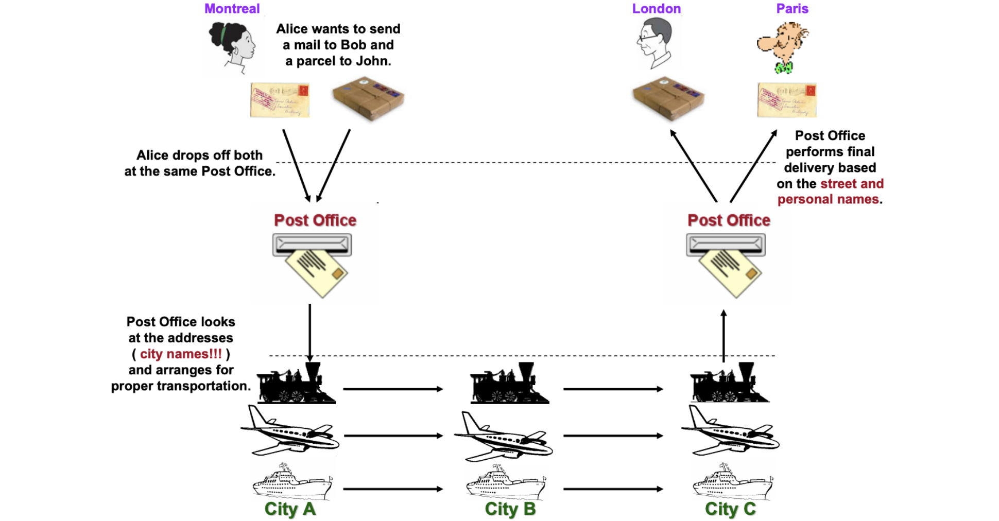
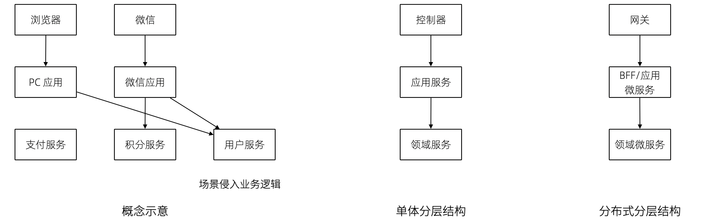
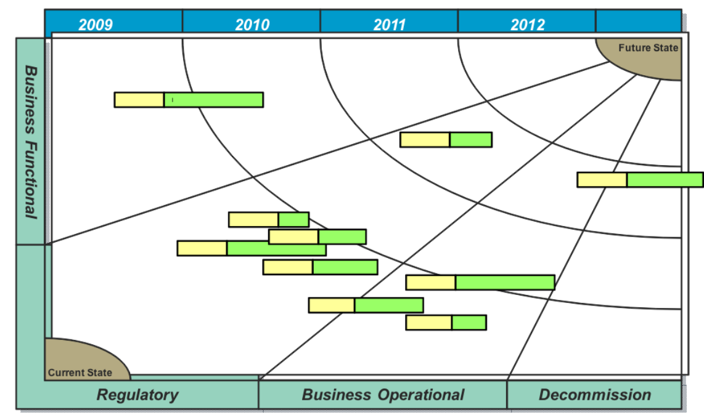
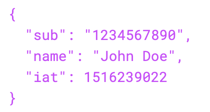

== 第 6 章 分层，软件架构和实现

什么是软件架构？通俗的来说，软件架构就是将软件中合适的组件放到合适的地方，这就让软件架构变成了一种混合大量经验的艺术行为。

架构是什么？在维基百科中，软件架构的定义是：

[source]
----
软件架构是有关软件整体结构与组件的抽象描述，用于指导大型软件系统各个方面的设计。 软件架构会包括软体组件、组件之间的关係，组件特性以及组件间关係的特性。
----

那么我们可以解构一下，软件架构的内涵就是：

. 组成软件结构的元素。
. 结构之间的关系。

除此之外，还需要有一些原则来指导具体的实施，类似于施工规范和标准。在设计软件架构时候，会做大量的决策才能得出最终元素+关系的形态。但是我也不需要将所有的细致入微的决策都马上做出，而只是做出以后不那么好调整的决策就行。维特根斯坦说“世界是一切发生的事情”，我们也可以说架构是一切决策完成后的事情。

于是我们可以将架构描述为：

[source]
----
软件架构 = 架构中的元素 + 关系 + 实现原则和技术规范。

软件架构的过程 = 一切决策之和。
----

架构中的元素有可能用不同的视角来表达的，也有可能具有层级结构，于是我们往往通过图形化的方式来描述和表达，也就成了传说中的“PPT 工程师”。

=== 6.1 复杂性管理

从复杂和混乱的信息中找到重点才能定义出元素以及找到关系。架构是一个非常玄学的领域，它不像编写一个确定的中间件一样，有明确的输入条件和输出。架构充满了权衡、取舍和纠结，其原因就在于复杂性问题。复杂的信息越多，系统熵越多，没有能量输入时，系统逐步趋向复杂、无序状态。

《人月神话》里面提到两个概念：本质复杂度和偶然复杂度。本质复杂度是在解决问题时，无法避免的事；偶然复杂度是做事方法不对，人为引入的复杂性。

*架构师就是与复杂性对抗的人。*

本质复杂度无法避免，而导致偶然复杂度上升的原因有：

. 沟通节点增多，软件项目中，人越多，信息节点越多，偶然复杂度越多。
. 信息噪音过多，就像信息论描述的那样，当噪音太大真实的声音就被掩盖了。

我们必须能找到办法对抗复杂，我们能用到的工具有：

. 获得信息"地图"，模型思维，过滤掉多余的信息。
. 分而治之，将复杂度隔离到局部，让局部的复杂性减弱，将复杂性进行分层。
. 统一语言，降低沟通的熵。

==== 图是复杂信息的索引

在架构设计中，过滤掉多余信息的方法就是做 PPT 或者画图。

PPT 的真正作用是复杂性管理，这也是微软幻灯片软件 PowerPoint 的寓意来源。据说 Gaskins 在给 PowerPoint 起名字时，最初在洗澡时迸发的灵感，想到的名字中包含了这个词。而且在不知情的情况下他的同事 Glenn Hobin 在机场的海报中，一眼看到了 PowerPoint 这个被强调的词。

为什么幻灯片做得好的人升职越快，而且比一线干活儿的人升的更快。有时候一线开发人员愤愤不平，为什么做做幻灯片不写代码就能获得高薪。实际上做 “PPT 工程师并不轻松”，靠的是对问题 深刻的理解、信息的分析、有效的呈现等多种能力。

一套架构用的汇报材料，可能就是某个复杂系统一份极好索引。全景是什么、边界在哪里、骨干的业务逻辑是什么，都需要体现在在幻灯片中。

所以做好幻灯片的前提是深刻吃透业务、产品、技术方案，而且还需要具备非常强的表现能力，把方案清晰的表现出来。幻灯片图表并非只是展示，更像是一个索引来描述复杂的系统。

优秀的架构师、咨询师都能做出好的幻灯片，有时候甚至幻灯片就是一种很好的概念模型，这样想就应该能把幻灯片重视起来。没有好的思维结构，就做不出幻灯片，想到的不一定能表达出来，所以幻灯片做的好的人具有特别的强的思维能力。

简化和克制的图才是真正有用的图，因为保留的有效信息更为突出，将庞大无比的系统简化到几张 A4 能够被打印出来的纸时，它的复杂性才能真正被驾驭。

==== 分而治之

分而治之不能降低复杂性，只能隔离复杂性。而分而治之可以通过不同的维度来进行，主要分解的方向有三个：

. 水平分解。对系统进行分层，下层对上层透明，上层的开发者无需关心下层的变化。
. 垂直分解。对系统进行按模块（上下文）切割，上下文之间不需要关心彼此，只在有互相依赖的情况下了解对方。
. 按时间分解。对系统的实现很分步骤完成，根据迭代演进，制定产品、架构路线图（RoadMap）。

image::06-architecture/architecture-dimension.png[架构维度,align="center",title="架构维度"]

注意区分广为流传的 AFK 拓展立方体，AFK 拓展立方体更像是对系统容量的分解，而不是对复杂度的拆解。

对于上面的图片说每一个版本我们可能都会进行垂直、水平分解得到一张平面的架构图，在持续演进的状态下不断更新。

这就印证了我们前面说的架构的过程是一切决策之和。架构决策的影响有时候远远被我们低估，有时候我们的决策是基于上一次决策之后的结果做出的，而不是最初的问题，这就让架构问题变得更加复杂。

由于架构设计不是一次性做出来的，水平分解、垂直分解不能体现真正的复杂性，往往问题的复杂性来源云架构决策的前后因果。

=== 6.2 系统水平分层

分层的目的是水平隔离复杂性，那么怎么定义“一层”呢？由于对具体分层的定义非常模糊，导致了我们实际上分了很多层，但是却觉得没几层。

==== 架构分层的主客体分析

互联网通信依赖的网络协议 TCP/IP 是一个非常经典的分层模型，因为全球网络是一个经典的分布式系统，实际上我们无论在设计哪种形态的分布式架构都可以参考网络协议的设计思想。

我们在学习 TCP/IP 或者 OSI 分层网络时会使用一个常见的“邮差”比喻，来形象的描述网络协议的原理，其中就体现了分层的思想。

Montreal 需要寄送一个信，她在信的结尾写上了自己的名字作为落款，然后通过邮局将其寄出。邮局进一步包装贴上邮局的标签，并发送到运输公司。运输公司将其装箱，并通过不同的交通工具将其递交到目标的站点，并发送到目标邮局，也就是他们在目的地方的客户那里。最终，邮局将信件发送到收信人手中。

我们将整个过程看做三层：用户层，也就是收信人、发信人收发信件的过程；邮局层：邮局的工作人员处理邮件的过程；运输层：物流公司通过不同的交通工具运输货物的过程。

有时候，我们仅仅通过行为来描述分层很难说清楚分层是什么，比如邮局和物流公司的分层在某些情况下可能说不明白。我们可以通过另外一个视角来看待这个问题。

图片来源：https://www.eecs.yorku.ca/course_archive/2010-11/F/3213/CSE3213_03_LayeredArchitecture_F2010.pdf

任何一个行为都能找到它的操作者以及身份，也就是行为的主体，也能找到被操作的内容，也就是行为的客体。我们可以通过分析主体、行为、客体三个要素来辨析分层之间的关系。这样让分层更加明确。如果能在该层找到明确的主体对象、客体对象，以及说明其关系，我们就能将其说清楚。

我们用一张表格来划分，并将其表述更加精确：

|====
|分层 |主体 |行为 |客体

|用户层 |收信人、发信人 |收发信件的过程 |原始寄件
|揽收层 |邮局、揽收点 |揽收寄件，并打包的过程 |包装后寄件
|运输层 |物流公司 |运输货物，装箱运输的过程 |物流箱
|====

通过主体的明确和客体的明确，主体之间的职责会清晰的浮现出来，主体的权责更加清晰，我们细心的分析也会发现这种分层也是社会化分工的体现。主体的性质是截然不同的，邮局、揽收点作为法律主体时，一般不是以自然人的性质出现的。另外物流公司这类主体往往也需要额外的资质、营业许可，侧面的说明了分层的要素。

这是现实中的分层思想，那么在软件中是不是这样的呢？假设以后端业务系统的经典三层结构，我们来看下它的分层主客体分析：

|====
|分层 |主体 |行为 |客体

|Controller 层 |Controller |处理业务场景 |Request/Response
|Service 层 |Service |处理通用能力 |Model
|Repository 层 |Repository |处理数据持久化 |数据/SQL
|====

用主客体来分析，MVC 模型如果没有 Service 时，只能算两层，因为 Model 只是客体，构不成完整的一层。Service、Repository 层都有对应的主客体关系，能够说清楚它的权责关系。

如果按照网络协议的分层设计，下层是不需要知道上层的信息或者知识的，也就是说理想的情况下 Repository 层的客体应该是无差别的数据才对。所以我们可以看到 JPA 这类 ORM 工具接收了两类参数：数据体 + 领域模型的类型信息。当我们无法实现出无差别的 Repository 层时，才不得不使用持久化对象这类概念。

所以这里总结下对分层的理解：

. 分层是主体权责的让渡，通过分层演化出更多主体，实现分工。
. 下层需要尽可能的提供无差别的能力给到上层，让上层对下层保持透明。

那么通过辨析主客体的关系，就能提高代码的表达力，尤其是在命名上。所以对客体起名的关键在于定义这个客体的概念，**使用拟物的方式起名**。对主体的起名需要定义它的职责，**使用拟物的方式起名**。

这样就能通过类似“主谓宾补”（主语：服务对象，谓语：方法，宾语：参数，补语：返回值）的方式编写代码，让我们在编写业务代码时思绪流畅。

==== 应用和服务分离

*良好组织代码的关键不是将方法划得足够小，而是对象各司其职。* 架构的本质就是将各种库、业务代码、基础设施等架构的组成部分良好的组织到一起，这是在成为架构师的路上必须想通的一环。企业架构框架把信息架构分为四层：业务架构、应用架构、数据架构和技术架构。如何把业务系统中的代码良好的组织起来，就是我们应用架构中的内容。

*应用和服务分离* 是一个非常简单的原则，在各个地方都有体现，但是没有编程大师像 SOLID 原则一样明确的表述出来，但它又很重要，能给我们一个如何复用代码的准则。

“复用就一定好吗？”

当我向同事问出这个问题的时候，同事一脸茫然，好像软件开发本来就应该这样，所有的代码都应该尽可能的复用。

复用，在多数人的眼里已经是理所当然了，但有时候还是忍不住提醒一下，复用只是手段而非目的。

复用是通过消除重复代码的方式，得到一系列可以重用的代码片段，在需要的地方组合使用即可，提高开发速度的同时，也可以提高整体的一致性。

显然，组合组件用的胶水代码是不需要复用的，因为组合本身就是为了解决场景中的事情，不再具有复用价值。强行复用的后果有两个：

. 场景特有的东西被纳入组件，导致组件的复用性降低。信息被泄露到组件中，组件和场景中的代码职责不清晰
. 响应业务变化的能力反而降低了，说白了就是不好改。

有时候两段代码虽然看起来只有细微的差异，但是也不要复用它们。对于全栈开发者来说，这个原则对我们设计前后端的代码都有好处。在后端，我们可以使用 DDD 分层中的 application 让代码变得更清晰；在前端，我们可以将业务组件分为 pages 和 components 提升设计。

我们知道，在Eric DDD 的分层架构中，将系统分为了 4 层：

. 接入层（Interface）。
. 应用层（Application）。
. 领域层（Domain）。
. 基础设施层（Infrastructure）。

我们可以这样看待应用层：

[source]
----
应用层，负责组织业务场景，编排业务，隔离场景对领域层的差异。
----

应用层的目的是处理不同应用场景的差异，它被用于不同场景的关注点分离中。例如，用户下单可能会涉及多个原子的操作，订单、支付、积分累积等逻辑。

思考一个问题，为什么 DDD 中引入了一个应用层。没有它我们会面临什么问题？

如果缺乏应用层（在很多微服务系统中都是这样的），导致领域服务和场景绑定，复用性大大降低。例如系统接受用户自己注册，也可以使用微信登录完成一个隐藏的用户注册。另外一个例子，对于新用户，系统会为他赠送一些积分，在没有应用层的情况下，服务被前端直接调用，于是服务不得不定义来自不同渠道的 API。在下面的示例中，微信自动登录会比浏览器注册多好一些内容。

image::./06-architecture/layers-without-application.png[无应用层架构,align="center",title="无应用层架构"]

在一些情况下，大家只是把这层当做一个简单的代理，大量的和场景相关的逻辑进入了领域层，依然会为系统带来麻烦。

我们重新思考应用层，它到底解决了什么问题呢？

有一个典型的场景，就是管理员和普通用户，在使用场景的差异非常大，看似是具有不同的权限的同一个操作其实未必是同一个用例。例如，用户能通过 API 获得商品列表，管理员能看到未发布的产品列表。对于没有经验的工程师往往会编写一个 API 然后通过一些权限机制来限制它们的访问。

注意，这不是权限的区别！**这是用例的区别。**

管理员查看商品列表是一个用例，用户查看商品列表是另外一个用例。当我们不再把用例混淆的时候，就能理解应用层了。我们重新看待应用层和领域层两个层次的定位：

[source]
----
领域层，实现具体的业务逻辑、规则，为应用层提供无差别的服务能力。
应用层，组织业务场景，编排业务，隔离场景对领域层的差异。
----

当我们能把每层的的职责弄清楚之后，代码的组织变的如此清晰，而在此之前我们还在靠把代码划分的更小来实现的。在前端开发中，随着工程化的发展，开发者把组件划分的越来越小的时候，也会有类似的问题。下图表达了 Store 模式的数据流动关系，对应的实现有 Redux、Vuex。

image::./06-architecture/frontend-layers-without-application.png[无应用层前端架构,align="center",title="无应用层前端架构"]

从技术的角度看，它的逻辑非常清晰，但是在实际的工程项目中会有一点小问题。

Action 的发生是从 Menu 等这些基础组件中发出的，也就意味者，Menu 组件和全局的状态联系到一起，这个时候 Menu 组件的复用性就降低了。

换个例子，设计一种弹窗组件，这个弹窗组件和全局的 Store 数据联系到一起的话，如果想要做到基础的组件在各个地方干净的使用，那么状态的承接工作就不应该由基础组件来完成。

我经历过几个项目，设计者没有意识到这个问题，带来的后果就是，组件为了复用不得不写很多条件语句。比如模态弹窗不得不使用枚举来区分是那个用途的弹窗。

问题的关键同 “应用和服务分离” 类似。如果页面用于承载状态，组件用于复用，那么两种组件具有了清晰地定位：

[source]
----
Pages，用于承接页面状态，和后端通信等业务逻辑。

Component，用于承载 UI、交付逻辑，需要通过参数、事件和 pages 传递数据。
----

image::./06-architecture/frontend-layers-with-application.png[有应用层前端架构,align="center",title="有应用层前端架构"]

==== 水平划分的权责

服务划分是职责划分的问题，职责划分的问题是权责利的问题。权责利是管理的基本思想，从这个角度上来看，架构设计和管理并无差别。

我们拿几个更具体的例子来说。在一次架构评审会议上，有一个问题大家争执不休，问题的背景是这样的：

[source]
----
某会议软件，具有几十个微服务，这些微服务都需要鉴权，基本的思路是通过 Redis 集群来存储会话数据。不过在是否应该将 Redis 集群直接暴露给微服务使用，在架构设计中有两种声音。
一种声音是为了性能提高，微服务需要直接能访问到 Redis 集群，而不是通过 REST API 等接口方式通过一个服务来中转。因为会频繁调用该接口，性能上难以保障。
另外一种声音是，性能虽然有损失，但是和数据的封装性比起来不值一提，不应该直接暴露 Redis 集群。
----

在这个案例中，我们不妨问这样一个问题。我们为什么需要封装一个鉴权服务？

原因很简单，需要有专门的人来维护这个服务，并提供相应的能力。直接连接 Redis 会将这份工作让渡给了各个微服务，而不是 Redis 集群的运维团队，毕竟 Redis 集群的运维团队的职责只是提供 Key-Value 数据的存储，而与具体的业务无关。

如果将工作给了各个微服务，也就意味着 Redis 集群的使用权公开了，鉴权工作的考核（利）也分摊了。慢慢的，这个 Redis 集群会变成一个多方共管地区，会有更多的无关数据被写入，也变得危险和不稳定。

将鉴权服务封装起来的目的是权责利的隔离，封装成服务只是手段。这样看来，只要目的达到了，手段可以是多种多样的。我们可以考虑让一个团队构建一个 SDK 来提供会话数据访问的能力，这样既能满足权责利要求，也能避免一次网络通信，提高性能。

还有另外一个例子。我们在规划一个分销系统，分销系统会涉及组织结构、商品维护、订单流转、仓库库存、结算等多个上下文。这里就会出现一个矛盾，订单流转和库存之间会有强烈的耦合，如果将其合并可以减少分布式事务、频繁的跨服务调用的问题。但是，将其合并后，仓库库存和订单流转之间耦合了。

为了清晰地理解这个矛盾，我们可以回到现实中。订单流转是订货、发货方两个销售主体之间的关系，但是物流是基于仓库来说的，仓库是货物的主体。

从职权关系上来说，订单的流转和仓库库存之间的职权是不同的。我们可以将其微服务想象为一个虚拟的电子助手，这个电子助手应该能提供相应的能力，自然也需要承担责任，同时有权利访问对应的数据。

那么拆开后分布式事务怎么看待呢？

在现实世界中，如果交易的双方在地理位置上处于相同的位置，自然可以一手交钱一手交货。如果不幸的是，不能当面交易只能通过书信或者电话远程交易，当交易发起后，其中任何一方返回就会产生冲突。

回到计算机世界，并不需要惧怕分布式事务。让最终一致性的收敛速度足够快，就可以看做强一致性。虽然我们应该尽可能的避免分布式事务，但是作为分布式系统应该坦然的接纳分布式事务的存在。不过需要警惕，无论技术上多先进，收敛速度多快，都会在一定几率上发生冲突。这也并不是大的问题，只需要人工的干预即可。

=== 6.3 系统垂直划分

服务划分的目的是垂直分解复杂性，**垂直是指在某一层内的垂直**。也就是说，在不同层垂直划分的粒度可能并不相同。

image::./06-architecture/vertical-stratification.png[垂直分层,align="center",title="垂直分层"]

图片来源：https://www.eecs.yorku.ca/course_archive/2010-11/F/3213/CSE3213_03_LayeredArchitecture_F2010.pdf

在很多系统的垂直划分时最大的误区是**穿透了分层**，想象一下我们有一套自己的通讯协议，这套通讯设备同时具备了应用层、网络层、传输层、数据链路层，那么这套通讯协议就很难被归纳到 TCP/IP 协议簇中了。

==== 垂直划分的权责问题

实际上水平分层比垂直分层要简单很多，因为我们很容易根据工作的性质识别到他们边界。比如，网关、业务服务、数据库中间件，很容易就知道他们的分层关系。

我们怎么找到垂直划分的边界呢？

技术类的垂直划分实际上比较简单的，比如接入层，我如果有两种物联网设备接入协议，我们很容易将其根据协议类型划分开。这是因为计算机科学家在这些领域有充分的解决方案。

但是业务服务的垂直划分就非常麻烦了，特别是没有经历过沉淀的创新类软件系统。以企业通讯软件为例，企业通讯录、群组、用户这几个概念若即若离，无论是划分开、还是合并到一起都会有不少的麻烦，有时候甚至没有完美（或者有些架构师称作干净）的解决方案。

我们会发现，垂直划分和水平划分的特点可以被归纳出来，这便于我们对系统进行设计。

|====
|划分方式 |特点 |示例

|水平划分 |性质具有明显的不同 |领域层、网关
|垂直划分 |性质类似但是职责范围不同 |用户服务、会议服务
|====

下面这张图为互联网收银系统的分层架构，水平的方向使用了同样的背景色，他们的性质基本类似。假设这个系统以非常理想的方式设计，接入层为不同的网络接入方式，它取决于应用场景，它的垂直划分非常容易。

但是对于应用层来说，如何清晰的界定那些属于应用，需要对产品设计有非常深刻的理解，以及和产品经理达成共识。对于领域层来说，如何找出相对独立的能力单元也不是那么容易（当我们把领域逻辑和应用逻辑分开后，领域层的垂直划分相对简单一些）。

image::./06-architecture/complete-sample.jpg[完整示例,align="center",title="完整示例"]

那么对于业务相关的服务来说，我们有什么线索可以进行垂直划分吗？对于应用层的服务来说，我们可以主要以使用该应用的业务主体来划分。比如在餐饮系统中，我们可能会有下面几个主体使用该系统：终端用户（店员）、商户、系统管理员、第三方 API调用者，在应用和服务分离部分我们已经详细讨论过这类问题，应用层的划分比较容易。

那么领域层呢？领域层的微服务之间大部分情况下是平等的。由于领域服务和系统状态（有自己的数据库）相关性比较强，这些状态可以通过模型（实体）来表达。这也是为什么我们通常说的微服务划分，实际上是说的领域微服务，它们的划分和上下文划分可以意义对应。所以领域服务的划分，是根据系统所处理的客体来划分的，这是一个比较好的线索。

这里总结下应用层和领域层的划分线索的区别，以及辨析权责关系：

|====
|分层类型 |划分方式 |权限 |职责

|应用层 |参考业务主体为线索来划分 |访问领域层、基础设施层的服务能力，无权修改系统状态的 |编排领域层，为业务主体提供个性场景
|领域层 |参考业务客体（领域模型）的分类来划分 |修改系统状态的能力，无权干涉应用场景 |提供上下文内对系统状态的管理职责
|====

当权责关系被定义清楚后，开发团队在开发时能减少沟通的成本，但是并不意味着应用层和领域层的鸿沟。对于规模非常大的系统来说，让领域层持有所有的系统状态会变得过重，也可以考虑让应用层持有一些局部的领域逻辑。

比如在餐饮系统中，收银机应用中可能会有一些临时数据，这些数据不需要被运营管理后台和商户后台所管理，为了灵活性考虑增加局部的状态，承载方式可以是数据库或者 Redis 等。

==== 架构是供需关系

垂直方向的划分，供需关系也是一个非常重要的线索。

在几年前，我经历了一次红蓝项目。所谓红蓝项目就是类似于军事演戏中，为了训练自己的军队，模拟了一个虚拟的敌人，通过给虚拟的敌人配置不同的火力来检验自己的战斗力。

但是红蓝的软件项目有点不同，软件项目的红蓝是指业务方提出了需求，不同的研发团队都接了这个任务，最后由公司的高层评估哪一个团队研发的成果更能胜出。往往残酷的是，输掉的团队会被解散到其他团队中，甚至整体裁掉。

当然，实际工作中这种情况发生的更加隐晦。一个公司的研发团队不仅仅面临着其他研发团队的竞争，实际上还有市面上成熟的产品、外包团队等外部的竞争对手。

对于架构师来说，不得不认清的一个现实是，软件开发是一个供需关系，无论发生在公司内部还是外部。供需关系的双方不仅仅局限在研发团队和业务团队两个主体之间，还发生在研发团队和另一个研发团队之间。

当一个服务的 API 频繁被其他团队需要时，这个团队就自然的不会过多的参与终端业务开发了，而是给忙着给其他的研发团队提供通用能力。如果公司内部具有 API 调用结算机制，或者提供能力给内部团队也算作一种考核，供需关系就变得更加清晰起来。

这是因为当系统变得极其巨大的时候，系统不再是规划出来的了，是根据供需关系生长出来的，这种效应在越大的公司越明显。这会给我们一个错觉，大型公司感觉非常不专业，时时刻刻都在做无用工，每年规划了几十、上百个系统，然后存活下来的寥寥无几。

反而是创业公司看起来更稳，细致的规划，灵活的调整，而不是像大公司这样大动干戈。于是很多架构师和程序员会有一个疑问，为什么公司不进行细致的规划呢？

如果一线的程序员多和 CTO、架构师们聊聊天的话，会发现一个事实，CTO 们也不是三头六臂将所有事情都规划的妥妥帖帖，因为系统的复杂性必然会超出人的宏观规划能力。

成功的企业解决这些问题背后的方法极其简单粗暴——试错。架构的一切出发点是有业务需求，而且这些业务需求是真实的“生意”才行，当业务部门愿意拿出预算进行研发时，供需关系就产生了。

在一个公司整体的层面上，CTO 更像是一个裁判，他需要有敏锐的眼光找到最适合的人来承接，以及宏观上需要什么，而不是规划、指导怎么研发。对大厂来说，浪费不过是计划之内的事情，这样看来重复建设是为了自然选择。

CTO 别无选择。架构设计，其实也是一种对业务的抽象，如果业务始终在变化，用一套“灵活”的框架满足“无限”变化，是一件不可能的事情，唯一的方法就是淘汰。

=== 6.4 架构演进路线图

架构演进是通过时间维度来分解复杂度的一种方法，在设计时就考虑架构的演进方式，并制定一套架构演进路线图，对架构非常有帮助。

制定架构演进路线的好处有：

. 更容易落地，从最小的、最核心的地方落地架构，但是保持某个方向拓展性。
. 容易说服关键的干系人，让当期成本、风险变得可以接受。
. 保持团队技术战略在同一个目标，以及排列工作优先级。
. 跟随技术趋势，在合适的情况下演进到主流的技术上，让技术成本更低。

架构演进路线主要需要包含当前状态、目标状态、关键节点和时间。比如，我们可以使用企业架构标准化制定组织 Open Group 提供的通用图例绘制架构演进路线。

图片来源：Open Group 文档

我们在架构设计时，往往拿到的不会是一个全新的系统，从一张白纸开始设计。我们往往容易被当前的系统状态说限制，将未来、现在两种状态混在到一起。

比较好的做法，我们可以将架构设计工作分为 AS-IS、TO-BE 两套，AS-IS 用来分析现状，将当前的架构信息重建出来，使用 TO-BE 的工作设计未来的架构方案。AS-IS 和 TO-BE 中间还需要考虑分阶段实施方案、数据迁移方案。

架构路线图需要包含 4 个要素：

. 确定当前的状态。包括当前架构的问题和矛盾，我们可以进行对架构图进行还原，并分析出当前架构图中的痛点。
. 确定理想的状态。包括未来的状态是什么，需要满足什么样的目标。比如能够支持多大用户量的访问，性能指标，开发成本，需要更新到什么技术栈上等。
. 阶段切片（列）。制定每一步可执行的演进活动，比如将 Redis 切换到集群模式。阶段设计，需要根据当前的制约来制定，评估每个阶段的分享，是否会影响正常的业务开发节奏。
. 执行序列（行）。我们可能会将一些可以并行执行的演进活动放到架构路线图中，这样可以同步演进，但是会带来协同的问题。因此可以设计一些执行序列。

一些项目管理工具是可以提供一些架构演进工具的，比如 roadmunk.com 网站就提供了如下风格的架构演进地图：

image::06-architecture/architecture-road-map-sample2.png[架构演进管理工具,align="center",title="架构演进管理工具"]

图片来源：Enterprise Architecture Roadmap https://www.productplan.com/glossary/enterprise-architecture-roadmap/

在不使用专业工具的情况下，使用表格软件、PPT 也没有问题，关键在于我们的架构应该保持一种活跃的状态，因此在研发资源投入的时候需要将架构演进和持续更新的成本计算在内。

=== 6.5 架构的关键因素

什么是架构中重要的事情呢？在和同事、社区的朋友交流时，收集到的一些架构关键因素。

==== 抓大放小

架构是一个非常时髦的词，既不属于以前的详细设计，也不属于概要设计。但是在一些场合下，却不得不设置这样一个岗位，来统筹规划各个模块之间的交互和依赖。

所以架构设计有两个方向。一个是归纳法，找出已经存在的详细业务，然后进行归纳，得出模型、架构设计。另外一个是演绎法，根据业界的模型出发，在现有的业务中进行演绎。有时候在极其复杂的系统中，可能有几百个场景和功能，我们根本不可能提前整理出全部的模型，并对齐抽象。

在这种情况下，架构师不像是一个建筑师，有条件勘测所有的信息，并作出合理的设计，然后进行评审。更多时候更像是一个园丁，将花园规划好后，任由花草生长，当一些花草探出篱笆时进行干预。如果将架构师比喻成园丁是合适的话，那么园丁就需要快速识别出最重要的事，避免夏天到来后花草快速生长来不及修剪。

对于架构师来说，认识到什么重要，比事无巨细的设计更为重要，因为这会让本来可以分配到开发的工作挤占原本就不多的决策时间。

对于微服务项目来说，当团队规模非常庞大时，最重要的事情有这么几个：

. 清晰地定义每个服务的职责，以及相互的依赖关系。
. 在每个微服务中挑选几个核心模型，建立这些核心模型的关联关系，确保其他的模型都能依附这些模型生长出来。
. 拓展点，抽象结束后需要通过不同的策略设计拓展点来满足个性化需要。
. 定义建模、架构设计的原则，以便对各个开发团队的产物进行整合以及评审。

因为准确决策会花非常多的时间，所以做少量的决策重要的事情，比决策大量的事情。

==== 架构元素和关系

我们做软件架构设计，设计的主体是架构师，客体是软件，这里的软件往往是一个软件系统。系统意味着存在组成部分，以及通过有机的方式组成到一起，并具备一定的能力。

我们说架构就是定义系统的元素和关系。架构设计中往往最让人混乱的是颗粒度问题。当我们说服务这个词汇时，说的是什么呢？有可能是一个可以单独部署的容器，也就是微服务这个粒度。但是其他人可能理解为，某个代码库中的一个服务类。

设计架构时，需要时刻清醒的知道自己工作在哪个层次。如果是微服务层次，我们可以说，这是在做战略架构设计。微服务是战略架构设计中的元素，微服务之间的调用和依赖关系就是系统元素的关系。

当把微服务打开来看，每个类就成为了元素，进入了战术设计的层次。在领域模型部分，基本的类可以再次组合为聚合，以聚合为战术设计的基本元素。通过定义聚合根的概念来明确战术设计的核心元素，分析出聚合的职责就能作为元素的关系。

==== 建模和架构原则

架构师不必事无巨细的评审细节每项内容，并且也不太好通过偏好来评审产出。如果能整理一些架构设计的原则、规范，以符合原则为依据来进行评审和指导开发就行。

制定技术原则时候，有一些“原则的原则”。

. 客观类规范需要自动化。在框架上、工具上、流程上做出约束，让团队成员在不经过培训的情况下满足建模原则。
. 主观类原则需要轻量级。轻量级也就意味不能在细节上过多的约束，而只是一个底线。掌握一份几十页的文档是几乎不可能完成的任务，非自动化的架构原则必须足够精简。
. 可操作性。不能制定一些不切实际的原则，原则需要能够明确的被判定。比如，“服务间依赖合理”不是一个好的原则，而“领域服务之间不允许出现 API 双向依赖” 就能被识别和判定。

比如，这里选择几条领域模型设计的一些比较清晰的原则：

. 不允许出现多对多关系，多对多关系造成聚合之间的耦合，应该明确找出中间模型并给予一个合适的名称。
. 聚合的深度尽量不超过 2 层，最多不超过 3 层。
. 聚合根不共用实体，如果存在共用实体的情况，可以拆开或者将被共用的实体升级为聚合根。
. 值对象在持久化时需要将字段展开到所属实体上，不能使用单独的数据库表存储。

这里示例的几条原则可能不会被所有人认可，但是当我们在一个团队中工作时，会降低团队的沟通成本。

==== 拓展点设计

抓大放小的方法之一是找到核心模型，但是过于收敛到核心模型，核心模型的职责就会变重，不利于扩展。

架构师需要抓住核心模型的同时为核心模型设计拓展点，这样架构师负责守护核心模型，并给予一线的开发和技术经理拓展和发挥的空间。

举个例子来说，保险行业往往有两个核心模型：投保单和保单。如果将各种场景都收敛到投保单、保单这两个模型上，这两个模型的内容会非常多。

对于投保单来说，可能有非常多的渠道，对于这些渠道不能直接关联到投保单上。一种设计方法是，抽象出各种各样的投保渠道，这些投保渠道在实现上都是一些策略，这些策略使用到的模型不需要直接关联到核心模型上，让其独立存在即可。

通过拓展点设计有非常多的好处。架构师可以通过拓展点识别到核心模型，并建立核心模型之间的关系，找到系统的核心逻辑；拓展点可以用来研发工作，将不同策略的工作拆分出来，交由不同的开发人员负责，让分工更清晰；当然，显而易见的，拓展点可以支持更多业务，而不必侵入核心模型。

最后一个好处单独拎出来说一下。通过明确拓展策略，可以非常容易的说服业务方（产品经理、BA）克制的设计交互，因为这样可以最大的支持更多业务场景。举个例子，一个餐饮系统，一般有外卖、堂吃两种订单，我们可以设计一个核心模型订单，以及拓展模型外卖、堂吃。如果产品经理需要将其列出在一个列表中，并根据外卖、堂吃的专属字段进行分页搜索，这样就破坏了抽象和拓展策略。当我们能说明白拓展策略时，业务方也能接受一定程度上的取舍和克制了。

如何获得拓展点是一个难题。获得拓展点的前提是找到不变点，也就是一组模型中具有相同内涵的属性。基于此来设计抽象后的模型，如果找不到不变点，也就意味者存在过度设计。

==== 团队契约

9个女人不能在一个月内生孩子，现实是这种要求太多了。架构师的目标是尽可能将团队中的人并行化，这是我们想尽办法拆分系统重要原因。架构拆分的目的是不是让软件设计的多么美妙，而是丢给你几百人能不能在一起工作不发生冲突，这是极为困难的事。

从另外一种角度上来说，既然人多一起工作就必然会产生浪费，接受浪费也是大型系统架构设计的客观需要发生的。

考虑到了拆，还需要考虑合。拆分的越细，合并就越困难。而合并最大的问题是，每个人的做事方法，和想法是完全不同的。如何清晰简单的制定可行的工作规范和产物才能让系统合并运行，这就是架构师需要思考的另外一个问题。

=== 6.7 补充 1：基于主客体的权限设计方法

以权限设计方法为例，说明主客体思维在架构中的应用。

[source,text]
----
一线工程师：领域服务之间还需要鉴权吗？
架构师：不需要
一线工程师：这样安全吗？
架构师：安全，而且不能因为过度设计造成性能消耗
几秒钟后
架构师：等等，你说的鉴权是什么鉴权。
----

在设计架构时，鉴权是无法避免且非常重要的一个专题内容。但是当我们说鉴权的时候说的什么呢？是认证（Authentication）、鉴权（Authorization）还是审计（Audit）?

这个问题并不复杂，一般来说：

* 认证是指系统需要识别是谁来访问。
* 鉴权是指识别出来的“谁”能不能访问特定的资源。
* 审计是指识对别出来的“谁”行为进行记录。

认证、审计可以被单独讨论，这里只讨论分布式系统下鉴权的问题。问题往往在于当我们系统分布式化后在每层“谁”这个概念可能发生了变化，因为“分层是主体权责的让渡”，下层的主体可能已经变化了。

这样说可能有点晦涩，举一个例子来说。用户服务提供了一个 API 用来查询用户信息，我们自然会想到查询用户信息是敏感信息，需要鉴权防止信息泄露。前端和另外一个服务都可能使用这个 API 时，权限应该怎么控制呢？

于是往往会出现两种流派。一种是领域服务只提供通用的能力，无需鉴权，鉴权的点应该由应用层来做。另外一种是领域服务每次的请求也需要知道用户的存在，并在领域服务内检查权限。

这两个流派都不能完全解决问题，如果鉴权只是由应用层来完成，基于不同权限展示的数据无法限制。如果将权限检查留给领域服务实现，会造成 API 的混乱。因此折中的思想是将权限设计为功能权限和数据权限，通过区分这两种权限类型来解决这个问题。

==== 主客体分析

我们不妨使用主客体来分析一下这个问题：

. 用户（前端真实的操作者）操作软件，我们识别到的权限主体是真实的用户。
. 在系统内部，应用服务调用领域服务，对于领域服务的权限主体是前面的系统，真实操作的用户被消化成了业务的一种参数。而所谓的数据权限只不过是基于某个用户 ID 过滤数据的一种业务规则，虽然都叫权限，实际上并不相同。
. 领域服务调用数据库等基础设施，对于数据库来说权限主体是领域服务。

经过主体的分析，我们会发现这些鉴权问题需要分开来看。这种分解并不新鲜，在一些文章中用了一组更为直观的术语：

. H2M（Human to Machine）鉴权。人-机鉴权，需要识别的用户的身份的鉴权活动。在单体系统下，默认就是H2M 鉴权，也是大家习惯的模式。
. M2M（Machine to Machine）鉴权。机器-机器之间的鉴权，往往是系统之间的鉴权活动。发生在应用服务-领域服务之间、领域服务-领域服务之间、第三方系统-领域服务之间、领域服务和基础设施之间。在内网环境，由于网络隔离，我们常常会忽略这部分的鉴权，并将其和 H2M 鉴权混杂起来。成熟的系统会通过 AK/SK 的方式鉴权，或者提供一种和开发者无关的账号（Service Account）实现鉴权。
. D2M（Device to Machine）鉴权。设备-机器（服务器）之间的鉴权，比如餐饮系统，会存在一个账号在多个收银机上登录的情况。一般设备-机器鉴权会通过接入协议转换为统一的人-机鉴权，这也是很常见但是容易忽略的鉴权方式。

基于对主体认知，我们可以将权限检查点映射到到 DDD 的分层模型上，就像下面这张图一样，当管理员管理他能访问的一组数据时，会经历几个检查点，这几个检查点由不同的主体完成：

. 应用层处理 D2M鉴权、H2M 鉴权，识别用户的身份，并检查该用户是否能访问相关功能（可能是API）。鉴权完成后，需要提取用户的身份主体（Principal/Subject），最简单就是用户 ID。
. 领域层拿到的用户 ID 只是一种业务参数，应用层到领域层的检查点为数据检查，根据用户 ID 过滤合适的数据。有条件的做 M2M 鉴权，但是不应该过重。
. 领域层访问数据库的鉴权应该也是 M2M，只不过这种鉴权机制由数据库等基础设施提供，或者强制要求。

image::06-architecture/permission-check-point.png[权限检查点,align="center",title="权限检查点"]

基于此，我相信关于鉴权的困惑会解决一大半。

==== 主体权限分析的灵感

你可能会疑惑，我是如何将权限这样一个专题的技术方案和主客体思维挂钩的，听起来有点牵强附会。实际上，主客体思维已经成为了西方世界的基本哲学思维之一，我们可以在很多地方找到它们的影子。

我找到了一篇 1995 年古老的论文《Role-based access control (RBAC): Features and motivations》footnote:[参考文献：Ferraiolo, David, Janet Cugini, and D. Richard Kuhn. "Role-based access control (RBAC): Features and motivations." _Proceedings of 11th annual computer security application conference_. 1995.]，这篇论文就是从主体、客体视角下分析了 RBAC 模型。

这篇文章对 RBAC 做了清晰的论述，简要的思想可以总结为：用户根据角色划分为不同的主体，操作（Operations）可以被看做客体。那么 RBAC 描述的是根据角色对用户群体划分，对其操作的控制。

image::06-architecture/rbac-and-subjects.png[RBAC 和 主体,align="center",title="RBAC 和 主体"]

除此之外，我们还可以在其他地方发现主体的影子。JWT 是一种自编码的鉴权载体，在令牌中就可以解出鉴权相关的用户信息。在 JWT 的 payload 数据域中，约定了一个 sub 字段，这个字段就是 “Subject” 的缩写。

这里可能有人会问，客体不在令牌中吗？答案是肯定的，令牌记录了用户的身份，就像将军的虎符，能被指挥的军队就是客体。

在计算机系统中，我们往往会将权限和功能绑定记录到数据库中当做客体存在，这就引出了下一个需要讨论的话题，鉴权客体的设定，会直接影响是否能开发出高效易懂的权限检查程序。

==== 鉴权的几个陷阱

我们最容易掉入几个鉴权的陷阱中，有了主客体思维，可以轻松的分析它。比如，我们常常将 API 和权限控制绑定到一起，但是麻烦在于 API 不一定和鉴权的单位一一对应，这就导致了方案无法实现。

这里的症结在权限控制的客体没有被清晰地认识到。如果以 API 作为鉴权的客体，那么权限控制就完全和技术设计绑定了，用户在配置权限时一头雾水。

而大多数时候，我们需要控制的客体是功能、数据集。那么，就需要清醒的不要把权限的客体设计成页面、API、菜单。

除非我们权限的控制单位就是它们，这一点同互联网公司喜欢说的颗粒度无关，当客体不匹配时，无论的多小的颗粒度都不能满足灵活配置权限的诉求。

另外一个陷阱是将鉴权的客体和数据的查询、增加、修改、删除绑定到一起，如果存在一个功能会涉及多个数据资源的修改也就无能为力了。

因此涉及权限系统，需要清晰的明白权限限制的主体是什么，以及权限限制的客体是什么。而由于主客体存在嵌套关系，我们需要明白是在哪一个语境下设计的。用户和系统之间？还是系统内部的服务之间？这是一个值得思考的问题留给大家。

==== 更灵活的权限设计

在鉴权的上下文下，将主体和客体重新定义，可以让我们的设计更加灵活。

主体：行为的施动者。可以是一个用户、用户组、带角色的用户、有父子关系的用户、设备、第三方系统、内部系统等。

客体：行为的检查点。可以是一个方法、对象、数据、系统、第三方系统、基础设施。

如果我们设计主体、客体、检查器三个接口，那么是不是可以做的万能的访问控制模型？我找到了一篇文章《A new dynamic access control scheme based on subject-object list》footnote:[参考文献：Hwang, Min-Shiang, and Wei-Pang Yang. "A new dynamic access control scheme based on subject-object list." _Data &amp; knowledge engineering_ 14.1 (1994): 45-56.]设想了这样一种模型，通过列表管理主体、客体清单来实现更加灵活的权限检查。

理想的情况下，实现不同的检查器就可以对不同的客体进行检查。不过如果抽象太高，就会带来更多的认知负担，实践价值降低。至于需要抽象到什么程度，就需要架构师来根据实际情况选择合适的模型和策略了。

=== 6.8 补充 2：基于主客体来命名

我们说分层的元素是主体、客体、行为，那么如果能给这些元素起个好名字，就能写出表达力强的代码。

首先，我们将需要起名字对象进行分类：

* 对客体命名。
* 对主体命名。
* 对行为命名。

==== 对客体命名

根据 DDD 的统一语言原则，名词往往代表着一个业务概念，并需要在团队中和开发人员、业务人员对齐。编程就是使用特定的算法操作一组数据，这些数据代表着业务中的某些概念。

[source]
----
一个对象就是一个概念，对象中的属性就是这个概念的内涵，这个对象被用来表达的范围就是它的外延。
----

这里需要普及一下逻辑学中内涵和外延。内涵是指一个概念的典型特征，外延是指它能描述事物的集合。比如兔子有长长的耳朵是内涵，兔子在地球上指代的动物就是它的外延。

当我们说白色的兔子不是兔子的时候，说的是“兔子”这个概念不是“白色兔子”的概念；当我们说白色的兔子是兔子的时候，说的是“白色兔子”概念表达的集合是概念“兔子”表达的集合的子集。

所以对客体起名字的关键在于定义这个客体的概念，**使用拟物的方式起名**。

我们可以通过概念图（可以搜索概念图相关的文章）来定义，也可以直接用语言来表达。比如当我们给系统中用户相关起名字的时候可以这样定义：

* 用户：在系统中用来标识软件使用者身份的对象，可以通过关键属性来进行登录。
* 客户：在系统中关于参与人的个人资料，不具备登录能力，客户可以关联用户也可以不关联。
* 账户：用户拥有用于存放资金的对象，关键属性为余额。
* 用户组成员：用户在某个用户组下的身份，持有这个用户组的权限。
* 商户：在系统中表达一个资源的空间，在实际业务中对应法人。
* 商户管理员：用户在一个商户下的身份，具有管理这个商户资源的权限。

对于容易混淆的”地址&quot;，也可以这样定义：

* 地址：地址库中的地址，属于站点元数据。
* 用户地址：用户个人资料下保存的地址，可能引用自地址库也可以不引用。
* 收获地址：在订单中使用的地址，可以引用自用户地址也可以不引用。

==== 对主体命名

在代码操作中操作客体的对象就可以看做主体，那么主体怎么命名呢？

其实很简单，我们只需要区分好他们的功能就行了。假如有 A、B、C 三个人去荒野求生，他们到了一个小岛靠打猎为生。A 负责打猎，B 负责加工，C 负责存储。反应快的朋友可能知道我要说什么了，这不就是代码中的分层吗。看看这样命名是否合适：

* A：Hunter。
* B：Processor。
* C：Storekeeper。

看下我们代码是不是类似的：

* 负责处理 API 请求的类叫做 Controller。
* 处理业务逻辑的类叫做 Service。
* 负责生成 SQL 的类叫做 Mapper。

所以对主体起名字的关键在于定义他们的能力或者职责，然后**使用拟人的方法起名**。

==== 对行为命名

有了主体、客体，只要给行为一个动词，也就是我们的方法名，我们就可以像主谓宾一样写出句子了，是不是很简单？

但是这个时候很多朋友就犯难了，我除了会 get、take、do 这类词汇之外，找不到其它词汇了。

实际上这是对业务理解不够，或者英语词汇量的限制。这类词汇在英语中叫做小词，往往威力无穷，但表达能力拉胯。这里介绍一个学习英语的技巧，如果我们出国旅游，其实也只需要 get、take、do、I、it 等几个词就够了。如果想要买东西，就指着想要买的东西说，I take it，老板自然就知道你的意思。然后不断用更准备的词去代替这些词，然后英语就可以渐进提升。

*英语的学习的关键不是背单词，关键在于表达能力。*但是不使用更准确的词汇，表达能力就会受限。同理，我们可以使用 doXXX 来完成所有的业务，也能写出整洁的代码，但是表达能力非常弱。

所以对方法进行命名，只需要找一个合适的动词即可。

那么，动词如果真的不够用怎么办？

试想，如果有两个方法，类名、方法名、参数都相同，那么需要思考一个问题，这两个方法的区别是什么？这也是方法签名为什么这样定义的原因。

==== 命名反模式

下面通过一些命名的反模式，来对比主客体命名法的优点。

===== 命名毫无意义

使用 a、b、c 进行命名，就像四川人使用 “大娃、二娃、幺娃子”来命名一样，只能算小名，没人能看得懂。

还有使用拼音（甚至粤语拼音）、符号、不统一的风格，批评这类命名的文章已经很多了，不是本文的重点。

===== 不遵守主客思维

不遵守主客思维的命名有拿物品作为主语，这类命名我称为“成精”命名法。比如我总喜欢用的例子，订单中的结账方法、商品中的发货方法，可读性非常差。

提示一下，由于主客体具有相对性，拟人的不一定不能作为客体，就好比理发师也能被其他理发师理发一样。但是主体我们尽量使用拟人法，特殊情况是当一个对象操作它自己的属性时候，我们能看做一个局部的主客关系，也能作为主体。

===== 过于抽象

在一个系统中，如果看到命名全是 xxxData、xxxMessage、xxxInfo 等非常通用和抽象的词汇，基本没有表达能力，造成混乱。

这是由于我们对客体认识不足造成的，按照前面对客体进行重新定义，这也是设计的一部分。

===== 主体或者客体冗余

在主客体命名法中，行为只需要一个动词，或者动词短语即可，如果你的方法名形如：

* createUser 保存用户。
* merchantUpdate 商户更新。

当我们的方法被调用时，带上参数，会看起来别扭：

[source]
----
orderService.createUser(user)
----

如果能熟练的掌握主客体命名法，就能写出这样的代码：

[source]
----
orderService.create(user)
----

如果主体、客体能表达完整的含义，行为就是用一个动词即可；如果不能，就使用一个动词短语。

==== 命名驱动设计

很多建模和架构问题甚至不需要费神去解决，找到一个恰如其分的名字可能就解决了。

命名是编程中非常让人头疼的事情，但是你可能不会相信，取一个好名字你的建模问题也解决了，这个问题说起来还真是挺有意思，否则也不值得一提了。

在保险领域，业务有一个需求是在正式提交签约后，保单才具有法律效应，正式生效。但是在受理签约之前，用户会提交一些材料，这些材料几乎和最终的保单一模一样。

最初的开发人员设计了 Policy 这个对象，并增加了一个状态属性，但状态为生效后保单才成为合法的保单。这样做看起来没有问题，但是随着业务的变化，签约前和签约后慢慢开始有了差异，仍然使用 Policy 这个对象不是很好。开发人员准备准备将这些差异分离，这个时候出现了两个派别，并发生了争吵。

[source]
----
主分派：签约前后，这是两个不同对象应该分离。
主合派：他们明明都是 Policy，怎么能分了，再说分开了签约前叫什么呢？
主分派：…… 好像确实不知道叫什么。
主合派：看吧，你都不知道叫什么，还是别拆吧。
----

这类对话在我培训或者咨询工作中，听到不下 10 次，如果有明确的命名来区分概念，往往大家很认同拆分，但是在不知道如何起名的时候，问题就变得模棱两可。

所以说，**命名的问题，本质是一个设计问题。**

上面问题最终通过找到一个业界公认的词汇得以解决——投保单，英文中叫做 insurance slip。类似的概念还有客户、用户、账户的三户设计，当我们找到了命名后，建模问题往往迎刃而解。

小的时候几乎每家都有一本书《姓名与人生》，用来给新生儿起名字。它提供了一套根据笔画来判断名字是否足够好的理论，虽然现在看来有点扯，但是也意味着人们对名字的重视情况。

优秀的开发者对待命名应该像对待自己孩子的名字一样，毕竟他们有一个共同点就是，被广泛使用后基本上很难被修改。
