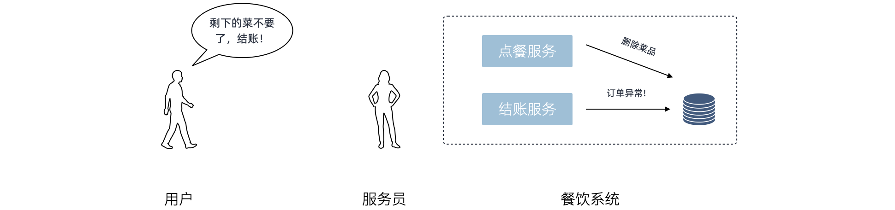
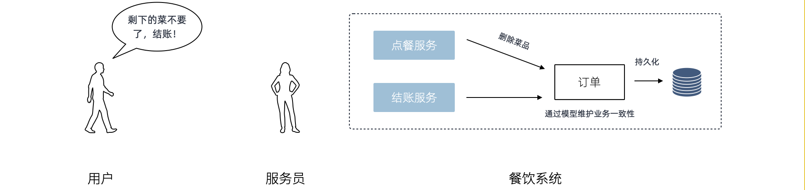
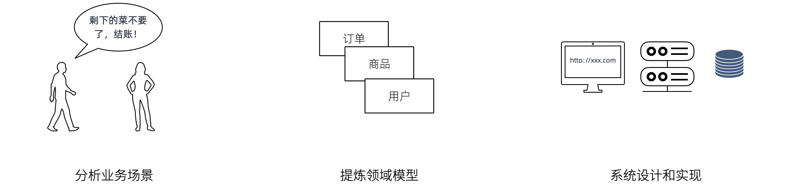
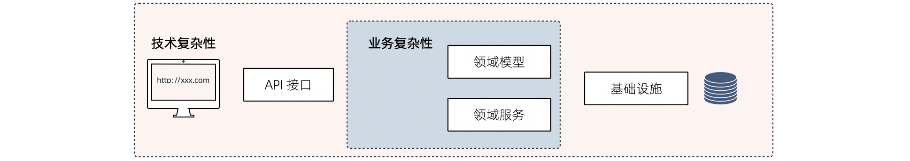
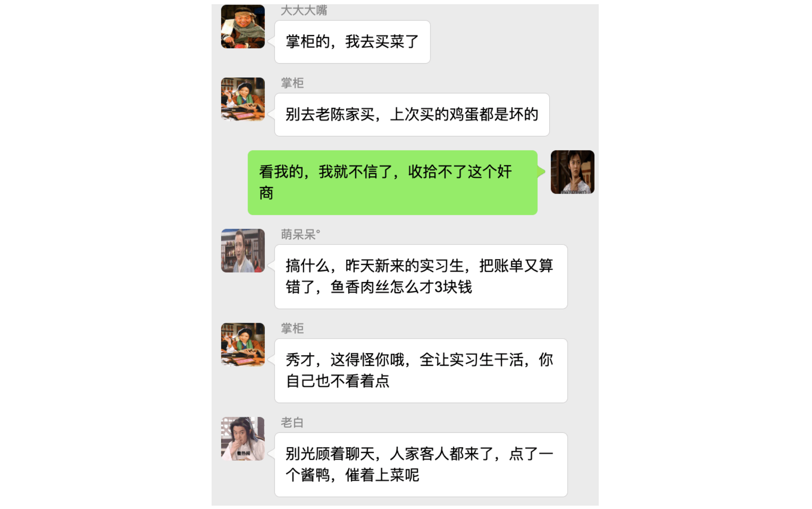
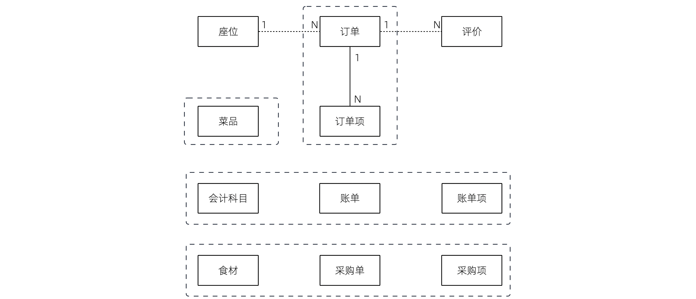
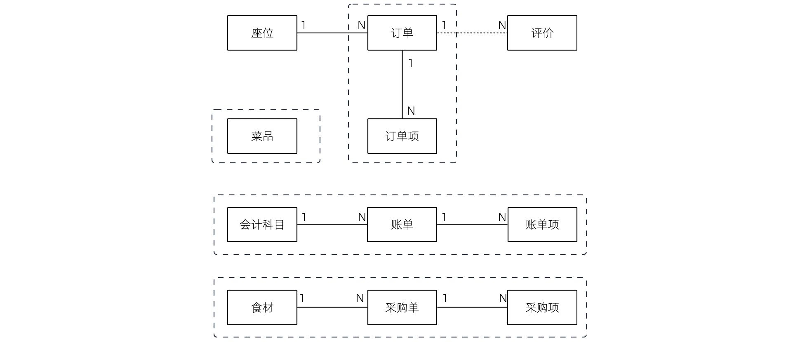
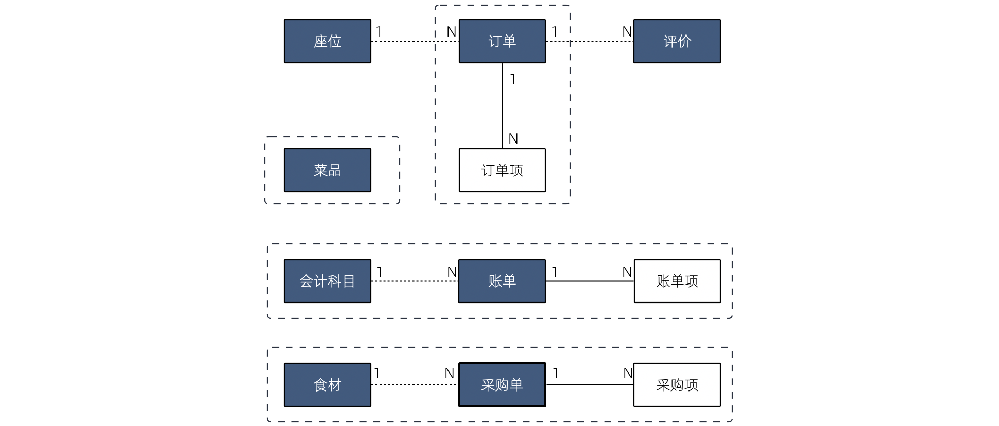
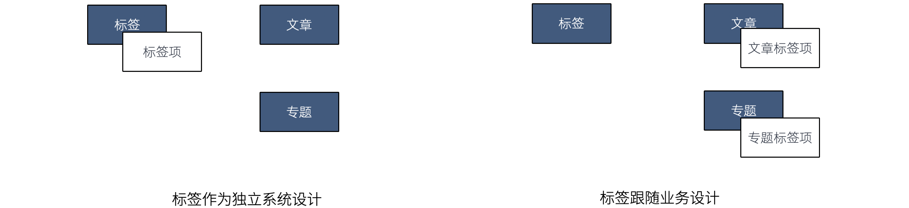

== 第 5 章 领域建模，设计软件的骨相

通过对软件业务模型的分析，对业务领域进行建模就能获得软件的逻辑结构。获得了软件的逻辑结构就能进一步指导服务划分、数据库设计、API 设计等技术实践。没有领域模型设计的软件，工程师往往会过多的关注到技术问题上，而忽视了产品设计和业务的目标。

这类软件特点是技术听起来都很高大上，但是就是不好用，或者没用。所以领域建模对于商业软件来说是非常重要的一环，也是工程师消化行业领域知识的重要方法。

=== 5.1 认识领域驱动设计

领域驱动设计（DDD）footnote:[参考图书：《领域驱动设计——软件核心复杂性应对之道》 https://book.douban.com/subject/26819666] 是 Eric Evans 提出的一种软件设计方法和思想，主要解决业务系统的设计和建模。DDD 有大量难以理解的概念，尤其是翻译的原因，某些词汇非常生涩，例如：模型、限界上下文、聚合、实体、值对象等。

实际上 DDD 的概念和逻辑本身并不复杂，很多概念和名词是为了解决一些特定的问题才引入的，并和面向对象思想兼容，可以说 DDD 也是面向对象思想中的一个子集。如果遵从奥卡姆剃刀的原则，“如无必要，勿增实体”，我们先把 DDD 这些概念丢开，从一个案例出发，在必要的时候将这些概念引入。

==== 从纸和笔思考 IT 系统的工作逻辑

让我真正对计算机软件和建模有了更深入的认识是在一家餐厅吃饭的时候。数年以前，我还在一家创业公司负责餐饮软件的服务器端的开发工作，因为工作的原因，外出就餐时常都会对餐厅的点餐系统仔细观察，以便于改进我们自己产品的设计。

一次偶然的情况，我们就餐的餐厅停电了，所幸是在白天，对我们的就餐并没有什么影响。我突然很好奇这家店，在收银系统无法工作的情况下怎么让业务继续运转，因此我饶有趣味的等待服务员来接受我们的点单。

故事的发展并没有超出预期，服务员拿了纸和笔，顺利的完成了点餐，并将复写纸复写的底单麻溜的撕下来交给了后厨。

我这时候才回过神来，*软件工程师并没有创造新的东西，只不过是数字世界的砖瓦工，计算机系统中合乎逻辑的过程，停电后人肉使用纸和笔一样合乎逻辑。*

合乎现实世界的逻辑和和规则，使用鼠标和键盘代替纸和笔，就是软件设计的基本逻辑。如果我们只是关注于对数据库的增、删、改、查（CRUD），实际上没有对业务进行正确的识别，这是导致代码组织混乱的根本原因。

会计、餐饮、购物、人员管理、仓储，这些都是各个领域实实在在发生的事情，分析业务逻辑，从中找出固定的模式，抽象成计算机系统中对象并存储。这就是 DDD 和面向对象思想中软件开发的一般过程。

你可能会想，我们平时不就是这样做的吗?

现实是，我们往往马上关注到数据库的设计上，想当然的设计出一些数据库表，然后着手于界面、网络请求、如何操作数据库上，业务逻辑被封装到一个叫做 Service 对象上或散落在其他地方，然后基于对数据的操作。

一般来说这种方法也没有大的问题，甚至工作的很好，Martin Fowler 将这种方法称作为事务脚本（Transaction Script）。还有其他的设计模式，将用户界面、业务逻辑、数据存储作为一个“模块”，可以实现用户拖拽就可以实现简单的编程，.net、VF曾经提供过这种设计模式，这种设计模式叫做 SMART UI。

这种模式有一些好处。

* 非常直观，开发人员学习完编程基础知识和数据库 CRUD 操作之后就可以开发。
* 效率高，能短时间完成应用开发。
* 模块之间非常独立。

麻烦在于，当业务复杂后，这种模式会带来一些问题。

虽然最终都是对数据库的修改，但是中间存在大量的业务逻辑，并没有得到良好的封装。客人退菜，并不是将订单中的菜品移除这么简单。需要将订单的总额重新计算，以及需要通知后厨尝试撤回在做的菜。

不长眼的新手程序员擅自修改数据片段，整体业务逻辑被破坏。这是因为并没有真正的一个 “订单” 的对象负责执行相关的业务逻辑，Service 上的一个方法直接就对数据库修改了，保持业务逻辑的完整，完全凭程序员对系统的了解。

我们在各个餐厅交流的时候，发现这并不是一个 IT 系统的问题。某些餐厅，所有的服务员都可以收银，即使用纸和笔，收银员划掉菜品没有更新小计，另外的服务员结账时会发生错误。于是餐厅，约定修改菜品必须更新订单总价。

我们吸收到这个业务逻辑到 IT 系统中来，并意识到系统中这里有一些隐藏的模型：

* 订单。
* 菜品。

我们决定，抽象出订单、菜品的对象，菜品不应该被直接修改，而是通过订单才能修改，无论任何情况，菜品的状态变化都通过订单来完成。

复杂系统的状态被清晰的定义出来了， Service 承担处理各个应用场景的差异，模型对象处理一致的业务逻辑。

在接触 Eric Evans 的 DDD 概念之前，我们没有找到这种开发模式的名字，暂时称作为 *朴素模型驱动开发*。

==== 模型和领域模型

从上面的例子中，模型是能够表达系统业务逻辑和状态的对象。

我们知道要想做好一个可持续维护的 IT 系统，实际上需要对业务进行充分的抽象，找出这些隐藏的模型，并搬到系统中来。如果发生在餐厅的所有事物，都要能在系统中找到对应的对象，那么这个系统的业务逻辑就非常完备。

现实世界中的业务逻辑，在 IT 系统业务分析时，适合某个行业和领域相关的，所以又叫做领域。

*领域，指的特定行业或者场景下的业务逻辑*。

*DDD 中的模型是指反应 IT 系统的业务逻辑和状态的对象，是从具体业务（领域）中提取出来的，因此又叫做领域模型*。

通过对实际业务出发，而非马上关注数据库、程序设计。通过识别出固定的模式，并将这些业务逻辑的承载者抽象到一个模型上。这个模型负责处理业务逻辑，并表达当前的系统状态。**这个过程就是领域驱动设计。**

我从这里面学到了什么呢？

我们做的计算机系统实际上，是替代了现实世界中的一些操作。按照面向对象设计的话，我们的系统是一个电子餐厅。现实餐厅中的实体，应该对应到我们的系统中去，用于承载业务，例如收银员、顾客、厨师、餐桌、菜品，这些虚拟的实体表达了系统的状态，在某种程度上就能指代系统，这就是模型，如果找到了这些元素，就很容易设计出软件。

后来，如果我什么业务逻辑想不清楚，我就会把电断掉，假装自己是服务员，用纸和笔走一遍业务流程。

分析业务，设计领域模型，编写代码。这就是领域驱动设计的基本过程。领域模型设计好后（领域模型就是一些 UML 类图），可以指导后续的工作：

* 指导数据库设计。
* 指导模块分包和代码设计。
* 指导 RESTful API 设计。
* 指导事务策略
* 指导权限。
* 指导微服务划分（有必要的情况）。

在我们之前的例子中，收银员需要负责处理收银的操作，同时表达这个餐厅有收银员这样的一个状态。收银员收到钱并记录到账本中，账本负责处理记录钱的业务逻辑，同时表达系统中有多少钱的状态。

==== 技术和业务复杂度

我们进行业务系统开发时，大多数人都会认同一个观点：将业务和模型设计清楚之后，开发起来会容易很多。

但是实际开发过程中，我们既要分析业务，也要处理一些技术细节，例如：如何响应表单提交、如何存储到数据库、事务该怎么处理等。

使用领域驱动设计还有一个好处，我们可以通过隔离这些技术细节，先进行业务逻辑建模，然后再完成技术实现，因为业务模型已经建立，技术细节无非就是响应用户操作和持久化模型。

我们可以把系统复杂的问题分为两类：

* 技术复杂度。软件设计中和技术实现相关的问题，例如处理用户输入，持久化模型，处理网络通信等。
* 业务复杂度。软件设计中和业务逻辑相关的问题，例如为订单添加商品，需要计算订单总价，应用折扣规则等。

当我们分析业务并建模时，不要关注技术实现，会带来极大的干扰。和上一章聊到的断电法理解业务一样，就是在这个过程把“电”断掉，技术复杂度中的用户交互想象成人工交谈，持久化想象成用纸和笔记录。

DDD 还强调，业务建模应该充分的和业务专家在一起，不应该只是实现软件的工程师自嗨。业务专家是一个虚拟的角色，有可能是一线业务人员、项目经理、或者软件工程师。

由于和业务专家一起完成建模，因此尽量不要选用非常专业的绘图的工具和使用技术语言。可以看出 DDD 只是一种建模思想，并没有规定使用的具体工具。我这里使用 PPT 的线条和形状，用 E-R 的方式表达领域模型，如果大家都很熟悉 UML 也是可以的。甚至实际工作中，我们大量使用便利贴和白板完成建模工作。

这个建模过程可以是技术人员和业务专家一起讨论出来，也可以是使用 “事件风暴” 这类工作坊的方式完成。这个过程非常重要，DDD 把这个过程称作 *协作设计*。通过这个过程，我们得到了领域模型（这里以简单的图表表示，也可以用 UML）。

image::05-domain-model/model-sample-v1.png[领域模型 v1,align="center",title="领域模型 v1"]

上图使我们通过业务分析得到的一个非常基本的领域模型，我们的点餐系统中，会有座位、订单、菜品、评价几个模型。一个座位可以由多个订单，每个订单可以有多个菜品和评价。同时，菜品也会被不同的订单使用。

==== 上下文、二义性、统一语言

我们用这个模型开发系统，使用领域模型驱动的方式开发，相对于事务脚本的方式，已经容易和清晰很多了，但还是有一些问题。

有一天，市场告诉我们，这个系统会有一个逻辑问题。就是系统中菜品被删除，订单也不能查看。在我们之前的认知里面，订单和菜品是一个多对多的关系，菜品都不存在了，这个订单还有什么用。

菜品，在这里存在了致命的二义性！！！这里的菜品实际上有两个含义：

* 在订单中，表达这个消费项的记录，也就是订单项。例如，5号桌消费的鱼香肉丝一份。
* 在菜品管理中，价格为30元的鱼香肉丝，包含菜单图片、文字描述，以及折扣信息。

菜品管理中的菜品下架后，不应该产生新的订单，同时也不应该对订单中的菜品造成任何影响。这些问题是因为，技术专家和业务专家的语言没有统一， DDD 认识到了这个问题，统一语言是实现良好的领域模型的前提，因此应该 “大声地建模”。我在参与这个过程目睹过大量有意义的争吵，正是这些争吵让领域模型变得原来越清晰。

这个过程叫做 *统一语言*。

和现实生活中一样，产生二义性的原因是我们的对话发生在不同的上下文中，我们在谈一个概念必须在确定的上下文中才有意义。在不同的场景下，即使使用的词汇相同，但是业务逻辑本质都是不同的。想象一下，发生在《武林外传》中同福客栈的几段对话。

这段对话中实际上有三个上下文，这里的 “菜” 这个词出现了三次，但是实际上业务含义完全不同。

* 大嘴说去买菜，这里的菜应该被理解为食材，如果掌柜对这个菜进行管理，应该具有采购者、名称、采购商家、采购价等属性。
* 秀才说实习生把账单中的菜算错了价格，秀才需要对账单进行管理，这里的菜应该指的账单科目，现实中一般是会计科目。
* 老白说的客人点了一个酱鸭，这里老白关注的是订单下面的订单项，订单项包含的属性有价格、数量、小计、折扣等信息。

实际上，还有一个隐藏的模型——上架中商品。掌柜需要添加菜品到菜单中，客人才能点，这个商品就是我们平时一般概念上的商品。

我们把语言再次统一，得到新的模型。

4个被虚线框起来的区域中，我们都可以使用 “菜品” 这个词汇（尽量不要这么做），但大家都明确 ”菜品“ 具有不同的含义。这个区域被叫做 *上下文*。当然上下文不只是由二义性决定的，还有可能是完全不相干的概念产生，例如订单和座位实际概念上并没有强烈的关联关系，我们在谈座位的时候完全在谈别的东西，所以座位也应该是单独的上下文。

识别上下文的边界是 DDD 中最难得一部分，同时上下文边界是由业务变化动态变化的，我们把识别出边界的上下文叫做**限界上下文（Bounded Context）**。限界上下文是一个非常有用的工具，限界上下文可以帮助我们识别出业务的边界，并做适当的拆分。

限界上下文的识别难以有一个明确的准则，上下文的边界非常模糊，需要有经验的工程师并充分讨论才能得到一个好的设计。同时需要注意，限界上下文的划分没有对错，只有是否合适。跨限界上下文之间模型的关联有本质的不同，我们用虚线标出，后面会聊到这种区别。

使用上下文之后，带来另外一个收获。模型之间本质上没有多对多关系，如果有，说明存在一个隐含的成员关系，这个关系没有被充分的分析出来，对后期的开发会造成非常大的困扰。

==== 聚合根、实体、值对象

上面的模型，尤其是解决二义性这个问题之后，已经能在实际开发中很好地使用了。不过还是会有一些问题没有解决，实际开发中，每种模型的身份可能不太一样，订单项必须依赖订单的存在而存在，如果能在领域模型图中体现出来就更好了。

举个例子来说，当我们删除订单时候，订单项应该一起删除，订单项的存在必须依赖于订单的存在。这样业务逻辑是一致的和完整的，游离的订单项对我们来说没有意义，除非有特殊的业务需求存在。

为了解决这个问题，对待模型就不再是一视同仁了。我们将那相关性极强的领域模型放到一起考虑，数据的一致性必须解决，同时生命周期也需要保持同步，我们把这个集合叫做**聚合**。

聚合中需要选择一个代表负责和全局通信，类似于一个部门的接口人，这样就能确保数据保持一致。我们把这个模型叫做**聚合根**，聚合根充当一组领域模型领航员的角色。当一个聚合业务足够简单时，聚合有可能只有一个模型组成，这个模型就是聚合根，常见的就是配置、日志相关的。

在聚合中，无论是否是聚合根，对于有自己的身份（ID）的模型，我们都可以叫做**实体**。

我们把这个图完善一下，聚合之间也是用虚线链接，为聚合根标上更深一点的颜色。识别聚合根需要一些技巧。

* 聚合根本质上也是实体，同属于领域模型，用于承载业务逻辑和系统状态。
* 实体的生命周期依附于聚合根，聚合根删除实体应该也需要被删除，保持系统一致性，避免游离的脏数据。
* 聚合根负责和其他聚合通信，因此聚合根往往具有一个全局唯一标识。例如，订单有订单 ID 和订单号，订单号为全局业务标识，订单 ID 为聚合内关联使用。聚合外使用订单号进行关联应用。

还有一类特殊的模型，这类模型只负责承载一组字段值的表达，没有自己的身份。在我们饭店的例子中，如果需要对账单支持多国货币，我们将纯数字的 `price` 字段修为 `Price` 类型。

[source,text]
----
public clsss Price(){
    private String unit;
    private BigDecimal value;

    public Price(String unit,BigDecimal value){
        this.unit = unit;
        this.value = value;
    }
}
----

价格这个模型，没有自己的生命周期，一旦被创建出来就无须修改，因为修改就改变了这个值本身。所以我们会给这类的对象一个构造方法，然后去除掉所有的 `setter` 方法。

我们把没有自己生命周期的模型，仅用来呈现多个字段的值的模型和对象，称作为**值对象**。

值对象一开始不是很容易理解，但是理解之后会让系统设计非常清晰。“地址” 是一个显著的值对象。当订单发货后，地址中的某一个属性不应该被单独修改，因为被修改之后这个“地址”就不再是刚刚那个“地址”，判断地址是否相同我们会使用它的具体值：省、市、地、街道等。

最简单的理解，值对象就是“属性包”，就是一些自己定义的通用拓展类型，持久化时展开到数据库表或者存为 JSON 字符串。

值对象是相对于实体而言的，对比如下。

|====
|实体 |值对象

|有 ID 标识 |无 ID 标识
|有自己的生命周期 |一经创建就不要修改
|可以对实体进行管理 |使用新的值对象替换
|使用 ID 进行相等性比较 |使用属性进行相等性比较
|====

另外值得一提的是，一个模型被作为值对象还是实体看待不是一成不变的，某些情况下需要作为实体设计，但是在另外的条件下却最好作为值对象设计。

地址，在一个大型系统充满了二义性。

* 作为订单中的收货地址时，无需进行管理，只需要表达街道、门牌号等信息，应该作为值对象设计。为了避免歧义，可以重新命名为收货地址。
* 作为系统地理位置信息管理的情况中具有自己的生命周期，应该作为实体设计，并重命名为系统地址。
* 作为用户添加的自定义地址，用户可以根据 ID 进行管理，应该作为实体，并重命名为用户地址。

我们使用浅色表达值对象以便区别于聚合根和实体，更新后的模型图如下：

image::05-domain-model/model-sample-v6.png[领域模型 v6,align="center",title="领域模型 v6"]

虽然我们使用 E-R 的方式描述模型和模型之间的关系，但是这个 E-R 图使用了颜色（如果是黑白印刷的纸质版可能看不到具体的颜色，可以自行体会即可）、虚线，已经和传统的 E-R 图大不相同，把这种图暂时叫做 *CE-R* 图（Classified Entity Relationship）。DDD 没有规定如何画图，你可以使用其他任何画图的方法表达领域模型，如果需要严谨一点可以采用 UML 的类图绘制（推荐使用 UML 绘制领域模型）。

=== 5.2 建模方法元模型

Eric DDD 中阐述了领域驱动设计的重要意义和一些基本实践，但是并没有给出一套具体的建模过程方法。这给架构师巨大发挥空间，各种建模方法就都可以拿来使用，比如事件风暴、 四色原型等建模过程方法。

于是有一些朋友会产生疑惑，这些建模方法背后的逻辑是什么呢，它们有没有什么共通之处？这里和大家一起探讨软件建模过程方法的基本逻辑，以及如何设计一套简单的建模过程。

目前进行领域建模方法使用的最多的是事件风暴。事件风暴 footnote:[Event storming 网站 https://www.eventstorming.com/] 的发明人是 Alberto Brandolini ，它来源于 Gamestorming，通过工作坊的方式将领域专家和技术专家拉到一起，进行建模。事件风暴非常有意思的地方在于，它先从事件开始分析，捕获事件。然后分析引发事件的行为和执行者，从这些信息中寻找领域模型，最终进一步展开。

Event Storming 的逻辑是什么？为什么需要先从事件开始分析？这是事件风暴工作坊中遇到过最多的问题。

我带着这些问题请教了很多专家，甚至发送了邮件给 Alberto Brandolini，有幸得到回复。根据 Alberto Brandolini 理解，他认为系统中事件是一种容易寻找到的元素，通过头脑风暴，容易打开局面，仅此而已。

带着同样的问题，分析了几种建模方法（为了减少争议避开了公司同事发明的建模方法）。

==== 系统词汇法（OOA）

系统词汇法就是面向对象分析方法。这种面向对象建模的方法比较原始和直接，直接通过经验提取领域模型，就是简单的面向对象分析方法。其操作过程简化如下：

. 首先，从需求陈述中找出所有的名词，将它们作为 “类—对象” 的初步候选者。去掉不正确和不必要的对象（不相关的、外部的和模糊的对象），做出合理地抽象。
. 为上一步的模型做出定义，构建数据字典，描述对象的范围、成员和使用场景。
. 聚合，把业务一致性强的对象聚合到一起。
. 使用合适的关联方式设计对象之间的关系。

系统词汇法建模的优点和缺点都比较明显。优点是没有过多的建模过程，对于简单的系统有经验的架构师马上就能观察出合适模型。相应的，缺点也很明确，没有对业务充分分析，直接得到模型，容易错误理解业务和过度设计模型。

==== 用例分析法

用例模型是一种需求分析模型，是需求分析后的一种输出物，通过对用例再加工可以得到我们的领域模型。1992 年, Jacobson 中提出了用例的概念和可视化的表示方法用例图。

[source]
----
用例（UseCase）是对一个活动者使用系统的一项功能时所进行的交互过程的一个文字描述。
----

用例由参与者、关系、用例三个基本元素构成，用例图的基本表示方法如下：

通过用例图来提取领域模型的方法如下：

. 梳理用例的用词，统一用例中所有的概念，避免混淆。
. 从用例中提取出名词，作为备选模型，这个时候不区分对象或者属性。
. 找动词，通过动词和用例关系分析模型之间的关联关系，比如：用户结账用例，会触发累积积分的用例，说明用户账户和积分有关联。
. 对名词进行抽象、展开，把用例中作为属性的名词归纳到对象中，补充为完整模型。

因为用例图是从不同的参与者出发的，非常适合表达表达业务行为，可以避免错误的复用。在很长一段时间你，很多软件架构师对的模型的建立都依赖用例图。用例分析法的特点是不容易漏，缺点是由于名词的二义性，往往会设计出一些过度复用的模型。

==== 四色建模法

四色建模法的思路和用例略有不同，它的理念是:

[source]
----
“任何业务事件都会以某种数据的形式留下足迹”。
----

四色建模法其实是以数据驱动，通过挑选一些关键数据（类似于办事过程中的存根），来还原整个业务流程。然后基于这个线索，找出时标性对象（moment-interval）、实体（party/place/thing）、角色（Role）、描述对象（description）。

. 以满足业务运营的需要为原则，寻找需要追溯的业务事件。
. 基于这些业务事件发生的的存根，建立时标性对象，比如订单 → 发货单 → 提货单等。
. 基于时标性对象反推相应的实体，比如订单 → 商品，发货单 → 货物和发货员。
. 最后把描述的信息放入描述对象，附着在需要补充的对象上。
. 梳理为最终的模型。

四色建模法由 Peter Coad 提出，其实并不是一种非常主流的建模方式，其原因为存根和时标性对象在很多业务系统中并不容易找到。

==== 事件风暴

事件风暴相对其他的建模方法非常独特，所以放到最后来说，但是简单来说，它的思路是：

[source]
----
“事件是系统状态变化的关键帧”。
----

事件是比较容易找到的，它的建模过程有点逆向思维。

. 寻找事件。事件（Event）是系统状态发生的某种客观现象，事件格式参考 “XXX 已 YYY”，比如 “订单已创建”。
. 寻找命令和执行者。命令可以类比于 UML 分析中的业务用例，是某个场景中领域事件的触发动作，执行者是命令的发生者。
. 寻找模型。为了在这个阶段保持和业务专家的良好沟通，寻找 “领域名词” 。
. 设计聚合。对领域名词进行建模，获得模型的组合、关系等信息。
. 划分限界上下文。对模型进行划分，在战略上将模型分为多个上下文。

事件风暴在获得模型的深刻性上具有优势，但是在操作上更为困难。另外由于它不从用例出发，和四色建模一样，可能有一些遗漏，所以对工作坊的主持人要求较高。

==== 元模型

元模型是关于模型的模型，我们可以为建模方法建立一个模型。在计算机领域中，研究元模型的资料和书籍较少，因为涉及到更高的抽象层次，理解起来比较困难。在有限能查到的资料中，《本体元建模理论与方法及其应用》一书介绍了如何建立软件建模的元模型。

通过对这些建模方法进行分析，发现他们有一些共同特点。都是围绕着参与者、行为、事件、名词这几个元素展开的，通过对这些方法的总结，我们可以尝试建立一个简单的建模方法元模型，为建模方法的改进提供依据。

其实，面向对象中的模型是现实世界在计算机系统中的一种比喻，类似的比喻还有函数式等其他编程范式。对于现实世界的分析，我们可以使用认识论建立一个非常简单的模型。

[source]
----
主体 + 行为 + 客体 = 现象

主体：主体是有认识能力和实践能力的人，或者，是在社会实践中认识世界、改造世界的人。
客体：客体是实践和认识活动所指向的对象，是存在于主体之外的客观事物。
----

在认识论中，每一个客观现象的出现，都可以使用主体、客体来分析。找到导致这个客观现象的行为背后的主体、客体，就能清晰地描述事件，也更容易看到问题的本质。从认识论的角度出发，建模的过程就是找到确定的客体作为模型的过程。

基于元模型把 4 种建模方法实例化一下：

|====
| |系统词汇法（OOA） |用例分析法 |四色建模法 |事件风暴
| 主体 | - | 参与者 | 角色 | 执行者
| 行为 | - | 用例关系 | - | 命令
| 客体 | 名词，模型 | 名词，模型 | 时标性对象、实体、描述对象 | 领域名词、模型
| 现象 | - | - | 业务事件 | 事件
|====

从这个图我们可以看出，系统词汇法的建模线索不够清晰，直接获得模型，没有从业务行为中抽取的过程。而事件风暴可以这样理解：

*执行者作为业务主体，在系统中发出了一个命令作为业务行为，对模型的状态发生了改变，最终导致了事件的发生。* 事件风暴是从事件、命令和执行者为线索推导出模型，整个过程更加完整。

==== 为特定领域调整建模过程

在识别模型的过程中，模型这个词太过于宽泛，因此不适用于业务专家找到这些模型。于是有咨询师认为不应过早强调模型，建议先使用 “领域名词”、“业务概念” 等和业务相关的概念，甚至可以直接使用 “合约”、“单据” 这类和行业相关的词汇。

因此，在和业务专家的交流时候，我们可以换成和当前业务相关的词汇系统。不仅可以让建模方法发挥更好的作用，还可以为客户定制一套建模方案。

我们以事件风暴为蓝本，针对餐饮行业设计一个特有的建模法，姑且我把它叫做 Cake Flow。餐饮行业的过程中，围绕大量的单据展开，这些单据的本质是业务凭证。业务凭证意味着业务中各个参与者的责任转移，所以我们可以寻找模型的阶段调整为 “寻找业务凭证”。

我们依然可以使用事件风暴的结构：

. 寻找事件。这些事件的线索是业务凭据被改变或者转移。
. 寻找命令。找出那些业务参与者发生了什么行为修改业务凭证、生成了新的凭证。
. 寻找业务凭证。比如：菜单，是餐厅能提供产品的凭证；桌位，是接待客人的凭证；订单，是一次产品供应的凭证；出餐小票，是后厨生产的凭证；发票，是交税的凭证。

在建模的过程中，先不引入计算机中的技术概念，通过走访餐厅、收集它们的单据、调研优秀餐饮公司的工作流。避免需求叙述过程中制造的新概念、重新命名的业务名词，根据奥卡姆剃刀的原则，减少 “伪需求”的产生。

同样的，架构师需要意识到为特定领域调整建模方法的局限性，只有在特定的范围内才能发挥作用，如果把 “合约”、“业务凭证” 这类词汇系统带入其他行业，会让业务专家更加迷惑。

==== 设计自己的建模方法

根据元模型，选取一个建模视角（从主体、行为、客体和现象选择），可以轻松的设计一个适合自己的建模方法。Cake Flow 的结构还是先从事件出发，那么我们这次选择另外一个视角出发会有什么好玩的事情发生呢？

比较少地建模方法从主体出发，这次我们选择从主体出发，先找出业务的参与者，通过角色扮演的方式建模，我把这个方法叫做 *“Play 建模法”。* footnote:[有意思的是，这种建模方法并非空穴来风，的确有一种使用卡片进行角色扮演的建模方法。] 这次的建模方法的流程完全不同于 Event Storming 的结构，而且更为有趣。

. 寻找业务参与者。将业务的参与者全部找出来，在工作坊中找到熟悉该角色工作内容的人扮演。如果让工作坊更为有趣，可以用 A4 纸跌一个帽子，写上该角色的名字。
. 每个业务参与者需要有两个人来扮演，一个人扮演按照正常操作者，另外一个人扮演异常操作者。
. 选择一个场景开始，正常操作者在墙上用便利贴逐步写上该角色工作过程中的行为，这些行为需要产生业务凭证。异常操作者需要寻找任何可以退出、停止的行为触发异常流程。
. 扮演做够多的场景，从这些行为中提取业务凭证。如果异常操作者发现流程漏洞，需要梳理合适的分支流程。
. 对业务凭证进行细化、展开得到领域模型。
. 回顾扮演者的职责转移，业务凭证的转移往往意味着上下文的切换。比如，订单生成后，需要分解为不同后厨的出餐单，凉菜、中餐、甜品在后厨由不同的厨师完成，订单和出餐单发生了业务凭证的转移。

Play 建模法有几个特点。有明确的职责转移，容易找出上下文；角色扮演的方式比较真实和有代入感，避免单纯的业务叙述带来误解；异常操作者可以用来提前发现流程中问题，让流程更加完善。

当然，Play 建模法只是通过元模型设计出来的一个例子，在实战中需要继续打磨。根据元模型，我们可以根据一些特殊的场景设计出合适地建模方法，更进一步可以为客户设计专属的建模方法。

=== 5.3 多对多关系主客体分析

多对多关系是软件建模中比较的麻烦的场景，如果梳理不清楚对软件架构伤害很大。在不久前的一个项目中，十足的体验了一次多对多关系带来的痛苦。

我们的项目有是一种多空间模型，也就是用户可以处于不同的空间，在不同的空间中可以访问空间中的资源。一个空间可以拥有多个用户，用户可以出现在多个空间中。看起来和编程老师在数据库课程中的多对多关系没有区别。

image::05-domain-model/many-to-many-problem-1.png[多对多关系,align="center",title="多对多关系"]

对于数据库来说，多对多关系需要一个中间表，一般会使用类似 workspace_user_relation 的名称。假如不对这个中间模型进一步分析，可能会得到 E-R 模型如下。

团队使用了 JPA 的 @ManyToMany 注解，导致 workspace 和 user 两个对象无时不刻在一起了。另外，通过 user 可以操作 workspace，通过 workspace 也可以获得 user。

这种设计，不仅在技术上实现困难，对业务的支持也不足。

. 用户加入到空间中具有权限，通过这种方式比较难管理。
. 空间管理员并没有对用户的修改权利，只有对用户加入、退出、访问空间资源的权利，这种设计诱导了业务提出不合理的需求。比如空间管理员对用户的禁用，其实只是对用户参与到空间中的行为禁用，而非对用户禁用。
. 关系表中的创建时间的含义是用户加入空间的时间，使用中间表语义不明显。

==== 隐藏的客体

在很多编程指南和规范中，都有写明不允许使用多对多关系。在一些框架中，虽然实现了多对多关系，但是往往不推荐使用。

因为我们在开始学习编程的阶段中，接受了数据库的关系理论。数据库关系理论是 1969 被英国计算机科学家 Edgar Frank "Ted" Codd 首次提出。关系数据库理论继承了集合论的的思想，在处理数据上有独特优势，被广泛使用。关系数据库理论可以做到降低冗余，提高一致性的能力。

关系模型被用来存储数据、处理数据非常好用。但是，面向对象作为一种流行的编程模型，它是用来模拟现实业务的。面向对象构想的信息结构是树形，而关系模型是集合。

它们有一个天然的鸿沟，就是这两种结构如何转化的问题，因此出现了大量 ORM（对象关系映射） 软件来试图解决这个问题。数据库中的普通关系（一对一、一对多）可以使用面向对象中的 “组合” 来映射，但是多对多关系却极难被处理，这也是一些框架不建议使用的原因，但往往难以说明其中的道理。

其中的道理是什么呢？因为，关系模型中的多对多“关系”，映射到面向对象在本质是一个“隐藏的模型”。

我们用认识论中的主体-客体思维来看待这个问题，主体-客体可以让认识问题变得更深入。主体是有认识能力和实践能力的人，或者，是在社会实践中认识世界、改造世界的人。客体是实践和认识活动所指向的对象，是存在于主体之外的客观事物。在业务系统中，我们可以把 Controller、Service 这类带有行为能力的对象看做拟人化的主体，而 Entity、Model 看做客体。

回到上面的例子，对于工作空间、用户而言，当把用户加入工作空间的时候。我们发生三步行为：

. 使用了用户信息、工作空间的信息，这一步用户、工作空间都是被感知的客体。
. 创建了一个关系“工作空间-用户”，这一步“工作空间-用户”是客体。
. 把这个关系加入到工作空间，扩充了工作空间的信息，这一步工作空间是客体。

问题的关键是我们往往没有找到一个好的名词来描述“工作空间-用户”这个概念，一旦这个概念被明确下来，我们的模型就清晰了，多对多关系就不存在了。

举例来说，我么可以给“工作空间-用户”找到如下的名字：

. 空间成员
. 参与者
. 空间用户

真真实的例子中，我们使用了空间成员来作为这个隐藏模型的名字，因此空间和用户的关系被拆解为 “空间拥有多个成员” 和 “成员可以引用用户” 两个关系。

image::05-domain-model/many-to-many-problem-3.png[确定的中间模型,align="center",title="确定的中间模型"]

==== 另外一个例子

大部分的多对多关系都可以通过这种方法消除，不过，除了起名字这个难题外，还有另一个问题。

多出来的这个隐藏模型和谁走？我们使用一个例子来说明这个问题。

在很多系统中，我们都需要使用 “标签”，而标签和特定的资源都是多对多关系。明白上面说的逻辑后，我们把标签存在于某个资源中的关系叫做 “标签项”。但是，如果同时有多个资源都需要使用便签，标签项跟谁走呢？

如果所有类型的标签都跟着标签走的话，可以做出一种通用的标签系统。其结果类似于搜索系统了，通过标签系统处理所有的业务。这样设计会使聚合搜索带来便利，但是标签在具体业务中的使用变的困难。

如果标签跟随具体的业务走，那么隐藏的中间模型就是具体的业务中的一个概念，比如文章专题中的标签、文章中的标签。通过这样的处理，可以让系统解耦良好。不过，代价是聚合搜索能力需要额外的技术来实现。

这个例子充分说明了模型的建立需要为业务服务，业务人员往往需要明确其业务重心，并做出一些权衡和取舍才能设计出合适的模型。

=== 5.4 领域建模的原则

如果团队和系统的规模不大，可以根据一两个人的经验设计出足够合适的模型。但是，当团队规模非常大、系统极其复杂的时，我们就需要制定一些原则来评审、检查各个各个团队产出的模型是否合适。

这些原则也许不能指导所有的场景，但是能在一定范围内做出约束。年轻的工程师总是喜欢自由，经过历练的工程师开始理解到约束的好处，想法也变得成熟。

我收集了一些社区讨论的观点，这里整理了一些 DDD 战术建模中的一些原则，作为软件领域建模中的基本要求。

*1. 当一个【实体】被多个聚合根使用时，需要将其设计为【聚合根】或者将其拆开，不能再作为实体使用。*

如果我们将聚合理解为系统中业务一致性、生命周期相对独立的一组实体，可以作为系统设计的基本单位，那么，一旦出现被多个聚合共享的实体，聚合就不再有意义了。

当两个聚合中出现了相同、相似的实体，有时候我们可能想要减少实体的数量，于是有了将其合并在一起的想法。比如，在分销系统中，销售和退货由两个不同模型实现，但是它们有类似的操作记录。如果将操作记录作为实体，但是处于不同的两个聚合，就会让这两个聚合耦合，让开发人员在开发时摸不着头脑。

类似的，在不同的业务场景中都会使用到附件，如果将附件作为实体存在，会造成混乱，与其这样不如直接设定一个原则，不允许出现共享实体的聚合。

*2. 不允许使用【中间表】处理多对多关系，探明多对多原因，明确中间模型的归属。*

多对多关系是领域建模的杀手，但在有些地方缺会是消除系统耦合的钥匙。

一个多空间系统，用户可以出现在不同的空间下，空间也可以容纳多个用户。看似是一个典型的多对多关系，我们大多数情况下会使用简单的中间表处理。

使用中间表往往意味着没有创建时间、状态等额外字段了。但是我们仔细一分析会发现，这个中间表的创建时间就是用户加入空间的时间，也就是说它是具有业务含义的，只不过被我们疏忽了。

当出现禁用空间下的用户业务时，只是删除中间表无法表达合适的业务需要，于是我们可以在中间表加上状态以满足业务需求。随着业务的丰满，中间模型就会显露出来，慢慢体现其重要意义。

多对多关系的存在，让我们无法建立合适的聚合。也就是说，无法将中间模型的归属问题明确下来。查询空间时，可以获得用户列表，同样的查询用户时，也可以获得空间列表。

那么，是用户拥有空间，还是空间拥有用户呢？

这就变得混沌，我们明确中间的模型为“成员”，明确空间拥有“成员”。当需要根据用户查询所属空间时，本质上是根据用户在空间下的成员信息来筛选空间。

当然，中间模型可能会归属到任何一边，这就需要架构师来拿捏和设计了，但是重要的是，中间模型的归属问题需要尽早的明确下来。

*3. 区分【关联】和【拥有】，避免将本应该关联的模型设计到聚合之下，否则聚合非常大。*

本条原则可以避免聚合设计过大，也可以避免不合适的生命周期。

以银行信用卡开户流程来说，代入到具体场景，银行账户是一个核心的模型，可以构成一个聚合。相关的，在开户时，会提交一个开户申请，银行的工作人员会对信息做出审核，完成审核后进行开户。

一个不佳的设计是，账户不能将开户申请纳入聚合中，因为申请的生命周期和账户并没有关系。开户申请和账户之间可以存在关联，但是不应该具有拥有关系。

*4. 领域模型和数据库保持一致。*

本条原则约束了领域模型落地实现的处理方式。

在理想的情况下，领域模型、数据库、API 都能体现系统状态（RESTful 叫做表征状态转移）的变化，如果能一一对应能让系统的复杂性降低，换个时髦的说法是让“熵”足够低。

有时候，我们会偷懒，想要将不同的模型持久化到同一张数据库表中，节省数据库设计。但是，这种差异造成了团队认知负载。如果没有必要，不建议这样操作。

*5. 聚合的层级保持在 2 级，最多不超过 3 级。*

这条原则非常好理解，层级过会带来落地上的巨大成本。

聚合的大小是领域模型设计中非常难取舍的地方。过大的聚合持久化，更新操作都不好处理；过小的聚合业务一致性得不到保证。

根据经验，2-3 层的聚合已经能满足大部分场景，如果超过 3 级，考虑将部分模型进行分解。

*6. 事实数据快照化。*

这条原则往往容易被初级的工程师忽略，但是非常重要。

根据范式理论，如果想做到很高的一致性，就不应该冗余过多的数据，这是大学数据库课程的基本内容。但是现实情况不能一概而论，对于重要的交易业务来说，完成业务后不会再更新，不存在一致性要求，反而是应该锁定交易时发生的关键数据。

这是因为一些事实数据本质上是业务合同。举个例子来说，合同的甲方乙方会记录下身份证号码、以及名字，即使当事人去派出所变更了姓名，也不会影响到合同中的主体。

*7. 核心交易，设计交易流水或日志，用于审计。*

接上一条原则，交易发生后，可能会对一些账户、库存、积分等信息进行变更，需要意识到为这些重要的信息记录流水、操作记录或者日志。

这是因为大部分信息系统都有商业契约性质，为了保护用户利益，需要在系统中留下足够的痕迹，避免未来“扯皮”，在纠纷发生时能提供证据。

*8. 抽象类核心模型，提供拓展策略。*

如果我们将一类相似的模型抽象统一后，注意设计良好的拓展策略，避免抽象后的模型无法支持拓展。

每位工程师都应该听过编程中追求复用的原则，但是并非所有的工程师认识到策复用和抽象带来的制约。当抽象发生时，意味着放弃了一些个性化的数据和行为，被抽象的模型在以后的命运中被绑定到一起。

如果我们想清楚了需要将一组抽象到一起，应该通过“不变点”找到共性，然后通过各种设计模式（例如，适配器模式，策略模式）为“变化点”提供拓展。

举个例子来说，餐饮领域中外卖、堂吃是两种不同的订单，外卖具有送货信息，堂吃具有座位信息。如果我们将两种订单抽象为一起，设计了订单模型，这是合理的，因为订单是“不变点”，和金额、结账、支付有关。

对于送货信息、座位信息可以使用适配器模式隔离出来作为独立的聚合并关联订单，避免订单上挂载送货信息、座位信息这类和场景相关的信息。

*9. 当业务变化时，分而治之；当业务稳定后，抽象统一。*

接上一条原则，如果在是否将相似模型抽象到一起而犹豫时，说明没有足够的信息输入，以至于缺乏信心。

抽象的模型是通过归纳产生的，如果没有信息做出归纳，可以优先分而治之，待业务明确后再重构为统一的方式。

*10. 让合适的人做合适的决策，并做好决策记录，为后续决策提供背景信息。*

最后一条是写给架构师的原则。

如果一个团队存在专门的架构师，而且团队又非常庞大时，架构师无法获得完整、足够细致的信息，需要承认无法在任何场景下做出合理的决策。

架构师应该只关注系统核心的模型，以及划定上下文边界附近的模型归属，确保系统作为一个有机的整体。而对于系统某个角落的模型设计应该交给具体的开发人员来决定，记得做好决策记录就行。因为架构师认识到什么重要，什么不重要比事无巨细的决策更有意义。

=== 5.5 总结

对于领域模型而言，我们是站在结构而非流程的视角上的。我们就不应该把流程、行为赋予领域模型。如果我们在设计一台机器，工件可以看做一个聚合。工件可以被用到各个地方才具有相应的能力和用途。

需要时刻重考的是，领域模型表达的是软件的逻辑结构。沿用工件的例子，一颗螺丝可以被用到婴儿车上，也可以被用到起重机上。但是有些工件却是某个特定机器的零件，虽然它并没有特定的功能，但是有经验的老师傅一眼就能看到它可以被用到那些机器上，并提供某种特定的功能。

大部分情况下，领域模型就是数据库表在代码中类的体现，所以不是特别赞同为了"干净"将领域模型和映射数据库的类分开，大部分情况下领域模型（代码中）就是数据库表（数据库中）的映射。
