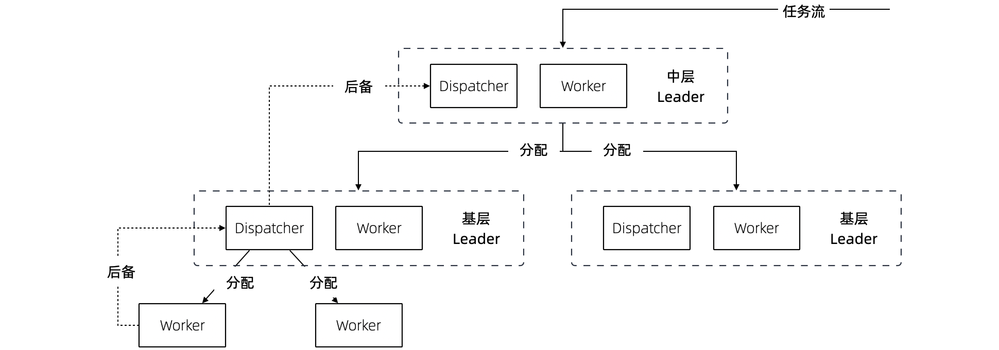
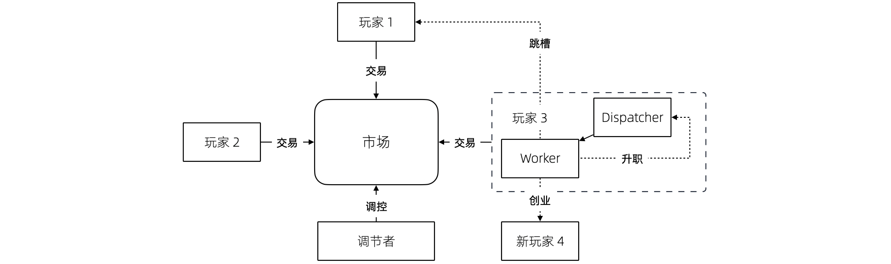

== 第 7 章 把软件团队也看做系统

团队管理是一件非常困难的事情，尤其是在认知能力强的群体中尤其如此（和直觉相悖，认知能力越强的团队越不好管理）。历史告诉我们，缺乏组织的人类群体没有任何战斗力，且在社会化生产的过程中效率非常低下。

在一些公司中，管理问题时时刻刻存在，要么靠管理者的本能管理，要么就是管理混乱，或者是靠经验性的管理框架来进行管理。在 IT 团队中这种现象尤其比较明显，因为往往技术管理者更关注技术本身而非管理。

有意思的是，管理能不能也用 “技术的语言”来表述呢？其实是可以的，作为一个分布式系统的爱好者，慢慢发现分布式系统和团队管理有一些共通之处，能用这些发现解决一些问题。这些问题对于管理者和团队成员都有一些启示，希望您能耐心的看下去。

=== 7.1 团队管理和分布式系统

团队管理是社会学讨论的问题，分布式系统是计算机中的概念。它们能有什么关系呢？在开始写作前，我在和同事聊到这部分内容的想法，同事笑道：你这个想法非常有意思，但是你可能只是强行将它们联系到一起。

这两个概念甚至都不在一个学科，一个是文科，而一个算工科的内容。但是，世界是非常有意思的，跨学科的碰撞往往能发挥意想不到的作用（以后还会有类似的跨学科联系的文章）。

查理·芒格一生都在不停强调跨学科思维的重要性，在他的模型中，数学、物理、生物、化学、哲学、社会学、心理学等领域都会被突然联系到一起。例如，大家以为的投资是经济学话题，其实是一个社会学或心理学问题 —— 当身边的人开始向你推荐股票，牛市就结束了。

在《分布式计算——原理、算法与系统》footnote:[参考图书: 《分布式计算——原理，算法与系统》https://book.douban.com/subject/10785422] 这本书的开篇提到，“分布式系统是一组相互独立的实体构成的集合，这些实体相互协作可以解决任何单独的实体所不能解决的问题”。作者认为，分布式系统在宇宙之初就存在了，从蜂群、微生物系统、甚至由人体细胞构成的各种系统，这些都是分布式系统。

*团队是一个能独立承担一定功能和职责的人类群体，那么也应该是一个分布式系统，符合分布式系统的一些基本理论。这是这篇文章的基本前提。*

接下来我们会聊到分布式系统的两种模型，分别代表两种典型的团队形态，也代表不同的计算模型：

. 主从调度模型。在微观状态适用，当团队人数不多，能被直接调度到，可以看做微观团队系统。
. 反馈调节（市场）模型。在宏观状态下适用，当团队规模大到不可能被直接管理的时候，只能通过宏观调节机制来做宏观调控。

大部分情况下，我们不会用到反馈调节模型，但是当我们仔细观察和分析大型企业的工作机制时，就能发现端倪。这部分的内容，这里不过多讨论。

=== 7.2 主从调度模型

==== 7.2.1 基本模型

让我们先看下主从调度模型的基本形态是什么样的，它能指导我们加深对团队的认识吗？这种系统由两个主要的角色构成：Dispatcher 和 Worker，这是主从调度模型的基本逻辑。

回顾一下计算机系统中的这两个角色。基于负载均衡地无状态服务集群，负载均衡器充当了 Dispatcher 的角色，普通的服务器充当了 Worker 的角色；基于主从的 CI 构建系统 Jenkins，它的 Master 节点就是 Dispatcher 角色，负责处理任务调度，Slave 节点用于执行任务构建。

在这种模型下，我们发现如果 Master 节点用来跑具体的任务，会挤压它的调度能力， Master 节点崩溃整个系统也不可用了。

我们回归到团队管理中来，一个团队的 Leader 如果每天关注在自己具体的工作上，让 Worker 角色的工作挤占了 Dispatcher 角色的工作，整个团队会开始混乱。在好的情况下，团队中会有其他成员自发地弥补这部分工作，就有点类似于人体被切除某些器官后发生的代偿行为。然而，团队并不总是有这么好的运气，如果没有人来承担 Dispatcher 的工作时，整个系统就陷入混乱。

所以我们需要将模型做一些简单的修正，一名 Leader 不仅需要作为 Dispatcher 的角色还需要作为 Worker 完成某些具体的任务。这也更反应现实，一名技术经理不仅需要分配工作或者任务，往往还需要完成一部分的开发工作。

承担一定的 Worker 职责是有好处的，如果不熟悉具体的工作是什么很难真正的承担 Dispatcher 的职责，分解的任务不具备可执行。

在基本模型中，也可以找到 Dispatcher 和 Worker 的主客体关系，这样更能辨明他们的职责关系。

对于 Dispatcher 来说，主体是他自己，客体是被调度的 Worker 以及调度工作；对于 Worker 来说，主体是 Worker 自己，但是客体是具体业务工作。

==== 7.2.2 多层模型

在主从模型中，Dispatcher 带动的 Worker 的能力是有限的，因此为了让系统规模能进一步扩大，多级主从模型就是有必要的了。

根据经验，IT 团队由于工作性质的原因直接管理的人数最多能到 10 人左右，也就是常常说的两个披萨就能吃饱的团队规模，如果人数再多就需要增加系统层级通过间接管理的方式进行管理。

间接管理就形成了多层调度模型，也会产生中间节点。中间节点在上层的的角色就是 Worker，在下层就是 Dispatcher。

在多层模型中，我们可以将系统看做一个由多个子系统符合的系统。为了度量系统的健康状态，需要引入两个概念：

. 团队宽度。一个团队的宽度是指每层能够直接调度到的最大节点数量。对于不同的 Dispatcher 由于工作性质和能力不同直接调度的数量可能不同。所以团队宽度又可以分为最大宽度、最小宽度、平均宽度。
. 团队深度。一个团队的深度是指信息从团队顶层节点传递到最终端节点的层数。信息在传递的过程是会失真、变形，这也是为什么越来越多的公司追求扁平化（扁平化也不等于就是好）的原因。和团队宽度类似，每一个终端节点向上的路径深度也不一样，也可以分为最大深度、最小深度、平均深度。

通过这些概念我们可以建立起一些指标，定量的管理方式。

==== 7.2.3 摩擦的成因

当我们认识到团队满足这样一个基本模型后，可以通过模型识别到团队管理中的问题，也就能针对性的优化团队管理，将有问题的团队带出泥潭。

==== 无领导小组

这种情况发生在私人关系非常好的团队，领导交给几个平级的团队成员一些任务，但是没有经过任务拆分，且没有说明谁为这件事负责。

有时候这种场景是刻意为之，比如在应届生招聘时，会通过群体面试的方式设计无领导小组进行面试。目的是，通过竞争、选举、冲突寻找具有领导能力的潜在调度者。

==== 多任务流团队

主从调度模型中，当一个 Dispatcher 的能力不能满足团队需要时，能否增加多个 Dispatcher？

答案否定的，在分布式系统中，避免这样的模型：多个承担有 Worker 角色的 Dispatcher 构成系统，它会带来状态的一致性问题。在团队管理中，Dispatcher 的负载不会太大，但是需要保证一致性。在一个团队中出现 2 个 PM 会是一个灾难，然而这种场景在各个公司反复上演。

这种情况发生在团队出现 2 个事实调度者，当执行者需要接收多个调度者的任务时，会发生下面问题:

. 任务逻辑矛盾。
. 任务计划被打乱。
. 超出正常工作时间能消化的工作量。

==== 跨级指挥

跨级指挥和多调度者类似，对于执行者而言，无法区分那些任务优先级更高。同时，跨级指挥造成执行者的直接领导者的计划受到影响，对团队的效率产生影响。

跨级指挥的出现在中间层指挥体系失效的情况。

==== 无上升通道的团队

在这种团队中，即使工作时间非常久也无法从执行者成为调度者。无上升通道的团队是一个僵化的团队，意味着团队规模和业务没有增长，也没有足够的人员流动。

在这种团队中执行者和调度者都没有足够的主观能动性。

另外一种情况造成无上升通道问题的原因是，高层对团队彻底失去信心，决定从外部或者其他团队空降 Dispatcher 从而对抱有升职的现有团队成员造成打击。

==== “傀儡”Leader

在这种团队中，看似团队具有良好的结构，实际上 Leader 如果因为某些原因没有起到调度者的作用，也会让团队的任务传递出现问题。

和无领导小组不同的是，团队中存在名义上的调度者，阻挡了其他成员补齐这个位置的动力。但民间自发出现调度者时，会造成民间调度者和名义上调度者之间的冲突。

image::07-think-team-in-system/friction-puppet-leader.png[摩擦-傀儡 Leader,align="center",title="摩擦-傀儡 Leader"]

==== 激励失效

激励不仅仅是金钱，还包括很多内容。如果激励出现问题，无法传递、或者不合适的传递到团队成员，会造成严重的问题。

在多级的团队系统中，每一层都需要存在相应的激励。激励体系需要建立一个正反馈，符合“劳者多得”而不是“能者多劳”的局面。

==== 反馈失灵

这类团队高层无法知道基层的运行情况，无法做出合理的决策，盲目下发政策，造成基层工作无法展开。

反馈失灵虽然不会短期影响团队运行状态，但是系统会持续性恶化。

image::07-think-team-in-system/friction-blocked-feedback.png[摩擦-反馈失灵,align="center",title="摩擦-反馈失灵"]

==== 7.2.4 主从调度模型的特点和局限性

主从调度模型具有一些明显的特点，当然在不同的场景下具有一些局限性，当我们了解到局限性带来的相关影响时，就需要做出干预和修正，让系统回归到正常状态。

==== 系统的状态

主从调度模型是有明显的状态的，系统的调度状态在 Dispatcher 上，如果 Dispatcher 上的调度信息丢失，可能会造成系统的任务调度混乱。

这时很多人可能会说，在微服务系统中，我们的业务服务是没有状态的，是谁来调度的呢？无状态并不是真的无状态，而是状态被隔离了。例如，负载均衡器-服务器-数据库模型中，状态被隔离到负载均衡器、数据库中，服务器可以做到没有状态，系统状态由负载均衡器和数据库承担。

客户端负载均衡这种方式是不是没有状态？

其实也是有的，即使是通过 HASH 算法直接匹配到目标服务器，通过算法和计算规则实现客户端自己调度，实际上这个规则是数学规律帮我们提供了状态。开个玩笑的说法，就是使用了宇宙的状态。

==== 局限性

这种模型是有中心的，有一些看起来无中心化的系统，实际是由选举机制自动完成中心化的选举，慢慢的磨合出真正的领导者。

Dispatcher 的重点在于如何带动更多的 Worker，而不是自己完成工作。Worker 的工作需要 Dispatcher 梳理和分配。

Worker 的主动性受到抑制，工作由 Dispatcher 分配。即使让 Worker 主动挑选任务，其本质并没有变化。主从调度模型有点类似于计划经济，如果调度的层级过深就会出现积极性和效率问题，而这一点正好是市场模型所解决的问题。

主从调度模型的风险大部分来源于 Dispatcher，如果没有建立良好的后备机制和做好知识传递，当 Dispatcher 出现问题后（离职、生病），系统会处于短暂停顿状态。

另外这种系统中，竞争基本上由上层来裁定，会导致腐败和潜规则，带来不良的影响。由于竞争由上层的决定，因此基层的声音被忽视，基层领导者只需要讨好上级，Worker 的诉求可能会被忽视。

=== 7.3 市场模型

==== 7.3.1 基本模型

主从调度模型看起来很完善了，但是却不能描述一些特殊的场景，因此我们需要另外一种模型：市场模型，它是通过反馈调节来完成的。这个系统由 3 个基本元素构成：玩家、市场、调节者，以及一个隐藏的元素：庄家所构成。

这种系统出现在层级较为扁平的公司，各个团队相对独立和灵活，对于那种巨型公司的上层结构也符合这个模型。对于市场经济为主体的国家来说，整个经济体就是这个模型，所以我借用了市场这个词。

在分布式的计算机系统中，这种模型比较少见，在一些弹性扩容的系统中可以看做这种模型的简单实现。这是因为计算机科学基础决定了的，计算机科学建立在离散数学上，我们使用的计算模型为图灵模型，图灵模型是一种确定的计算模型（可计算性）。反馈调节模型不是一种确定的计算模型，目前的超计算（Hyper computation ）就是在研究如何在计算机中应用这类模型。

在这个模型中，Dispatcher 被市场代替了，市场可以认为是一个无形的手，这个手是全体玩家构成的。这种模型是真正地去中心化模型，在生活中如果能细心一点，会到处发现这种模型的影子：生物圈、股市、人体内分泌系统等。

回到团队管理来看，我们可以把市场看做一个大的公司，每个玩家就是一个团队，这些团队可以找其他团队合作，但是都要在市场上来竞争；对于国家而言，这些玩家就是企业。如果我们把场景聚焦到大型企业来看，每个团队都需要在这个企业的生态链中寻求一席之地，和上下游的合作关系就是交易的过程。

==== 7.3.2 市场模型的特点和局限性

这种系统具有和主从调度模型不同的逻辑，很多性质甚至是违反直觉的。

系统具有自我调节能力，且是无中心化的，调节者不是必须的，只要市场在就不会崩溃。由于没有中心化的存在，调节的效率非常高。但是在一定时间后，由于马太效应的积累，会出现庄家，庄家会控制市场，让市场失去平衡。

另外一方面，玩家具有主动性，市场上出现新需求时，玩家会立即参与，参与者的积极性高。但是在没有明确监管机制的环境下，会快速出现欺骗的不正当竞争。

=== 7.5 对管理者的启示

当我们聊完了这两个模型之后，我们可以得出对管理者有价值的一些启示。

==== 选举还是委派

在主从模型中，有两种实现形态。

有一些看似去中心化的自组织系统，实际上也是主从模型。比如蜂群无人机系统、电力行业的网格计算，他们一般使用自组网系统（ad-hoc ）。这些系统是通过选举算法完成的。这点在军事中使用的非常多，例如敌后穿插时不同单位的士兵集合到一起后重新组成临时指挥系统，就是通过军衔作为规则实现选举的。

另外一些场景下，他们的主从关系是提前设定的。比如数据库的主从关系、负载均衡等。在团队管理中，团队的关键人员是由上级委派和从其他地方调拨，而不是就地选拔。

==== 效率更高的系统

通过这两个模型，可以分别优化系统效率。

在主从模型中，我们可以使用认知管理模型。也就是使用认知能力强的人来承担 Dispatcher， Dispatcher 负责设定工作方式和流程，然后由认知能力弱的人来作为 Worker。在团队中，人的认知能力会随工作时间成长，因此一般选工作时间长的人作为 Dispatcher。

在反馈调节模型中，我们需要引入调节者来干预市场，防止庄家的出现，庄家会让系统带来风险和效率降低。

==== 系统的稳健性

这两者模型都有一定几率崩溃，但是组织和团队崩溃的原因是多种多样的。外部原因让这两种模型崩溃没有分析价值（比如投资中断等），这里只分析内部原因。

在主从模型中，系统崩溃的原因有：

* 系统混乱，Dispatcher 没有能力或者无法让 Worker 继续工作。
* 无上升通道，内部矛盾积累过多，个体会选择退出系统。
* Dispatcher 权利无法被制约，造成战略失误或一意孤行。

在市场模型中，系统崩溃的原因有：

* 庄家的形成，造成局部资源枯竭。
* 调节者被裹挟，资源分配不均衡，失去整理竞争力。

==== 让系统的规则显性化

俗话说，不成文的规则才是真的规则，但是健康的系统尽可能让规则显性化。

在主从模型中 Dispatcher 需要尽可能的把工作方式梳理的规范化、明确化，大多数情况下 Worker 可以依靠规则行事，在少量的情况中 Dispatcher 人为干预，是系统高效的表现。

在反馈调节模型中，竞争规则需要明确，否则调节机制将会失效，破窗效应会让问题进一步恶化。

==== 团队激励的方法

激励团队的方法有两个方向，一个优化团队内部的工作方式，合理的任务调度机制让系统摩擦和阻力减小；另外一个是对团队进行激励，提高能量输入，克服系统内的摩擦。

我们往往只强调了其中一个方面，于是错失了激励团队的最有效的手段。

关于摩擦的部分，我们在前面已经分析的非常多了。那么给团队输入能量的方法有哪些呢？

在过去的工作经历中，我收集了下面一些能量输入的措施：

. 有竞争力的薪资。这是最直接的激励有段，但是也是成本最高的手段。
. 带他们赢，获得成就感。这是性价比最高的激励手段，每个人都希望有人能带他们赢，尤其是在身陷困局的团队。
. 个人的锻炼和学习机会。
. 工作具有荣誉感。
. 团队关怀和情感价值。

==== “好人”还是好的管理者？

在很多管理的书籍中，容易把团队管理变成玄学，强调管理者的道德修养。如果我们试图变成一个世俗意义上的“好人”，那么就无法成为一个合格的 Dispatcher。

合格的 Dispatcher 需要合适、不偏颇的分配任务，并近乎冷酷的执行，以及监督执行的情况，才能将巨大系统运转起来。这样看来，通常意义上的“好人”就不适合成为 Dispatcher。

在一个要求理性的位置上，如果出现了一个感性的 Dispatcher 并不是一件好事。

=== 7.6 对被管理者的启示

当然，从站在被管理者的角度理解这两个模型，也会让自己受益。

==== 竞争力

在主从调度模型中，个体需要想办法**完成调度者给出的任务**。他的竞争力来自于：

. 强调个人在相应领域的专业能力，专业性越强竞争力越大。
. 任务和自己专业能力的匹配性，在越匹配和擅长的岗位上竞争力越大。
. 工作输出的稳定性和效率，能源源不断的完成调度者给出的任务，想法多并不会带来竞争力。

在市场模型中，参与的玩家需要想办法**满足市场的需求**，扩大自己的生态位。他的竞争力来自于：

. 对市场的敏锐嗅觉，识别市场上的需求。
. 找到自己的生态位和生存空间。
. 达到市场的支配地位。

==== 权利的来源

权利的流动是我们思考这两种模型中很重要的一部分。

主从调度模型中，**权利来自上级的授予，而非来自于团队成员的支持**（悦上者荣,悦下者蹇），因此需要注意平衡这两者的关系。例如，在某些政策执行中，可能会为团队成员增加额外的工作量，因此需要 Dispatcher 平衡利害关系。

在市场模型中，权利来自市场中的话语权，具有优势地位的玩家，可以获得更多的权利，最经典的是市场定价权。

==== 上升通道

主从调度模型中，Worker 可以上升为 Dispatcher。它背后的逻辑往往是先成为提高自己的工作效率，协助完成一些 Dispatcher 的工作，成为 Dispatcher 后备力量。

在反馈调节的模型中，个体（玩家团队中的 Dispatcher 或者 Worker）需要成为一个玩家，需要从把关注点放到需求和服务上，识别到市场中微小的需求，想办法满足它。

==== 躲避 “PUA”

如果我们站在上帝视角，管理者和被管理者在某种程度上来说处于相互对立，管理者会琢磨一些“不花钱的激励团队的方法”，而有时候这种激励并不是被管理者所期望的，有时候被管理者所期望的依然是获取自己的实际利益。

“PUA”是一个流行语，起源于两性情感中的某些概念，引申义为一方通过一些隐晦的手段对另一方进行洗脑或精神控制，从对方身上在没有对等付出的情况下获取超额的利益。

对于被管理者来说，不被 “PUA” 的关键在于知道自己在整个团队系统中的位置，并根据权责利对等的原则来看待自己被分配到的工作。

“PUA”行为的关键特征是尽可能的摆脱自己的责任，控制更多的权利，并获得更多的利益。容易被 “PUA”的特征是：本身并不具备特别多的权利，但是将过多的责任归到自身，不敢争取更多的利益。这也是为什么 “PUA” 管理者并不希望工作环境中具有清晰的权责关系的原因，因为这会让他对系统失去控制。

=== 7.7 补充1：一则管理的隐喻

不知道有驾照的朋友尝试推过失去动力的汽车没有，对于有一些糟糕的团队来说，Leader 变成了推动团队运行的人，就如同一名驾驶员通过推车的形式让汽车跑起来。

虽然我们知道，IT 团队 Leader 往往是技术最好的那一个。但是，团队 Leader 不仅仅技术好就行。我时常去徒步，我发现体力最好的人未必能作为领队，因为领队还需要制定路线、判断天气、鼓励团队前进等超越了独自运动的范畴。

如果团队 Leader 的没有意识到带领一群人完成艰巨的任务是“驾驶”技术，那么就会陷入推动团队前进的情况。甚至由于 Worker 角色占据了他全部的带宽，Dispatcher 的身份就无法充分发挥。

在敏捷软件项目中，我们往往会提前一个迭代设计技术方案，并在下一个迭代进行交付。如果，技术方案设计的不够充分，无法起到帮助下一个迭代更好的指导团队开发的作用，技术 Leader 就不得花费大量的时间进行支持。

更糟糕的是，有的技术 Leader 觉得交代任务沟通起来非常麻烦，与其交代给团队成员完成还不如自己一个人干掉。实际上，看似完成了工作，但是整个系统却并不健康，因为这个系统不再具备任何的拓展性，无法将更多的团队成员加入进来。

我们必须认识到，在汽车的隐喻中，推动团队前进的是团队成员而不是 Leader。作为驾驶员只能判断路况，将前进的信号传递到车机，当发动机的转速提高后，驾驶员需要变换合适的档位，以便让汽车在合适的工况下工作。毛主席曾指出“人民，只有人民，才是创造世界历史的动力。” 我们也可以充分的发挥群众的力量。

团队也是一样，想要团队良好的前进，就需要在两方面下功夫：**减少团队的摩擦，向团队输入能量**。

=== 7.8 补充 2：管理者和被管理者的认知差异

什么样的团队更好管理？认知能力越强的团队还是平平无奇的团队？和直觉相悖的是，认知能力越强的团队越不好管理。

管理的难度是由管理者和被管理者之间的认知差距造成的，认知差越大越容易管理。相反，如果被管理者的认知差距大于了管理者，那么管理者做出的政策都会被破解和失效。

那么，这种差距体现在什么方面呢？

在广义的解释下，人的认知是能够被度量的，认知能力是指人脑加工、储存和提取信息的能力。包括了概括抽象能力、发现问题的能力、预见性能力等。

在软件工程和团队的范畴下，狭义的认知差距具有更为具体的含义。管理者需要更具备下面的特质：

. 能够并干预做出决策的能力，而且需要承担决策后的责任，虽然最终的工作都是由整个团队承担。我们有时候发现，在团队中管理者并非是业务能力最强的人，但是必定是能够“拿主意的人”。在很多时候，团队中具有深刻见解的人并不缺乏，但是能做出果断决策以及持续推进的人并不多。
. 发现问题和其根因的能力。能发现团队或者工作中，那些是迫切需要改进的部分，那些是主要矛盾，那些对团队产生决定性影响的问题。管理者和被管理者的认知差异在：管理者看到的问题是核心的、关键的、从团队出发的，而不仅仅是从自己出发的。
. 具有一定的预见能力。能预见一定时间范围内团队的进展并做出一些提前的准备，能做到大部分问题心里有数。具有预见能力是一项非常重要的认知优势，管理者需要至少能走在团队前面发现问题，在运行良好的时候也能管理好未来的发展心理预期做到“不飘”。

当管理者和团队的认知拉开差距时，矛盾和服从性问题就能解决。“服从”并非一个贬义词，换句话说就是管理者除去行政职权外，对团队的影响力有多大，这决定了其政策和方向能否被团队接受，并实现统一思想。
