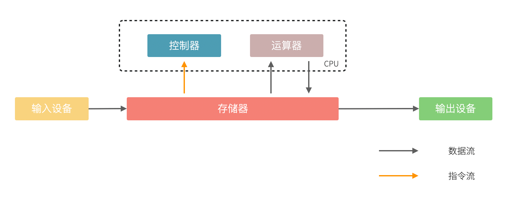

# 第 3 章 编程中的模型思维

模型，是人类重要的思维工具，在历史长河中不亚于火的使用。历法是一种认识气象变化的模型，通过 24 节气可以描述四季并指导农业生产；太极是阴阳家和道家认识世界的思维模型，通过阴阳描述了事物的两个方面，建立了朴素唯物主义的辩证体系；“君君臣臣父父子子” 的儒家社会模型，建立了相对稳定的封建社会。

认识世界和改造世界是我们每个人的日常活动，但是世界太复杂了。股神巴菲特的合伙人查理芒格说，我们必须在头脑中拥有一些**思维模型**，通过模型来认识世界。现代社会中经济学、社会学模型就更多了，波特五力模型、金字塔、四象限、2-8 定律等模型被各种培训和咨询广泛使用。

我相信几乎每一个程序员都听说过 “编程思维”，但是又没人敢说自己已经掌握了 “编程思维”，甚至说不清 “编程思维” 是什么。我们编写应用程序时，每个人都有自己一套方法来设计软件，但是随着需求的不断变化，程序的逻辑会慢慢变得混乱，不再简洁。

计算机科学和软件设计慢慢变成了哲学化、玄学化，衍生出很多形而上的概念，这是因为计算机科学体系变得过于复杂造成的。计算机科学是一门实践科学，计算机无非就是一台由半导体组成的电器而已，那么也可以通过模型理解计算机科学并指导编程。

从影响计算机科学建立的基本模型来看，有图灵模型、冯诺依曼体系、TCP/IP 网络模型等；从应用程序设计上来看有 RBAC、MVC 模型等；从业务设计上来看有具体业务领域的的模型，比如电商、SNS 等。

业务设计上往往没有建立起特定的领域（DDD 中的一个属于，简单理解为抽象的业务）模型，这是我们架构腐化和软件开发困难的关键原因。**业务领域建立好的模型，并指导代码实践，这就是 “编程思维”。** DDD（领域驱动设计）就是解决这部分问题，与其叫领域驱动设计，不如叫做模型驱动设计。所以很多人将 DDD 划分到业务建模这个范畴。

## 3.1 理解模型

模型这个词常常会听到，通常出出现在某个 PPT 或者一篇商业评论中，社会和经济学中的模型往往比较朴素，金字塔、V 型图、四象限会以各种形式出现在不同场合中；软件工程师的模型会更加形式化，UML、E-R 图等，能用较为精确的形式语言描述；数学模型就更加精确，马尔可夫、蒙特卡洛等模型可以用数学语言描述。

广义来说这些都叫模型，甚至是你随手在白板上画的一个用来解释当前程序结构的图形，通过这种方式表达思维框架。哲学家库恩将这种思维框架叫做范式，也就是模型。维基百科将广义的模型定义为：

> ”用一个较为简单的东西来代表另一个东西，这个简单的东西被叫做模型。“

我们天生就有用简单的东西代表另外一个东西的能力，比如幼儿园数数用的竹签，学习物理时的刚体、真空中的球形鸡，都是模型。通俗来说模型就是经验的抽象集合，平时听到的谚语、公式、定理，本质上都是一种模型。

为了理解模型，斯科特·佩奇在 《模型思维》一书中给出了模型的几个特征：

1. **模型是简化的。**正是因为我们要认识的事物非常复杂，因此需要通过简化找出最一般的规律，才能一语中的。”天圆地方“学说就是最简单的古人认识世界的模型之一；毛主席的”阶级划分论“ 简单、直接的指出旧中国的社会状态。
2. **模型是逻辑的**。例如用金字塔原理描述社会阶层，每层的定义是明确的而非模糊的，数学模型能用数学符号系统和公式描述，模型中的元素能用一种逻辑关系做到自洽。
3. **模型是错误的。**因为模型是一种抽象，所有的模型都是错误的，只能在一个方面反映事物的特征。场景变了，模型就需要修正，连牛顿、爱因斯坦的定律都没能逃脱。好的模型能尽可能简单的情况下较好的拟合事物，完全匹配的模型就不再满足简化特征了。

为了建立和利用模型，模型思考有几个层次：

1. **数据。**我们能直接观察到的现实情况，比如下雨了，并且雨下的很大。
2. **信息。**信息需要从观察到的情况中采样，转换成具体的的数字，比如某个地区某年的降雨量。
3. **知识。**知识是面对信息的处理方式，比如我们利用信息，将信息中的一般规律找出来，建立模型。比如某地区降雨量和年度呈现一定相关性，建立一个周期性降雨模型。
4. **智慧。**面对不同情况需要使用不同的模型和修正模型的能力，并能用它指导实践，比如根据周期性降雨模型修建水利设施。

在《模型思维》书中，使用了一张形象的图例如下所示。

我们可以尝试用这种方式来看待原本很困难的知识，比如去简化复杂问题，并理解它。

## 3.2 图灵和冯诺依曼模型

从算盘到计算机，人类走过了漫长的历史。计算机发展的转折点往往都是一些大师提出关键模型的时期，了解这些模型可以帮我们更好理解计算机世界。

计算机是数学的延伸和应用，图灵机模型是一个分水岭，图灵机和可计算性让理论自动计算具有了理论基础。虽然在此之前的模型也很重要，但是还停留在数学上，比如数理逻辑中最重要的一部分布尔代数。

新一代的软件工程师已经不再关注计算机是如何工作的了，他们把计算机当做一种可以通过编程语言对话的“生物”来看待了。我曾被问到过，我们日常使用的“电脑”为何被称作计算机，它和计算看似毫无关系。

要回答这个问题需要将图灵和冯诺依曼模型两个计算机科学基础模型清晰的分开。

计算机能够发展出这么多的功能，其实这只是一个偶然，现代计算机的各种高级应用是计算机的研究者们没有想到的。布鲁斯·斯特林创作了一本小说，名字叫做《差分机》。这本小说是为了致敬查尔斯•巴贝奇，巴贝奇设计了一种机械计算机，这种计算机需要通过蒸汽驱动，这就是差分机。在某个平行宇宙中，人类走向了由差分机带动的新一轮技术革命，不过这种技术革命还是蒸汽时代的延续。

理论上讲，全自动的机械计算机是能够被制造出来的，因为“程序”在图灵模型中被表述为“有限执行的操作序列”。所以很多东西都可以看做计算机。

算盘会被经常和计算机一起提到，算盘是人力驱动的一种计算机，算珠的状态可以看做寄存器。对中国人来说理解图灵机非常简单，我们可以使用算盘来类比。当算盘归零后，算盘的**状态**为初始状态，每一次拨动算珠就是一个**指令**，当所有的的指令下发完成，算盘上最终状态就是计算结果。指令序列就是算法，算盘就是一个状态机。

在算盘之后的时代，还有计算尺，甚至手摇计算机。手摇式计算机算一种半自动的计算机，六七十年代我国科研人员使用它进行原子弹的计算工作。

计算机带有计算两个词的功劳得归到图灵。图灵在 1937 发表了论文阐述可计算性这个概念，并给出了计算机的抽象模型。图灵在论文《论可计算数及其在判定问题中的应用》中，提出了著名的理论计算机的抽象模型——“图灵机”。

它描述了这样一种机器：一个虚拟的机器，由一个一条无线长的纸带和读写头组成。纸带上分布有连续的格子，并能被移动，读写。机器能读取一个指令序列，指令能对格子纸带进行移动和读写。和算盘的逻辑一样，机器每执行一个指令，纸带的状态就发生了变化，最终完成计算。

在电子计算机中，图灵模型是由门电路完成的，门电路就是开关电路。记录状态的门电路可以想象为算盘上算珠的拨动位置。门电路有开关两种状态，因此能通过简单的方法实现加法器，进而实现各种运算。

通过开关就能做出计算机？听起来在开玩笑，用机械来实现当然无比复杂，但是用电气来实现就非常简单。所有的运算都可以通过加法完成，这个不难理解。加法如果用电器开关来表达，只需要做到下面几种条件：

- 0 + 0 = 0
- 1 + 0 和 0 + 1 = 1
- 1 + 1 = 10

如果把每个数字想象为两个灯泡的话，怎么设计一个电路，满足上面三种让相应的灯泡亮起、熄灭。因此要通过电气实现图灵模型就需要实现指令的基本元素：加法器。以及需要一个存储结构：锁存器。

理解原始计算机的基本原理只需要理解加法器和锁存器是如何制作出来的，这个不是玄学，只需要初中物理学就能搞定，可以参考书籍《编码——隐匿在计算机软硬件背后的语言》。

图灵模型只是描述了一步一步的完成计算任务，这种机器称不上“电脑”。让一堆“沙子”具备通灵般能力的人是冯·诺依曼。现代的计算机实际上是一个死循环，可以类比为冲程发动机，才让计算机看起来有了生命。

ENIAC 是公认第一个满足图灵模型的计算电子计算机，ENIAC 通过纸带编写程序，并拨动开关执行和获得结果。冯诺依曼在比 ENIAC 更先进的计算机项目 EDVAC 中描述了另外一种模型，他认为程序本质上也是一种数据，将指令和数据共同存放到内存中，这些指令中存在特殊的跳转指令，让程序周而复始的运行。

存储程序模型构建了一个能自我运行计算模型，构成了一个系统。处理器和内存之间使用总线连接，用来给这个系统提供输入的设备叫做外设，每一次指令循环的可以访问一次外设传入的信号，这就是中断。

想象一台由继电器组成的计算机，如果每一次执行指令计算机会发出 ”嘚“ 的声音，图灵模型就是程序开始运行后线性的 ”嘚嘚嘚……嘚嘚停“。冯·诺依曼的模型就是上电后 ”嘚嘚嘚嘚嘚……中断……嘚嘚嘚嘚嘚”，并反复循环。冯·诺依曼让计算机永不停息，并产生交付效果。

我将计算机科学基础模型展开，每种模型都能作为计算机科学的原料：

1. 布尔数学逻辑模型：为开关电路组成复杂的逻辑规则提供了数学工具。
2. 加法器的电气模型：实现全加器，为图灵模型提供基础指令。
3. 图灵模型：算法是有序的操作序列，数据是状态，计算的过程就是有序修改状态。
4. 冯·诺依曼模型：算法也是数据，算法可以控制指令序列的跳转，然后无限循环下去，进而可以响应外部的信号输入。

在我朴素的认知里：冲程发动机、计算机、生命是一类事物，启动后便不再停下，直到能量耗尽以及外界的干预。

## 3.3 自动推理模型（理解编程语言）

各种各样的编程语言层出不穷，由于工作的需要，会接触不同的编程语言。

如何能理解编程语言的本质是什么呢？我尝试找一些模型简化对编程语言的理解。

先用矛盾论分析一下编程语言解决的什么矛盾：

> 计算机只能识别机器指令和人类难以使用机器指令解决具体问题之间的矛盾。 

所以人类设计出来各种各样符合人类习惯（各不相同）的方式编写程序，这些编写程序的模型就是高级语言。

要使用自己定义的语法规则来写程序，就需要一个转换器，能将符合人类习惯的语法进行转换，这就是编译器。

需要满足几个条件：

1. 新定义的语法必须是形式化的。
2. 新定义的语法能方便的被转换。
3. 人们能接受这种语法编写程序。

所以编译器是一个自动推理机，只要能被推理的形式化语言都可以作为输入。除了自然语言无法实现之外，无论用中文、表情包、符号、图形都能作为一种编程语言的形式。

编译的过程有：语法分析、词法分析、语义分析、中间代码和优化、目标代码。大师通过编译过程学习如何实现编译器，普通工程师可以反过来用这个过程理解一门新的语言。

我尝试将编译过程中的环节找到一个现实中的类比来理解编译器，将类比为人类阅读法律文书（法律是最贴近形式化的自然文本）。

| 阶段     | 编译器                                               | 类比                                       |
| -------- | ---------------------------------------------------- | ------------------------------------------ |
| 词法分析 | 扫描，识别代码 token，将关键字、变量、操作符提取出来 | 处理调查材料，案件人员、行为等要素         |
| 语法解析 | 将 token 组织为一棵树(AST) 用于推理                  | 将人员和行为映射成图谱，形式逻辑推理       |
| 语义分析 | 处理上下文相关的信息                                 | 识别行为发生的动机、背景，提取上下文信息。 |
| 中间代码 | 上面三步是前端，中间代码是为了多平台代码生成用       | 整理为卷宗                                 |
| 目标代码 | 根据不同的平台进行代码生成                           | 输出到报纸、网站等媒体                     |

尝试找到一些通俗的模型理解编译过程，在 https://craftinginterpreters.com/a-map-of-the-territory.html  这个网站下介绍了一个清晰的编译过程。

理解编译器再学编程语言就清晰很多，比如语法（grammar）有三个层次：

1. 词法（lexical）：那些表达式、关键字是合法的。
2. 句法（syntax）：一个句子是不是合法，比如流程语句。
3. 语义分析（grammar）：一段代码的组织结构，函数、类、闭包等规则。

lexical 和 syntax 往往可以看成一体，grammar 不太一样，在一些编译器中 syntax 和 grammar 的错误提示都不太一样。所以可以这样看一门语言：syntax 是类 C 的还是非类 C 的，grammar 上是面向对象的还是面向过程的，是否支持闭包这类上下文追溯的能力。

也可以用来帮助学习编程语言，比如 TypeScript 可以编译成 JavaScript，很多时候我们不需要特别学习，将小段 TypeScript 代码编译一下，看看生成的 JavaScript 是什么就行了。

## 3.4 面向对象模型

有了自动推理机，可以将自己人们定义的语法转换成机器代码的语法规则。让我们有了方法、变量、条件、循环等这些概念，可以大大简化编程的心智负担。

面向过程的语言依然还是图灵模型解决问题的思路：有限的有序指令序列。只不过这里的指令从机器语言、汇编代码换成了容易理解的表达式而已，面向过程的编程语言和机器代码在认知上没有本质区别。

组织面向过程的程序，这部分工作的心智负担需要高水平的程序员来完成，将现实中的业务，分解成有限的有序指令序列。分解任务成为指令序列的过程就是编程，它要求程序员既要像人一样思考现实，又要像机器一样思考。像机器一样思考需要最聪明的人来完成才行，好的程序员可不好找。

能不能想办法利用推理机，再进一步，让程序员按照人类一样思考事物，写出符合人类语义的代码，然后再翻译成目标代码呢？回答这个问题就需要先回答，符合人类认知的思考方式和语言是怎么回事。

人类需要通过概念来进行交流，给一撮物质一个标签，这个标签就是概念。给一堆便签夹起来再打上标签，就是抽象概念。不同的语言、不同文化背景的人无法交流就是因为使用了不同的标签系统。甚至也有可能标签贴错了的情况，导致认知无法对齐。

理解面向对象需要到生活中去，观察玩泥巴的小孩。他们用泥巴创造出一个城堡前，泥土就好像计算机世界中的数据，将泥土组织成有清晰边界的物品就是对象。我们为了描述这类对象，就给它起个名字才能交流。类可以对应现实中的一个概念，很多面向对象的书籍并没有点破这一点。

可以把现实和面向对象中的元素对比一下，建立一个理解面向对象的模型。

| 现实               | 人类语言 | 比喻                 | 面向对象                 |
| ------------------ | -------- | -------------------- | ------------------------ |
| 一类物质           | 概念     | 标签                 | 类                       |
| -                  | 抽象概念 | 一组标签的标签       | 抽象类/父类              |
| 一个有清晰边界物体 | 实体     | 用陶土制作了一个杯子 | 对象的实例化             |
| 一个有行动的的人   | 人       | 拿起了这个杯子       | 调用了人这个对象拿起方法 |
|                    |          |                      |                          |

## 3.6 应用开发中的模型

## 3.7 更广义的心智模型

## 3.8 模型有效性评估

## 3.9 更多模型

数据库模型和网络模型。

