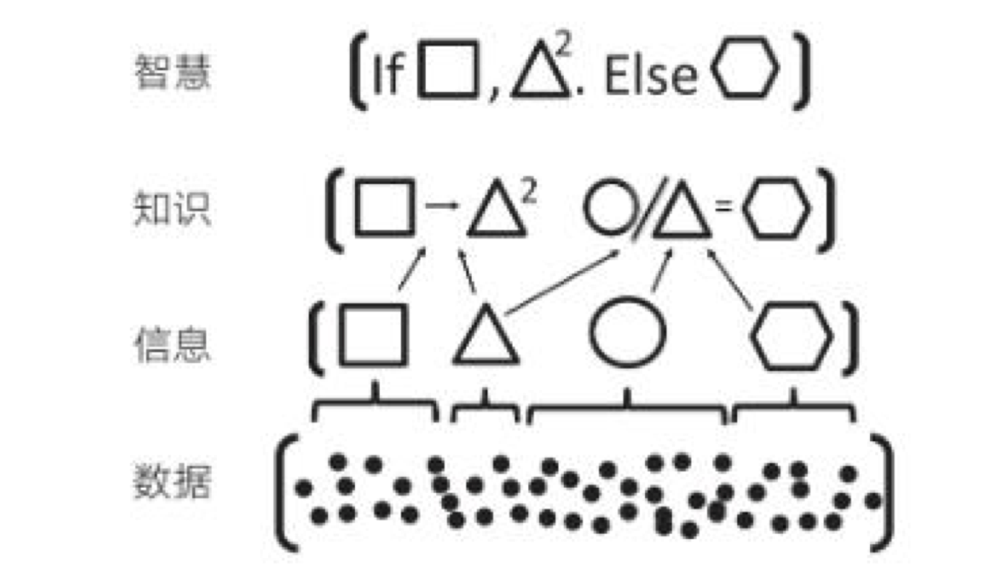

# 第 3 章 编程中的模型思维

模型，是人类重要的思维工具，在历史长河中不亚于火的使用。历法是一种认识气象变化的模型，通过 24 节气可以描述四季并指导农业生产；太极是阴阳家和道家认识世界的思维模型，通过阴阳描述了事物的两个方面，建立了朴素唯物主义的辩证体系；“君君臣臣父父子子” 的儒家社会模型，建立了相对稳定的封建社会。

认识世界和改造世界是我们每个人的日常活动，但是世界太复杂了。股神巴菲特的合伙人查理芒格说，我们必须在头脑中拥有一些**思维模型**，通过模型来认识世界。现代社会中经济学、社会学模型就更多了，波特五力模型、金字塔、四象限、2-8 定律等模型被各种培训和咨询广泛使用。

我相信几乎每一个程序员都听说过 “编程思维”，但是又没人敢说自己已经掌握了 “编程思维”，甚至说不清 “编程思维” 是什么。我们编写应用程序时，每个人都有自己一套方法来设计软件，但是随着需求的不断变化，程序的逻辑会慢慢变得混乱，不再简洁。

计算机科学和软件设计慢慢变成了哲学化、玄学化，衍生出很多形而上的概念，这是因为计算机科学体系变得过于复杂造成的。计算机科学是一门实践科学，计算机无非就是一台由半导体组成的电器而已，那么也可以通过模型理解计算机科学并指导编程。

从影响计算机科学建立的基本模型来看，有图灵模型、冯诺依曼体系、TCP/IP 网络模型等；从应用程序设计上来看有 RBAC、MVC 模型等；从业务设计上来看有具体业务领域的的模型，比如电商、SNS 等。

业务设计上往往没有建立起特定的领域（DDD 中的一个属于，简单理解为抽象的业务）模型，这是我们架构腐化和软件开发困难的关键原因。**业务领域建立好的模型，并指导代码实践，这就是 “编程思维”。** DDD（领域驱动设计）就是解决这部分问题，与其叫领域驱动设计，不如叫做模型驱动设计。所以很多人将 DDD 划分到业务建模这个范畴。

## 3.1 理解模型

模型这个词常常会听到，通常出出现在某个 PPT 或者一篇商业评论中，社会和经济学中的模型往往比较朴素，金字塔、V 型图、四象限会以各种形式出现在不同场合中；软件工程师的模型会更加形式化，UML、E-R 图等，能用较为精确的形式语言描述；数学模型就更加精确，马尔可夫、蒙特卡洛等模型可以用数学语言描述。

广义来说这些都叫模型，甚至是你随手在白板上画的一个用来解释当前程序结构的图形，通过这种方式表达思维框架。哲学家库恩将这种思维框架叫做范式，也就是模型。维基百科将广义的模型定义为：

> ”用一个较为简单的东西来代表另一个东西，这个简单的东西被叫做模型。“

我们天生就有用简单的东西代表另外一个东西的能力，比如幼儿园数数用的竹签，学习物理时的刚体、真空中的球形鸡，都是模型。通俗来说模型就是经验的抽象集合，平时听到的谚语、公式、定理，本质上都是一种模型。

为了理解模型，斯科特·佩奇在 《模型思维》一书中给出了模型的几个特征：

1. **模型是简化的。**正是因为我们要认识的事物非常复杂，因此需要通过简化找出最一般的规律，才能一语中的。”天圆地方“学说就是最简单的古人认识世界的模型之一；毛主席的”阶级划分论“ 简单、直接的指出旧中国的社会状态。
2. **模型是逻辑的**。例如用金字塔原理描述社会阶层，每层的定义是明确的而非模糊的，数学模型能用数学符号系统和公式描述，模型中的元素能用一种逻辑关系做到自洽。
3. **模型是错误的。**因为模型是一种抽象，所有的模型都是错误的，只能在一个方面反映事物的特征。场景变了，模型就需要修正，连牛顿、爱因斯坦的定律都没能逃脱。好的模型能尽可能简单的情况下较好的拟合事物，完全匹配的模型就不再满足简化特征了。

为了建立和利用模型，模型思考有几个层次：

1. **数据。**我们能直接观察到的现实情况，比如下雨了，并且雨下的很大。
2. **信息。**信息需要从观察到的情况中采样，转换成具体的的数字，比如某个地区某年的降雨量。
3. **知识。**知识是面对信息的处理方式，比如我们利用信息，将信息中的一般规律找出来，建立模型。比如某地区降雨量和年度呈现一定相关性，建立一个周期性降雨模型。
4. **智慧。**面对不同情况需要使用不同的模型和修正模型的能力，并能用它指导实践，比如根据周期性降雨模型修建水利设施。

在《模型思维》书中，使用了一张形象的图例如下所示。

我们可以尝试用这种方式来看待原本很困难的知识，比如去简化复杂问题，并理解它。

## 3.2 图灵和冯诺依曼模型

从算盘到计算机，人类走过了漫长的历史。计算机发展的转折点往往都是一些大师提出关键模型的时期，了解这些模型可以帮我们更好理解计算机世界。

计算机是数学的延伸和应用，图灵机模型是一个分水岭，图灵机和可计算性让理论自动计算具有了理论基础。虽然在此之前的模型也很重要，但是还停留在数学上，比如数理逻辑中最重要的一部分布尔代数。

## 3.3 自动推理模型（理解编程语言）

## 3.4 关系数据模型

## 3.5 面向对象模型

## 3.6 应用开发中的模型

## 3.7 更广义的心智模型

## 3.8 模型有效性评估

