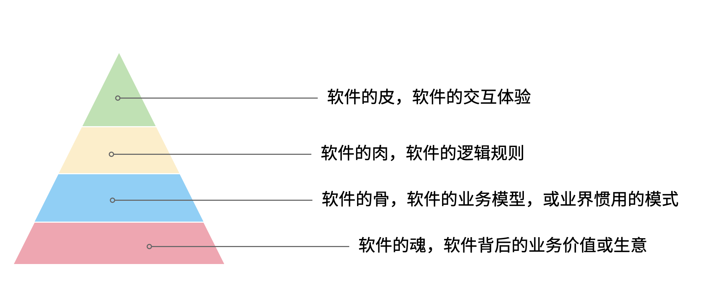

# 第 4 章 理解软件背后的生意

本章讨论两个问题，软件背后的生意，以及需要设计的软件如何支持生意的完成。要讨论这两个部分，就需要拿出在上一章模型思维中的商业模型和软件业务模型。通过这些模型展开讨论如何快速找到软件背后的生意，以及软件到底创造了什么价值。

如果说业务就是生意，那么就意味着业务等同于商业，但是如果就这样思考，会存在一个误区，很多软件的业务不是直接和钱相关，而是间接和钱相关。

举个例子来说，卡巴斯基和 360 同样都是杀毒软件，可以认为他们的业务模型类似。但是卡巴斯基是通过用户付费实现盈利，360 通过广告盈利，则可以认为他们的商业模型有所区别。

但是无论如何，商业软件做出来都是为了赚钱，业务模型会紧贴商业模型变化。同样的，分析商业模型和业务模型的方法也不同，关注的人也不同，所以有必要分开的定义一下。

>  商业模型定义：商业模型是指描述企业盈利方式的手段，关注企业如何实现赚钱。

>  业务模型定义：业务模型是指企业如何为用户提供服务，如何参与到社会分工中。

那么弄明白商业模型和业务模型后，再来看软件设计，软件设计就是关注软件如何为业务、商业提供服务，提高业务和商业能力。虽然商业模型和业务模型有所不同，但是从商业模型体现的生意出发就能快速的理解一个应用软件（和日常生活相关的软件，区别于工具类软件，例如电商、ERP 等软件）。

## 4.1 热身：快速了解一个全新的应用软件

这里以一款售后的 CRM 系统为例，如果想要快速的理解售后 CRM，我们可以通过先从必不可少的业务概念开始，聚焦生意本身，其他的业务概念都是为生意服务的。

售后 CRM 的生意是当用户需要售后服务时，销售方需要创建一个服务工单来管理相关的售后问题。一个极端简陋的 CRM 就是一个服务工单，服务工单的两端构成了消费者和售后服务方之间的契约。例如，消费者买了一部手机，在保修期类需要维修，消费者发起了保修的请求，售后服务方通过服务工单作为契约接过了手机，开始维修。

售后服务方的接待员需要在系统中有一个身份，那么就需要引入一个用户的概念。紧接着，如果维修工作需要材料，CRM 就需要增加对材料的管理功能，否则就只能用纸、Excel 来管理消耗的物料。对于大型企业来说，这些物料需要在网点、总部之间流转，那么就需要建立一套调拨关系。网点和总部之间的物料来往需要出入库相关的流程来支持多地的库存管理。为了 进一步扩大服务体系，会将一些地区的网点承包给当地商户，这样物料的往返、工费就发生了结算，以及财务相关的逻辑就必不可少了。

虽然复杂的 CRM 系统会极其复杂，但是识别核心的业务关系并不会过于复杂。当识别到这些关键业务概念后，进一步展开看到具体的业务逻辑和流程就不会晕头转向。


当然，并不是说，通过这种方法就能真的完整的理解业务，而是作为了解业务的第一步。

另外一个方法是“向钱看”。这是一种逆向思维，通过结算和财务往来快速找到系统之间的关键业务流转。它的逻辑很简单，一般商业软件都直接或间接和钱有关系，如果不涉及业务结算的软件一般是一些工具软件、非商业软件，不在我们讨论的范围。

正是因为商业软件具有和钱绑定的特点，那么我们可以首先去看结算的相关业务，也就是“谁在和谁做生意”，分析谁在和谁做生意必然会发生财务往来。通过财务线索看财务双方的身份，就找到了业务的核心主体，再看收费的项目就找到了业务的客体。

在前面售后 CRM 例子中，大型公司往往将其的售后服务外包给了一些地区代理商，这些代理商会和公司签约共同进行网点建设，人员培训，提供售后服务。如果不从结算出发，我们的视线会被淹没在一些无关紧要的场景中，忽略了真正重要的业务主体是代理商和公司之间。

再来看结算的项目中使用了什么载体做的结算处理。在售后体系下，既有物料的概念也有产品的概念，但是有意思的是，产品只是被维修的设备，用于登记用户维修的信息，判断是否属于保修期。如果用户在保修期外，需要付费维修，维修的过程中需要消耗物料，那么代理商就需要对服务费、配件的消耗进行结算。如果去查看结算相关的资料，我们会发现结算的客体是物料而不是产品。我们就能找到整个系统中最为关键的对象，也就能快速的理解整个系统了。


## 4.2 需求变化的原因：软件价值金字塔

需求变化是软件工程师最难以容忍的一件事，为了做好软件设计，不得不猜测未来需求的变化方向。猜中了就是 “正交分解”，猜不中就是冗余设计。

那么需求变化背后的逻辑是什么呢？

首先我们不得不承认，从客观上讲软件它是有区别于硬件的，为什么叫软件，因为它本身就是能改的，并且修改的成本是低于硬件。硬件涉及电路设计、制版、开模等流程，在开发的过程当中，需求变化会带来巨大的成本。这是为什么软件能够提高效率的原因，因为通过软件搭建在通用计算机平台上，能够很快做出业务应用和实现。通用软件的出现，软件开发和硬件开发分离是信息社会的一个关键节点，所以软件被发明出来就是为了容易改。

但是事物总是矛盾的，容易改的软件相比硬件降低了成本，但软件容易修改的能力被滥用后，给软件工程也带来负担。

对于软件来说，修改并不是没有成本的，只是相对硬件而言小了许多。对软件工程师来说，业务的变化往往会带来困扰，因为它会让软件的架构设计和模型的建立变得非常复杂。

但并不是所有的软件需求变化，我们都不能接受。对于一些软件的交互和界面 UI 样式等这些细节上面的修改不影响主体的业务变化，这种修改是没有任何问题的。

我们说的软件需求变化带来的困扰是指的是在软件开发过程中随意变更软件的逻辑，让软件的整体性和逻辑性受到了破坏，这是我们不喜欢，不能接受的软件修改的方式之一。

对于专业的产品经理来说，软件的修改是非常谨慎的，因为修改一个地方，可能会影响其他地方。

那么在软件开发和迭代的过程当中，我们可能难以意识到一个小小的修改会影响整个开发、测试、上线等不同的环节，造成项目的延期，这是开发团队人员不喜欢软件被修改的根本原因。

那么怎么应对软件需求的变化呢？

### 软件价值模型

如果我们对软件的需求进行分层，我们可以把软件所存在的价值分为 4 层。

最底层是软件所存在的业务价值，或者是通俗来说它是软件的生意。我们在构建一个点餐软件、构建一个电商软件、构建一个物流软件，那么软件帮我做的事情就是取代原来传统商业活动中人需要做的事情。提高这些行为的效率，为社会创造更多的价值，这些软件背后的需求就是我们的生意。业务价值，可以看做软件的灵魂。

那么在这层软件需求之上的，是我们软件的架构，软件的架构承载了对我们的软件的生意或者商业模式的一种提取，可以看做软件的骨骼。比如说电商里面就有订单等这些关键的一些模型，或者一些惯用模式。类比起来就相当于我们人体的一个骨架或者建筑物的一些承重结构。

还有一些是软件的一些具体的逻辑细节，比如说约束电商系统确认收货时间是多少天。软件这些业务规则，就像人体的血肉一样，丰满了软件。业务规则填充了软件的一些交互逻辑细节，让软件工程师在不修改主体结构的情况下去，改这些逻辑细节，有时候并不是非常困难的，软件工程师对于这类需求的变化也是乐于接受的。

还有一种软件的需求，就是软件的交互方式和 UI 样式，这些就好像动物的皮肤。不具备特别的功能性，而是负责软件的美观性。这些需求的变化，修改成本也是非常低的。

所以我们总结一下的软件的价值可以分为 4 层：



当我们软件的业务架构和业务价值发生翻天覆地的变化时，修改这个软件的难度，会呈指数上升，不亚于重新设计一个软件。

我曾经听过一个故事，有一个公司构建了一个财经的软件，但后来希望这个财经软件上面具有社交的功能，能够有直播，有聊天，有打赏。对于这个软件来说，已经侵害了它原有的逻辑。社交作为业务流程中天然不具有的一个能力，如果强行加上，软件整体的逻辑性和完整性，已经发生了变化。这种软件的业务价值没有被确定，那么它的业务架构就很难确定，需求也会翻天覆地变化。

对于创业公司来说，他们的业务架构和生意，或者说它的商业模式，还不确定，还在探索当中。对于这样的业务来说，他们的需求几乎每天都会发生变化，因为他们的生意会变，一旦生意会变，“上层建筑就会变化”。

对于成熟的公司来说，软件这个公司业务流程的沉淀，业务流程可能不会发生特别大的变化，比如说银行、保险或者会计，这些特定的业务流程基本上已经形成了行业的规范或者标准，他们的变化情况是不会特别大，那么软件的架构也就不容易受到破坏。业务需求的变化就会非常少。

### 竞争力和适应性

对于一些传统的公司来说，他们过去的业务价值或者是商业模式被新的模式受到一些冲击，他们会认为应该去探索新的环境下的业务模式，于是他们对业务的定位发生了变化。这个时候，已经在赚钱的业务模式可能不是他们的重点，他们探索新的业务价值，在很多方向就变得和创业公司一样，都想去尝试，这些尝试的方向都是对软件的未来重新定位。麻烦在于尝试的方向很多，软件的定位就会变得混乱，甚至开始伤害原有正常在运行的业务流程。

但是这些传统的软件他们又不得不去转型，这就陷入了一个逻辑的悖论。还没有确定的新的业务，去侵害了原来的业务的定位和方向，让整个转型过程当中充满了风险和不确定性。有一些数字化转型的企业认识到这一点，他们通过构建一个新的公司或者新的软件来重新开始，并代替原来的业务流程和软件。如果失败了，对原来的业务流程和商业模式并没有任何的影响，这是一种新的探索形式和方向。

总之，软件需求的变化，需要客观的看待。如果是上层的变化，比如说简单的一个规则和UI界面，这可能来自于客户的一些反馈或者优化，对软件背后存在的商业模式和业务价值没有没有破坏。反之，如果我们的商业模式发生了变化，也就是软件背后所存在的业务价值改变，我们就很难保证我们的软件架构不会重新被推翻。这个时候我们就需要去权衡或讨论，是构建一个新的软件，还是将原有的软件重构成我们目标的样子，而不是简单的说我们的软件需求变化了。

软件在市场中存活和生物适应生态环境非常相似，如果一个物种对生态的适应性非常强，或者自身的改造性非常强，它一定程度上在某个特定的环境下的竞争力就会被削弱，如果他在某一个特定环境下具有强烈的竞争能力，那么他就会牺牲适应其他环境的能力。

**特定环境的竞争力和对广泛环境的适应性存在矛盾。**

架构的背后就是权衡的艺术，适者生存。软件也是这样，因此我们软件需要有清晰的定位和适应市场的领域。如果我们需要重生，重新构建一个新的软件，繁衍下去，还是改造原来的软件，这是一个值得思考的话题。

### 对软件工程师的启示

软件价值模型给了软件工程师 2 点启示。

首先，我们可以通过这种方式来快速理解一个软件的架构和需求。一个能够在市场上存活的软件，一定有它背后的业务逻辑和业务价值。那么我们从底层出发，找到了一个软件的业务价值，也就是它的生意，我们就可以快速的理解软件的架构。

其次，我们可以真正的挖掘出业务分析师或产品经理希望的业务。基于软件价值模型，软件背后的逻辑和生意总是存在的，但是产品经理不一定能够用自己的语言或合适的方式讲给软件工程师。

对于软件工程师来说，只有两个选择。要么给自己的软件的架构设计提供足够的灵活性，这也是很多软件设计思想提倡的。但它背后的代价很明显，我们需要留出 “冗余设计”，在特定的环境下，软件的竞争力被削弱。一个有灵活或者弹性的软件架构，背后是付出一定的代价，但往往我们没有意识到这一点。

另外一个选择就是真正的理解软件背后的生意，通过软件价值模型的启示从变化中找到不变。因此我们不得不将视野从软件本身返回到软件承载的业务上，为了理解这些业务我们又需要追溯回到这些业务服务的商业目标中。

那么软件工程师理解软件的路径为：理解商业→理解业务→理解软件产品和信息系统。

## 4.2 理解商业

如果我们理解了软件背后的生意，可以更加从容地设计软件。更为重要的是，和需求提出者的交流更加容易，除非需求提出者也并不熟悉正在设计的软件背后承载的商业目标。

分析一个企业的商业模型方法非常多，下面介绍比较常见也比较简单的方法——商业模式画布。

顾名思义，商业模式画布是一种描述企业商业模式的模型，最早来源于亚历山大·奥斯特瓦德的《商业模式新生代》一书。其主要的思想是，商业模式不应该由几百页的商业策划书来描述，而是应该由一页纸就能清晰的呈现。根据思维经济性原则，无法清晰表述的商业模式其价值也值得怀疑。

商业模式画布，包含 9 个模块，可以呈现在一张画布上。如下图所示：


编写商业模式画布实际上是需要回答 9 个问题，弄明白至少这 9 个问题，才能知道对未来相关的商业设想是否靠谱。如果是投资人看这份商业模式画布，才能快速知道这笔生意是否能赚钱。

 这里将商业模式画布 9 个模块的含义通过问题给出来。

#### 含义

**1. 客户细分（CS，Customer Segments）**

企业的产品或者服务是为哪类人群提供的？客户是愿意为你的产品或服务付费的人，在未来会给企业带来收入。

这里容易混淆将客户同用户混淆，大多数情况下客户和用户是等同的，但是有时候用户不是客户。例如，搜索引擎一般是免费的，他们的客户一般是广告商，而用户是日常使用搜索引擎的人。当我们将用户和客户分开后，有时候用户只是企业的一种资源，并没有构成商业合作关系，这也为什么互联网公司都会出具不同形式的免责声明，因为用户并不是企业的客户。

**2. 价值主张（VP，Value Propositions）**

客户为什么愿意花钱购买我们的产品和服务？企业提供的价值是什么？

仍然以搜索引擎为例，搜索引擎需要给客户提供足够的广告曝光，为了提供广告曝光，于是需要给用户提供信息索引的服务，以便获得足够的流量。

**3. 渠道通路（CH，Channels）**

客户怎么知道企业能满足他们的需求？塑造企业的品牌，以及构建完整的渠道体系。如果把企业比喻成一台能赚钱的机器的话，渠道是这机器中的油路。

营销渠道可以将企业拓展的足够远，并且尽可能让核心足够小。

**4. 客户关系（CR，Customer Relationships）**

如何将企业的服务和产品嵌入到客户的生产体系？

客户关系应该理解为彼此需要，不仅仅是如何同客户如何相处。商业社会是一个复杂的系统，每个企业是社会化大分工中的一环。客户关系关注的是，如何补全客户的商业体系，组成更为完整的生态。

搜索引擎公司补充的是广告商的互联网平台，而不是取代广告商。和客户建立良好关系的唯一做法是利益方向一致，所以很多公司避免将自己的商业版图拓展的太宽，将手伸到别人的碗里可不见得是件好事。

**5. 收入来源（RS，Revenue Streams）**

提供的所有产品和服务中，客户愿意花钱的核心点是什么？

这是整个商业模式画布中最难回答的问题。对于软件产品来说，往往愿意使用产品和服务的用户很多，但是愿意付费变成客户的极少。

**6. 核心资源（KR，Key Resoures）**

企业拥有那些资源（资产），能击败同类竞争对手？

这些核心资源往往决定商业模式是否真正有用，因为商业模式画布本身并不值钱，很容易被复制，真正有价值的是背后的资源。比如专利、商标、政商关系、市场形象，甚至域名。

**7. 关键业务（KA，Key Activities）**

提供的核心产品和服务是什么？

一般来说，收入来源就是核心产品和服务，但是在某些情况下并非完全匹配。

**8. 重要合作（KP，Key Partnership）**

在嵌入的生态体系下，除了客户之外，还有那些商业主体？

如果是生产类企业，一般是下游的供应商。对于互联网平台型企业来说，包括达成合作的商业主体。比如，直播类平台，重要合作就是知名主播以及内容产生者。

会计是一种商业的语言，在财务会计中，客户和供应商往往分开处理，这是因为他们分别代表着不同的交易往来。

**9. 成本结构（CR，Cost Structure）**

为了提供这些产品或服务，需要消耗什么成本以及代价？

这些成本需要包含显性成本以及隐性成本，需要对成本保持极高的警惕性。当产品和服务不具备垄断性的优势之后，成本结构就成了企业竞争的主要战场。

#### 案例

使用商业模式画布来研究商业模式的案例非常多，这些案例的研究材料容易找，我以拼多多为例并结合 IT 视角来看商业模式对信息系统的影响。

很多人可能和我一样对拼多多有一些疑惑，为什么在电商格局已经充分竞争后依然还有崛起的机会？我们不妨用商业画布来的分析一下。

**1. 客户细分（CS，Customer Segments）**

拼多多的客户是什么？

如果不加以区分客户和用户，我们很容易得到拼多多的客户是普通的消费者。实际上从财务的角度，拼多多自己也不会承认。如果消费者的每一笔消费都算在拼多多的收入中，那么拼多多需要支付巨额的增值税。

拼多多的业务为帮助小微企业、农户、个人快速开设店铺，并从中获得佣金。因此在客户这侧和发展初期的淘宝网差别并不大，在某种程度上来说，由于天猫的存在和战略，阿里电商在这块领域相当薄弱。

**2. 价值主张（VP，Value Propositions）**

关于价值主张这部分我一直比较疑惑，拼多多到底能提供什么新的价值？

在一份名为《“电商黑马”拼多多的商业模式探析》的报告中，提到了拼多多价值主张为“免去诸多中间环节，实现 C2M 模式，提 供物有所值的商品和互动式购物体验的 “新电子商务”平台”。C2M 为（Customer-to-Manufacturer，用户直连制造，但是这个模式并不新鲜，戴尔、玫琳凯等直销公司都是这种模式。

一些分析者将拼多多的模式总结为**物找人**。通过拼单的方式，先定义物品，再通过社交媒体找到需要的目标群体。让“社会化消费”发挥作用。

从价值主张上来说，拼多多的价值和其他主流、非主流电商的差异并不大。

**3. 渠道通路（CH，Channels）**

在价值主张上，各种电商平台差距非常小，无非都是“消除中间商，降低流通成本”。但是在细分领域，渠道通路的竞争非常明显，甚至有些电商平台将自己的电商属性隐藏了起来。

例如，以社交抹茶美妆、小红书、它趣这些公司的电商属性非常弱，实际上是通过社交渠道强化了电商的渠道能力。拼多多的渠道是建立在一种病毒营销的模式上的，俗称“人传人”。

**4. 客户关系（CR，Customer Relationships）**

拼多多的店铺分为了几类，不过最终还是可以分为专业类和普通类。专业类的客户为具有一定资本的经销商，需要缴纳保证金以及登记工商材料，普通类的无需保证金和工商材料即可开店，而正是普通类占据了主要的店铺类型。

**5. 收入来源（RS，Revenue Streams）**

根据财报显示，拼多多的收入来源为在线市场服务和少量的自营商品销售（2021 年占比不足 10%），财务来源并没有特殊的地方。

**6. 核心资源（KR，Key Resoures）**

在商业模式和收入来源都没有特殊的情况下，拼多多的核心资源是什么呢？在一些商业分析中，将拼多多的核心资源归结为用户流量。截至 2021 年一季度，拼多多年活跃买家数达 8.238 亿，那么这些买家是哪里来的呢？

除了前面说的“人传人”的基础上，拼多多借助了微信渠道，而微信的宣传渠道屏蔽了其他电商，可以说这是拼多多的核心资源。

**7. 关键业务（KA，Key Activities）**

拼多多的关键业务是市场活动和供应链管理。

**8. 重要合作（KP，Key Partnership）**

拼多多的合作伙伴有：腾讯微信、物流企业、电视媒体。将商家排除在外的原因是，商家已经作为了客户存在。

换句话说，商家是赚得消费者的钱，拼多多是赚得商家的钱。由腾讯微信提供渠道，通过特有的病毒营销获得用户流量，并将流量转化为商家的客源。

**9. 成本结构（CR，Cost Structure）**

拼多多的成本结构主要是**市场推广**费用，其次是管理费用和研发费用。

根据商业模式画布分析，拼多多的商业模式主要是以独特的营销推广为基础，为小微企业和个体农商户带促成交易。在交易渠道上借助了微信腾出的渠道真空（微信渠道对淘宝不开放，拼多多和京东无竞争关系，腾讯为拼多多的第二大股东）。从其营收结构主要为在线市场佣金收入反应了这一点，成本结构上以营销费用为主也进一步佐证。

#### 商业模式画布小结

很多公司宣传的商业模式和真实的商业模式有很大的差别，这里面的原因很复杂，有一部分原因是公司处于转型期，当前的商业模式和公司未来的模式并不相同；另外有一部分原因是照顾主流舆论的主持，将公司的商业模式进行美化，以便在资本市场更加有利。

对于一线开发人员来说，公司的商业模式并不重要。但是，对于架构师来说来说，正如前面提到的，商业模式是理解信息系统需求变化的关键线索，架构的调整也需要适应公司的转型需要。

## 4.3 理解业务

通过商业模式画布可以理解企业的商业模式，弄明白在企业的业务中谁是客户，收入从哪里来，合作伙伴是谁等。不过，商业模式画布没有将企业的内部运转结构打开，一个企业需要运转起来，需要各个部分之间的通力合作，并和用户产生交互。

#### 业务服务蓝图

要明白的表达企业内部各方的合作情况，业务服务蓝图可以帮上忙。不过请注意在使用服务蓝图时，存在一些争议。例如，是否应该将 IT 系统参与到服务蓝图中表达？这里存在两种流派和方法：一种是使用两张图来表达，这样能看清楚企业引入 IT 系统前后的变化；另外一种流派是将其绘制到一张图上，统称为服务蓝图。

在我们的体系下，由于区分了商业模型和业务模型，我讲应用服务蓝图归属到业务模型中，它更多的是关注待分析的 IT 信息系统。

业务服务蓝图本质上是一种流程图，表达商业中各个参与的主体之间的往来，不过这个流程图通过多个泳道来表达参与的业务主体。服务蓝图可以到“服务设计”这个概念下，可以看做是用户故事地图的延伸。服务蓝图中，不仅包含水平方向的客户服务过程，还包括垂直方向各个业务主体之间的合作关系，描述服务前、中、后台构成的全景图。

我找到了一份不错的服务蓝图定义和绘图模板（主要是好看） https://www.nngroup.com/articles/service-blueprints-definition。


在这份模板中，服务蓝图包含 5 个主要元素：

1. Evidence 业务凭证或者接触点，比如在保险服务中，投保单、保单都是接触点和凭证。
2. Customer Journey /actions 用户的旅程或者行为
3. Frontstage 服务提供方（企业）的对客部门或者单位
4. Backstage 服务提供方的后台部门或者单位
5. Support processes 其他支持单位，比如财会、法务等

这里面还有三条关键的交互线：

1. Line of Interaciton 交互线 。用户服务提供方交互的边界，可以将交付线的上下分别看成独立的业务主体，他们通过业务凭证作为客体完成业务往来，在合法的经营活动中，业务凭证会作为契约以及法律凭证。
2. Line of visibility 可见线。用户直接接触的范围，以及可视范围。例如，用户购买通过某保险公司的经理人购买某保险，对用户来说用户只能看到保险经理人以及相关活动，当用户提交投保单信息后，后续的投保流程将由保险公司的具体部门审核通过，并生成正式的保单。
3. Line of internal interaciton 内部交互线。内部交付线为企业内部单位作为业务主体之间的往来，这些往来关系对用户不可见，其权责本质上也属于企业对其的让渡。

通过这 5 个元素和 3 条交互线我们能梳理一个企业实现其商业目标时，需要参与的业务细节，并在一张图表上表达。

#### 业务服务蓝图示例

TODO 

#### 和用户故事地图的关系

在服务设计和设计思维中，和服务蓝图类似的思维工具还有用户故事地图。不过他们之间有一点区别。用户故事地图也是一种非常好的思维工具，它更加关注于用户体验，以及用户的心情曲线。

过度关注用户故事的陷阱就是将用户和客户混淆，容易产生不计成本和盲目的用户体验优化。换句话说，用户故事描述了某个业务主体的行为和职责，在这些行为下面我们可以绘制出心情曲线，根据心情曲线可以寻找服务或者软件产品的机会点。而服务蓝图描述的是多个业务主体之间的行为，以及职责转移，不体现心情曲线。

它们两者各有所长。在体验设计上，可以更关注用户故事地图；从业务理解上，服务蓝图更加有用。有时候它们又可以相互补充，我们可以在合适的时候使用它们。

## 4.4 理解软件产品和信息系统

如果理解了一个企业的商业模式，以及支持了支持商业模式的业务，再来看构建在两者之上的信息系统或者软件就容易很多。

我们可以做一个思维实验，一家主营食材配送的企业，它的客户是餐厅老板，公司的主要业务为每日清晨为各个餐厅配送食材。毫无疑问在现代化的社会，信息系统必然是存在的。这家公司使用了微信作为渠道，建立了小程序、H5 应用建立了食材订购的应用，同时又为承担配送工作的员工开发了送货、打单的安卓原生 APP，以及财务核算的 Web 应用。

假定在某天系统出差了，但是配送的工作不能停下来，这是事关商誉的事情。如果因为一次无理由的断供，会导致相关的餐厅无法营业，营业中断带来的损失远远超过当天的货物价值。于是，公司领导无论如何都需要想办法将食材送到客户手中。在信息系统无法使用时，它们可能的做法是，从数据库导出备份的数据，打印出来，人工的通知到客户。我们会发现，对于这类软件，完全可以使用纸和笔进行延续之前的业务。

这种思维实验，也是也是在软件设计时常用的方法。当业务复杂，产品经理或者业务人员无法描述清楚，我们可以将“电”断掉，思考如何通过纸和笔来完成软件设计。

断电法，可以将系统中晦涩难懂的概念在现实中找到可以被理解的物品。比如，用户这个概念比较抽象。餐厅老板或者经理可以作为用户在配送平台上下单，如果断电了，那么用户在现实中是什么呢？可能是食材配送老板大脑中的一段记忆，也可能是写在笔记本上的一段记录。

可能会发生这样的场景：

```
烤鸭店张老板老板需要预定 100 斤大葱，打电话给食材配送的王老板。
张老板：老王啊（电话接通后）。
王老板：原来是老张啊，今天需要什么货呢。（根据电话号码、声音定位到这个用户）
张老板：我需要 100 斤大葱，上午帮我送过来。（下单、填写配送时间）
王老板：收到等下我就去装（确认订单，备货）
……
```

如果用现实中的行为扮演 IT 系统的逻辑，可以降低认知难度，更加容易理解业务。


前面的业务服务蓝图，可以看做断电后的纸笔推演。

### 电梯演讲


### 应用服务蓝图


## 4.5 产品设计的经济性原则

业务设计中有一个矛盾：

>  尽可能短的业务流程和契约完整性的矛盾。

使用经济学作为基本原理，选择最具有经济性的业务分析方案

## 4.6 业务主体分析

1. 为什么主体分析如此重要
2. 使用主客体分析参与业务的参与方
3. 使用主体契约构建完整自洽的需求方案