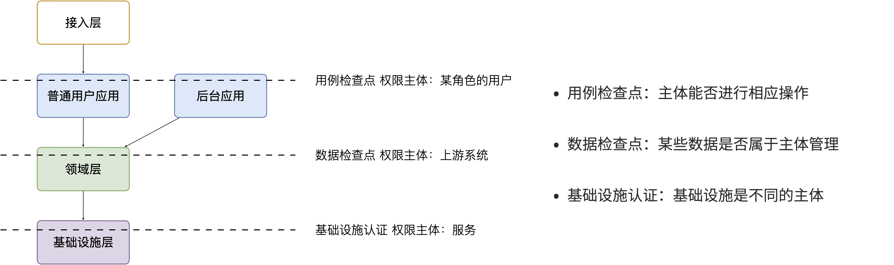

# 第 6 章 分层，软件架构和实现

什么是软件架构？通俗的来说，软件架构就是将软件中合适的组件放到合适的地方，这就让软件架构变成了一种混合大量经验的艺术。

## 图是复杂问题的索引

为什么 PPT 做得好的人升职越快，而且比一线干活儿的人升的更快。有时候一线开发人员愤愤不平，为什么做做 PPT 不写代码就能获得高薪。实际上做 “PPT 工程师并不轻松”，靠的是对问题 深刻的理解、信息的分析、有效的呈现等多种能力。

一套架构用的汇报材料，可能就是某个复杂系统一份极好索引。全景是什么、边界在哪里、骨干的业务逻辑是什么，都需要体现在在 PPT 中。

所以做好 PPT 的前提是深刻吃透业务、产品、技术方案，而且还需要具备非常强的表现能力，把方案清晰的表现出来。PPT 图表并非只是展示，更像是一个索引来描述复杂的系统。

优秀的架构师、咨询师都能做出好的 PPT，有时候甚至 PPT 就是一种很好的概念模型，这样想就应该能把 PPT 重视起来。没有好的思维结构，就做不出 PPT，想到的不一定能表达出来，所以 PPT 做的好的人具有特别的强的思维能力。

### 复杂性管理

### 边界识别

## 系统分层

分层的目的是水平隔离复杂性。


### DDD 分层的主客体分析

###  应用和服务分离

### 千层饼架构

## 系统的服务划分

服务划分的目的是垂直分解复杂性。

### 服务划分的权责利问题

“分层是主体权力的让渡。”这是我的同事施威知道我尝试用“主体-客体”的思维解决一些架构上的问题时，蹦出来的金句。

如果我们把这件事情说的更加完善的话，可以改为：

> 分层是主体权责利的让渡。

服务划分是职责划分的问题，职责划分的问题是权责利的问题。权责利是管理的基本思想，从这个角度上来看，架构设计和管理并无差别。

我们拿几个更具体的例子来说。在一次架构评审会议上，有一个问题大家争执不休，问题的背景是这样的：

```
某会议软件，具有几十个微服务，这些微服务都需要鉴权，基本的思路是通过 Redis 集群来存储会话数据。不过在是否应该将 Redis 集群直接暴露给微服务使用，在架构设计中有两种声音。
一种声音是为了性能提高，微服务需要直接能访问到 Redis 集群，而不是通过 REST API 等接口方式通过一个服务来中转。因为会频繁调用该接口，性能上难以保障。
另外一种声音是，性能虽然有损失，但是和数据的封装性比起来不值一提，不应该直接暴露 Redis 集群。
```

在这个案例中，我们不妨问这样一个问题。我们为什么需要封装一个鉴权服务？

原因很简单，需要有专门的人来维护这个服务，并提供相应的能力。直接连接 Redis 会将这份工作让渡给了各个微服务，而不是 Redis 集群的运维团队，毕竟 Redis 集群的运维团队的职责只是提供 Key-Value 数据的存储，而与具体的业务无关。

如果将工作给了各个微服务，也就意味着 Redis 集群的使用权公开了，鉴权工作的考核（利）也分摊了。慢慢的，这个 Redis 集群会变成一个多方共管地区，会有更多的无关数据被写入，也变得危险和不稳定。

将鉴权服务封装起来的目的是权责利的隔离，封装成服务只是手段。这样看来，只要目的达到了，手段可以是多种多样的。我们可以考虑让一个团队构建一个 SDK 来提供会话数据访问的能力，这样既能满足权责利要求，也能避免一次网络通信，提高性能。

还有另外一个例子。我们在规划一个分销系统，分销系统会涉及组织结构、商品维护、订单流转、仓库库存、结算等多个上下文。这里就会出现一个矛盾，订单流转和库存之间会有强烈的耦合，如果将其合并可以减少分布式事务、频繁的跨服务调用的问题。但是，将其合并后，仓库库存和订单流转之间耦合了。

为了清晰地理解这个矛盾，我们可以回到现实中。订单流转是订货、发货方两个销售主体之间的关系，但是物流是基于仓库来说的，仓库是货物的主体。

从职权关系上来说，订单的流转和仓库库存之间的职权是不同的。我们可以将其微服务想象为一个虚拟的电子助手，这个电子助手应该能提供相应的能力，自然也需要承担责任，同时有权利访问对应的数据。

那么拆开后分布式事务怎么看待呢？

在现实世界中，如果交易的双方在地理位置上处于相同的位置，自然可以一手交钱一手交货。如果不幸的是，不能当面交易只能通过书信或者电话远程交易，当交易发起后，其中任何一方返回就会产生冲突。

回到计算机世界，并不需要惧怕分布式事务。让最终一致性的收敛速度足够快，就可以看做强一致性。虽然我们应该尽可能的避免分布式事务，但是作为分布式系统应该坦然的接纳分布式事务的存在。不过需要警惕，无论技术上多先进，收敛速度多快，都会在一定几率上发生冲突。这也并不是大的问题，只需要人工的干预即可。

### 架构是供需关系

在几年前，我经历了一次红蓝项目。所谓红蓝项目就是类似于军事演戏中，为了训练自己的军队，模拟了一个虚拟的敌人，通过给虚拟的敌人配置不同的火力来检验自己的战斗力。

但是红蓝的软件项目有点不同，软件项目的红蓝是指业务方提出了需求，不同的研发团队都接了这个任务，最后由公司的高层评估哪一个团队研发的成果更能胜出。往往残酷的是，输掉的团队会被解散到其他团队中，甚至整体裁掉。

当然，实际工作中这种情况发生的更加隐晦。一个公司的研发团队不仅仅面临着其他研发团队的竞争，实际上还有市面上成熟的产品、外包团队等外部的竞争对手。

对于架构师来说，不得不认清的一个现实是，软件开发是一个供需关系，无论发生在公司内部还是外部。供需关系的双方不仅仅局限在研发团队和业务团队两个主体之间，还发生在研发团队和另一个研发团队之间。

当一个服务的 API 频繁被其他团队需要时，这个团队就自然的不会过多的参与终端业务开发了，而是给忙着给其他的研发团队提供通用能力。如果公司内部具有 API 调用结算机制，或者提供能力给内部团队也算作一种考核，供需关系就变得更加清晰起来。

这是因为当系统变得极其巨大的时候，系统不再是规划出来的了，是根据供需关系生长出来的，这种效应在越大的公司越明显。这会给我们一个错觉，大型公司感觉非常不专业，时时刻刻都在做无用工，每年规划了几十、上百个系统，然后存活下来的寥寥无几。

反而是创业公司看起来更稳，细致的规划，灵活的调整，而不是像大公司这样大动干戈。于是很多架构师和程序员会有一个疑问，为什么公司不过细致的规划呢？

如果一线的程序员多和 CTO、架构师们聊聊天的话，会发现一个事实，CTO 们也不是三头六臂将所有事情都规划的妥妥帖帖，因为系统的复杂性必然会超出人的宏观规划能力。

成功的企业解决这些问题背后的方法极其简单粗暴——试错。架构的一切出发点是有业务需求，而且这些业务需求是真实的“生意”才行，当业务部门愿意拿出预算进行研发时，供需关系就产生了。

在一个公司整体的层面上，CTO 更像是一个裁判，他需要有敏锐的眼光找到最适合的人来承接，以及宏观上需要什么，而不是规划、指导怎么研发。对大厂来说，浪费不过是计划之类的事情，这样看来重复建设是为了自然选择。

CTO 别无选择。架构设计，其实也是一种对业务的抽象，如果业务始终在变化，用一套“灵活”的框架满足“无限”变化，是一件不可能的事情，唯一的方法就是淘汰。

## 基于主客体的权限设计方法


```text
一线工程师：领域服务之间还需要鉴权吗？
架构师：不需要
一线工程师：这样安全吗？
架构师：安全，而且不能因为过度设计造成性能消耗
几秒钟后
架构师：等等，你说的鉴权是什么鉴权。
```

在设计架构时，鉴权是无法避免且非常重要的一个专题内容。但是当我们说鉴权的时候说的什么呢？是认证（Authentication）、鉴权（Authorization）还是审计（Audit）?

这个问题并不复杂，一般来说：

- 认证是指系统需要识别是谁来访问。
- 鉴权是指识别出来的“谁”能不能访问特定的资源。
- 审计是指识对别出来的“谁”行为进行记录。

认证、审计可以被单独讨论，这里只讨论分布式系统下鉴权的问题。问题往往在于当我们系统分布式化后在每层“谁”这个概念可能发生了变化，因为“分层是主体权责的让渡”，下层的主体可能已经变化了。

这样说可能有点晦涩，举一个例子来说。用户服务提供了一个 API 用来查询用户信息，我们自然会想到查询用户信息是敏感信息，需要鉴权防止信息泄露。前端和另外一个服务都可能使用这个 API 时，权限应该怎么控制呢？

于是往往会出现两种流派。一种是领域服务只提供通用的能力，无需鉴权，鉴权的点应该由应用层来做。另外一种是领域服务每次的请求也需要知道用户的存在，并在领域服务内检查权限。

这两个流派都不能完全解决问题，如果鉴权只是由应用层来完成，基于不同权限展示的数据无法限制。如果将权限检查留给领域服务实现，会造成 API 的混乱。因此折中的思想是将权限设计为功能权限和数据权限，通过区分这两种权限类型来解决这个问题。

### 主客体分析

我们不妨使用主客体来分析一下这个问题：

1. 用户（前端真实的操作者）操作软件，我们识别到的权限主体是真实的用户。
2. 在系统内部，应用服务调用领域服务，对于领域服务的权限主体是前面的系统，真实操作的用户被消化成了业务的一种参数。而所谓的数据权限只不过是基于某个用户 ID 过滤数据的一种业务规则，虽然都叫权限，实际上并不相同。
3. 领域服务调用数据库等基础设施，对于数据库来说权限主体是领域服务。

经过主体的分析，我们会发现这些鉴权问题需要分开来看。这种分解并不新鲜，在一些文章中用了一组更为直观的术语：

1. H2M（Human to Machine）鉴权。人-机鉴权，需要识别的用户的身份的鉴权活动。在单体系统下，默认就是H2M 鉴权，也是大家习惯的模式。
2. M2M（Machine to Machine）鉴权。机器-机器之间的鉴权，往往是系统之间的鉴权活动。发生在应用服务-领域服务之间、领域服务-领域服务之间、第三方系统-领域服务之间、领域服务和基础设施之间。在内网环境，由于网络隔离，我们常常会忽略这部分的鉴权，并将其和 H2M 鉴权混杂起来。成熟的系统会通过 AK/SK 的方式鉴权，或者提供一种和开发者无关的账号（Service Acount）实现鉴权。
3. D2M（Device to Machine）鉴权。设备-机器（服务器）之间的鉴权，比如餐饮系统，会存在一个账号在多个收银机上登录的情况。一般设备-机器鉴权会通过接入协议转换为统一的人-机鉴权，这也是很常见但是容易忽略的鉴权方式。

基于对主体认知，我们可以将权限检查点映射到到 DDD 的分层模型上，就像下面这张图一样，当管理员管理他能访问的一组数据时，会经历几个检查点，这几个检查点由不同的主体完成：

1. 应用层处理 D2M鉴权、H2M 鉴权，识别用户的身份，并检查该用户是否能访问相关功能（可能是API）。鉴权完成后，需要提取用户的身份主体（Principal/Subject），最简单就是用户 ID。
2. 领域层拿到的用户 ID 只是一种业务参数，应用层到领域层的检查点为数据检查，根据用户 ID 过滤合适的数据。有条件的做 M2M 鉴权，但是不应该过重。
3. 领域层访问数据库的鉴权应该也是 M2M，只不过这种鉴权机制由数据库等基础设施提供，或者强制要求。



基于此，我相信关于鉴权的困惑会解决一大半。

### 主体权限分析的灵感

你可能会疑惑，我是如何将权限这样一个专题的技术方案和主客体思维挂钩的，听起来有点牵强附会。实际上，主客体思维已经成为了西方世界的基本哲学思维之一，我们可以在很多地方找到它们的影子。

我找到了一篇 1995 年古老的论文《Role-based access control (RBAC): Features and motivations》，这篇论文就是从主体、客体视角下分析了 RBAC 模型。

这篇文章对 RBAC 做了清晰的论述，简要的思想可以总结为：用户根据角色划分为不同的主体，操作（Operations）可以被看做客体。那么 RBAC 描述的是根据角色对用户群体划分，对其操作的控制。


除此之外，我们还可以在其他地方发现主体的影子。JWT 是一种自编码的鉴权载体，在令牌中就可以解出鉴权相关的用户信息。在 JWT 的 payload 数据域中，约定了一个 sub 字段，这个字段就是 “Subject” 的缩写。


这里可能有人会问，客体不在令牌中吗？答案是肯定的，令牌记录了用户的身份，就像将军的虎符，能被指挥的军队就是客体。

在计算机系统中，我们往往会将权限和功能绑定记录到数据库中当做客体存在，这就引出了下一个需要讨论的话题，鉴权客体的设定，会直接影响是否能开发出高效易懂的权限检查程序。

### 鉴权的几个陷阱

我们最容易掉入几个鉴权的陷阱中，有了主客体思维，可以轻松的分析它。比如，我们常常将 API 和权限控制绑定到一起，但是麻烦在于 API 不一定和鉴权的单位一一对应，这就导致了方案无法实现。

这里的症结在权限控制的客体没有被清晰地认识到。如果以 API 作为鉴权的客体，那么权限控制就完全和技术设计绑定了，用户在配置权限时一头雾水。

而大多数时候，我们需要控制的客体是功能、数据集。那么，就需要清醒的不要把权限的客体设计成页面、API、菜单。

除非我们权限的控制单位就是它们，这一点同互联网公司喜欢说的颗粒度无关，当客体不匹配时，无论的多小的颗粒度都不能满足灵活配置权限的诉求。

另外一个陷阱是将鉴权的客体和数据的查询、增加、修改、删除绑定到一起，如果存在一个功能会涉及多个数据资源的修改也就无能为力了。

因此涉及权限系统，需要清晰的明白权限限制的主体是什么，以及权限限制的客体是什么。而由于主客体存在嵌套关系，我们需要明白是在哪一个语境下设计的。用户和系统之间？还是系统内部的服务之间？这是一个值得思考的问题留给大家。

### 更灵活的权限设计

在鉴权的上下文下，将主体和客体重新定义，可以让我们的设计更加灵活。

主体：行为的施动者。可以是一个用户、用户组、带角色的用户、有父子关系的用户、设备、第三方系统、内部系统等。

客体：行为的检查点。可以是一个方法、对象、数据、系统、第三方系统、基础设施。

如果我们设计主体、客体、检查器三个接口，那么是不是可以做的万能的访问控制模型？我找到了一篇文章《A new dynamic access control scheme based on subject-object list》设想了这样一种模型，通过列表管理主体、客体清单来实现更加灵活的权限检查。

理想的情况下，实现不同的检查器就可以对不同的客体进行检查。不过如果抽象太高，就会带来更多的认知负担，实践价值降低。至于需要抽象到什么程度，就需要架构师来根据实际情况选择合适的模型和策略了。


## 架构的关键因素

在架构设计中的一点小心得和体会。

### 抓大放小

架构是一个非常时髦的词，既不属于以前的详细设计，也不属于概要设计。但是在一些场合下，却不得不设置这样一个岗位，来统筹规划各个模块之间的交互和依赖。

所以架构设计有两个方向。一个是归纳法，找出已经存在的详细业务，然后进行归纳，得出模型、架构设计。另外一个是演绎法，根据业界的模型出发，在现有的业务中进行演绎。有时候在极其复杂的系统中，可能有几百个场景和功能，我们根本不可能提前整理出全部的模型，并对齐抽象。

在这种情况下，架构师不像是一个建筑师，有条件勘测所有的信息，并作出合理的设计，然后进行评审。更多时候更像是一个园丁，将花园规划好后，任由花草生长，当一些花草探出篱笆时进行干预。如果将架构师比喻成园丁是合适的话，那么园丁就需要快速识别出最重要的事，避免夏天到来后花草快速生长来不及修剪。

对于架构师来说，认识到什么重要，比事无巨细的设计更为重要，因为这会让本来可以分配到开发的工作挤占原本就不多的决策时间。

对于微服务项目来说，当团队规模非常庞大时，最重要的事情有这么几个：

1. 清晰地定义每个服务的职责，以及相互的依赖关系。
2. 在每个微服务中挑选几个核心模型，建立这些核心模型的关联关系，确保其他的模型都能依附这些模型生长出来。
3. 拓展点，抽象结束后需要通过不同的策略设计拓展点来满足个性化需要。
3. 定义建模、架构设计的原则，以便对各个开发团队的产物进行整合以及评审。

因为准确决策会花非常多的时间，所以做少量的决策重要的事情，比决策大量的事情。

### 架构元素和关系

我们做软件架构设计，设计的主体是架构师，客体是软件，这里的软件往往是一个软件系统。系统意味着存在组成部分，以及通过有机的方式组成到一起，并具备一定的能力。

架构就是定义系统的元素和关系。

架构设计中往往最让人混乱的是颗粒度问题。当我们说服务这个词汇时，说的是什么呢？有可能是一个可以单独部署的容器，也就是微服务这个粒度。但是其他人可能理解为，某个代码库中的一个服务类。

设计架构时，需要时刻清醒的知道自己工作在哪个层次。如果是微服务层次，我们可以说，这是在做战略架构设计。微服务是战略架构设计中的元素，微服务之间的调用和依赖关系就是系统元素的关系。

当把微服务打开来看，每个类就成为了元素，进入了战术设计的层次。在领域模型部分，基本的类可以再次组合为聚合，以聚合为战术设计的基本元素。通过定义聚合根的概念来明确战术设计的核心元素，分析出聚合的职责就能作为元素的关系。

### 建模和架构原则

架构师不必事无巨细的评审细节每项内容，并且也不太好通过偏好来评审产出。如果能整理一些架构设计的原则、规范，以符合原则为依据来进行评审和指导开发就行。

下面就领域模型设计、微服务设计、数据库设计简单整理了一些原则。

领域模型设计的一些参考原则：

1. 不允许出现多对多关系，多对多关系造成聚合之间的耦合，应该明确找出中间模型并给予一个合适的名称。
2. 原则上领域模型和数据库表对应。
3. 聚合的深度尽量不超过 2 层，最多不超过 3 层。
4. 聚合根不共用实体，如果存在共用实体的情况，可以拆开或者将被共用的实体升级为聚合根。
5. 当实体命名出现歧义，可以使用聚合根作为前缀。

微服务设计原则：

1. 领域服务不产生双向依赖。
2. 微服务必须定义清楚相对独立的能力。
3. 领域微服务 API 设计参考聚合名称，层次不超过 3 层。
4. 微服务规模与团队规模匹配。

数据库表设计一些原则：

1. 所有表都有主键。
2. 所有表都统一添加审计字段，比如创建时间、创建人等。
3. 频繁变动的数据不进行字段冗余设计，否则会产生批量数据更新。
4. 业务事实数据进行快照处理。

### 拓展点设计

抓大放小的方法之一是找到核心模型，但是过于收敛到核心模型，核心模型的职责就会变重，不利于扩展。

架构师需要抓住核心模型的同时为核心模型设计拓展点，这样架构师负责守护核心模型，并给予一线的开发和技术经理拓展和发挥。

举个例子来说，保险行业往往有两个核心模型：投保单和保单。如果将各种场景都收敛到投保单、保单这两个模型上，这两个模型的内容会非常多。

对于投保单来说，可能有非常多的渠道，对于这些渠道不能直接关联到投保单上。一种设计方法是，抽象出各种各样的投保渠道，这些投保渠道在实现上都是一些策略，这些策略使用到的模型不需要直接关联到核心模型上，让其独立存在即可。

通过拓展点设计有非常多的好处。架构师可以通过拓展点识别到核心模型，并建立核心模型之间的关系，找到系统的核心逻辑；拓展点可以用来研发工作，将不同策略的工作拆分出来，交由不同的开发人员负责，让分工更清晰；当然，显而易见的，拓展点可以支持更多业务，而不必侵入核心模型。

最后一个好处单独拎出来说一下。通过明确拓展策略，可以非常容易的说服业务方（产品经理、BA）克制的设计交互，因为这样可以最大的支持更多业务场景。举个例子，一个餐饮系统，一般有外卖、堂吃两种订单，我们可以设计一个核心模型订单，以及拓展模型外卖、堂吃。如果产品经理需要将其列出在一个列表中，并根据外卖、堂吃的专属字段进行分页搜索，这样就破坏了抽象和拓展策略。当我们能说明白拓展策略时，业务方也能接受一定程度上的取舍和克制了。

### 团队契约

9个女人不能在一个月内生孩子，现实是这种要求太多了。架构师的目标是尽可能将团队中的人并行化，这是我们想尽办法拆分系统重要原因。架构拆分的目的是不是让软件设计的多么美妙，而是丢给你几百人能不能在一起工作不发生冲突。

从另外一种角度上来说，既然人多一起工作就必然会产生浪费，接受浪费也是大型系统架构设计的客观需要发生的。

考虑到了拆，还需要考虑合。拆分的越细，合并就越困难。而合并最大的问题是，每个人的做事方法，和想法是完全不同的。如何清晰简单的制定可行的工作规范和产物才能让系统合并运行，这就是架构师需要思考的另外一个问题。


## 参考资料

[1] Ferraiolo, David, Janet Cugini, and D. Richard Kuhn. "Role-based access control (RBAC): Features and motivations." *Proceedings of 11th annual computer security application conference*. 1995.

[2] Hwang, Min-Shiang, and Wei-Pang Yang. "A new dynamic access control scheme based on subject-object list." *Data & knowledge engineering* 14.1 (1994): 45-56.

