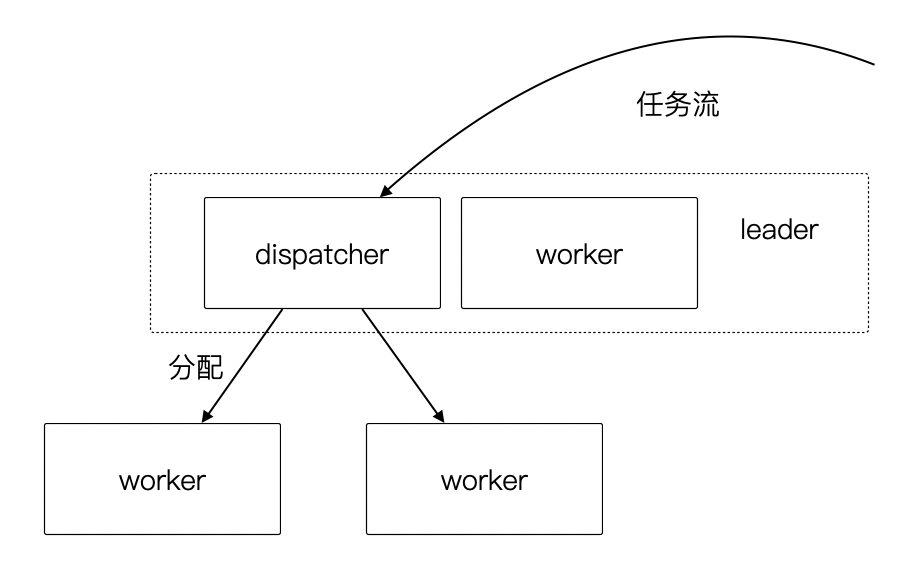
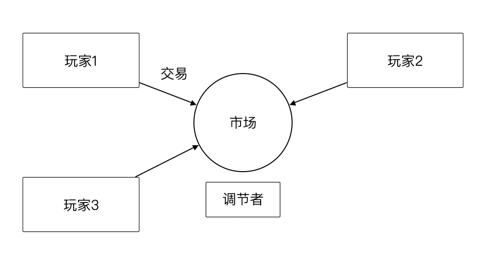
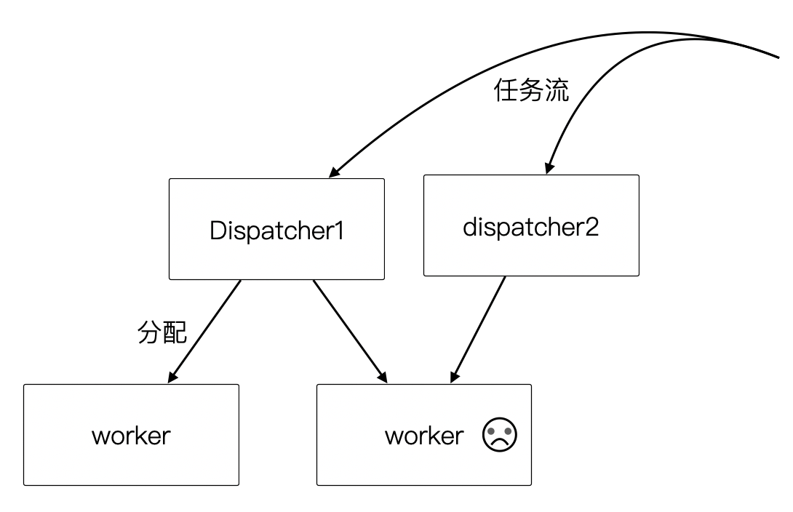
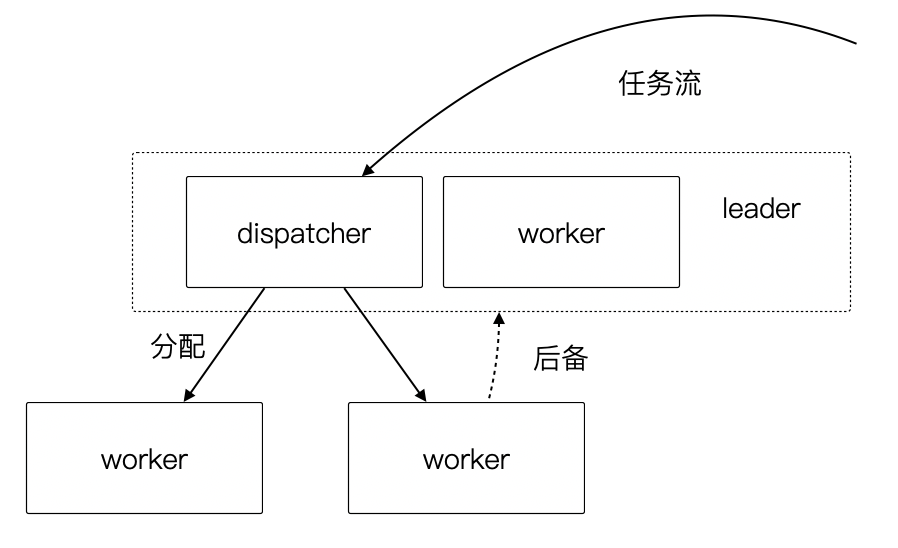
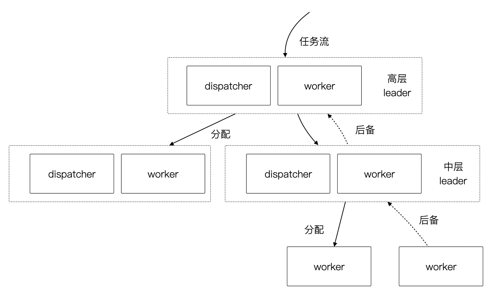
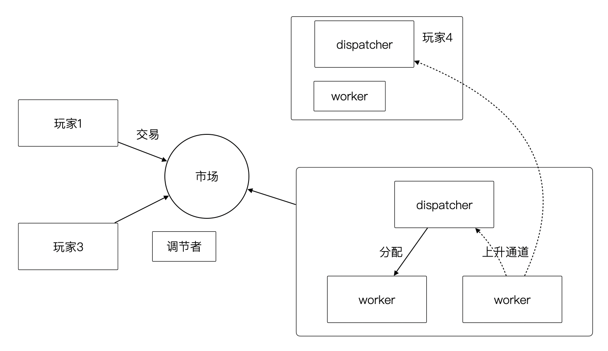

# 第 7 章 把软件团队也看做系统

团队管理是一件非常困难的事情，尤其是在认知能力强的群体中尤其如此。历史告诉我们，缺乏组织的人类群体没有任何战斗力，且在社会化生产的过程中效率非常低下。

在一些公司中，管理问题时时刻刻存在，要么靠管理者的本能管理，要么就是管理混乱，或者是靠经验性的管理框架来进行管理。在 IT 团队中这种现象尤其比较明显，因为往往技术管理者更关注技术本身而非管理。

有意思的是，管理能不能也用 “技术的语言”来表述呢？其实是可以的，作为一个分布式系统的爱好者，慢慢发现分布式系统和团队管理有一些共通之处，能用这些发现解决一些问题。这些问题对于管理者和团队成员都有一些启示，希望您能耐心的看下去。

## 7.1 团队管理和分布式系统

团队管理是社会学讨论的问题，分布式系统是计算机中的概念。它们能有什么关系呢？

在开始写作前，我在和同事聊到这篇文章的想法，同事笑道：你这个想法非常有意思，但是你可能只是强行将它们联系到一起。

这两个概念甚至都不在一个学科，一个是文科，而一个算工科的内容。但是，世界是非常有意思的，跨学科的碰撞往往能发挥意想不到的作用（以后还会有类似的跨学科联系的文章）。

著名投资人，巴菲特的合作伙伴查理·芒格一生都在不停强调跨学科思维的重要性，在他的模型中，数学、物理、生物、化学、哲学、社会学、心理学等领域都会被突然联系到一起。例如，大家以为的投资是经济学话题，其实是一个社会学或心理学问题 —— 当身边的人开始向你推荐股票，牛市就结束了。

在《分布式计算——原理、算法与系统》这本书的开篇提到，“分布式系统是一组相互独立的实体构成的集合，这些实体相互协作可以解决任何单独的实体所不能解决的问题”。作者认为，分布式系统在宇宙之初就存在了，从蜂群、微生物系统、甚至由人体细胞构成的各种系统，这些都是分布式系统。

**团队是一个能独立承担一定功能和职责的人类群体，那么也应该是一个分布式系统，符合分布式系统的一些基本理论。这是这篇文章的基本前提。**

接下来我们会聊到分布式系统的两种模型，分别代表两种典型的团队形态，在计算机中也代表不同的计算模型：

1. 主从调度模型
2. 反馈调节模型

## 7.2 主从调度模型

这种系统由两个主要的角色构成：dispatcher 和 worker，这是主从调度模型的基本逻辑。

回顾一下计算机系统中的这两个角色。基于负载均衡的无状态服务集群，负载均衡器充当了 dispatcher 的角色，普通的服务器充当了 worker 的角色；基于主从的 CI 构建系统 Jenkins，它的 master 节点就是 dispatcher 角色，负责处理任务调度，slave 节点用于执行任务构建。

在这种模型下，我们发现如果 master 节点用来跑具体的任务，会挤压它的调度能力， master 节点崩溃整个系统也不可用了。

我们回归到团队管理中来，一个团队的 leader 如果每天关注在自己具体的工作上，让 worker 角色的工作挤占了 dispatcher 角色的工作，整个团队会开始混乱。在好的情况下，团队中会有其他成员自发的弥补这部分工作，就有点类似于人体被切除某些器官后发生的代偿行为。然而，团队并不总是有这么好的运气，如果没有人来承担 dispatcher 的工作时，整个系统就陷入混乱。

**对于有状态的补充**

无状态并不是真的无状态，而是状态被隔离了。例如，负债均衡器-服务器-数据库模型中，状态被隔离到负载均衡器、数据库中，服务器可以做到没有状态，系统状态由负债均衡器和数据库承担。

客户端负债均衡这种方式是不是没有状态？

其实也是有的，即使是通过 hash 算法直接匹配到目标服务器，通过算法和计算规则实现客户端自己调度，实际上这个规则是数学规律帮我们提供了状态。开个玩笑的说法，就是使用了宇宙的状态。

**特点**

这种系统有一些鲜明的特征，可以用于后面分析一些具体的问题来使用。

- 这种模型是有中心的，有一些看起来无中心化的系统，实际是由选举机制自动完成中心化的选举
- dispatcher 的重点在于如何带动更多的 worker，而不是自己完成工作
- worker 的工作需要 dispatcher 梳理和分配
- worker 的主动性受到抑制，工作由 dispatcher 分配
- 系统的风险大部分来源于 dispatcher
- 竞争关系由上层决定

## 7.3 反馈调节模型

主从调度模型看起来很完善了，但是却不能描述一些特殊的场景，因此我们需要另外一种模型：反馈调节模型。这个系统由 3 个元素构成：玩家、市场、调节者，以及一个隐藏的元素：庄家所构成。

这种系统出现在层级较为扁平的公司，各个团队相对独立和灵活，对于那种巨型公司的上层结构也符合这个模型。对于市场经济为主体的国家来说，整个经济体就是这个模型，所以我借用了市场这个词。

在分布式的计算机系统中，这种模型比较少见，在一些弹性扩容的系统中可以看做这种模型的简单实现。这是因为计算机科学基础决定了的，计算机科学建立在离散数学上，我们使用的计算模型为图灵模型，图灵模型是一种确定的计算模型（可计算性）。反馈调节模型不是一种确定的计算模型，目前的超计算（Hyper computation ）就是在研究如何在计算机中应用这类模型。

在这个模型中，dispatcher 被市场代替了，市场可以认为是一个无形的手，这个手是全体玩家构成的。这种模型是真正的去中心化模型，在生活中如果能细心一点，会到处发现这种模型的影子：生物圈、股市、人体内分泌系统等。

回到团队管理来看，我们可以把市场看做一个大的公司，每个玩家就是一个团队，这些团队可以找其他团队合作，但是都要在市场上来竞争；对于国家而言，这些玩家就是企业。如果我们把场景聚焦到大型企业来看，每个团队都需要在这个企业的生态链中寻求一席之地，和上下游的合作关系就是交易的过程。

**特点**

这种系统具有和主从调度模型不同的逻辑，很多性质甚至是违反直觉的。

- 这种模型是无中心化的，调节者不是必须的，只要市场在就不会崩溃
- 系统具有自我调节能力
- 玩家具有主动性，市场上出现需求时，玩家会立即参与
- 在一定时间后，系统会调节非常充分
- 在一定时间后，由于马太效应的积累，庄家会控制市场，让市场失去平衡
- 市场存在被欺骗的风险

## 7.5 对管理者的启示

当我们聊完了这两个模型之后，我们可以得出对管理者有价值的一些启示。

**多 dispatcher 问题**

主从调度模型中，当一个 dispatcher 的能力不能满足团队需要时，能否增加多个 dispatcher？

答案否定的，在分布式系统中，避免这样的模型：多个承担有 worker 角色的 dispatcher 构成系统，它会带来状态的一致性问题。在团队管理中，dispatcher 的负载不会太大，但是需要保证一致性。在一个团队中出现 2 个 PM 会是一个灾难，然而这种场景在各个公司反复上演。

**后备者**

在计算机系统架构设计中，单点故障是一个需要极力避免的设计，因此需要考虑高可用。主从调度模型中，需要为 dispatcher 准备一个后备， dispatcher 不能提供服务时即使恢复系统。

反馈调节系统中具有天然的自我恢复能力，但是只有一定的阈值，调节者需要密切关注系统健康状态，然后通过政策来修正。

**多层系统**

在主从模型中，dispatcher 带动的 worker 的能力是有限的，因此为了让系统规模能进一步扩大，多级主从模型就是有必要的了。

中间节点在上层的的角色就是 worker，在下层就是 dispatcher。

**选举还是委派**

在主从模型中，有两种实现形态。

有一些看似去中心化的自组织系统，实际上也是主从模型。比如蜂群无人机系统、电力行业的网格计算，他们一般使用自组网系统（ad-hoc ）。这些系统是通过选举算法完成的。这点在军事中使用的非常多，例如敌后穿插时不同单位的士兵集合到一起后重新组成临时指挥系统，就是通过军衔作为规则实现选举的。

另外一些场景下，他们的主从关系是提前设定的。比如数据库的主从关系、负载均衡等。在团队管理中，团队的关键人员是由上级委派和从其他地方调拨，而不是就地选拔。

**效率更高的系统**

通过这两个模型，可以分别优化系统效率。

在主从模型中，我们可以使用认知管理模型。也就是使用认知能力强的人来承担 dispatcher， dispatcher 负责设定工作方式和流程，然后由认知能力弱的人来作为 worker。在团队中，人的认知能力会随工作时间成长，因此一般选工作时间长的人作为 dispatcher。

在反馈调节模型中，我们需要引入调节者来干预市场，防止庄家的出现，庄家会让系统带来风险和效率降低。

**系统的稳健性**

这两者模型都有一定几率崩溃，但是组织和团队崩溃的原因是多种多样的。外部原因让这两种模型崩溃没有分析价值（比如投资中断等），这里只分析内部原因。

在主从模型中，系统崩溃的原因有：

- 系统混乱，dispatcher 没有能力或者无法让 worker 继续工作
- 无上升通道，内部矛盾积累过多，个体会选择退出系统
- dispatcher 权利无法被制约，造成战略失误或一意孤行

在反馈调节模型中，系统崩溃的原因有：

- 庄家的形成，造成局部资源枯竭
- 调节者被裹挟，资源分配不均衡，失去整理竞争力

**让系统的规则显性化**

俗话说，不成文的规则才是真的规则，但是健康的系统尽可能让规则显性化。

在主从模型中 dispatcher 需要尽可能的把工作方式梳理的规范化、明确化，大多数情况下 worker 可以依靠规则行事，在少量的情况中 dispatcher 人为干预，是系统高效的表现。

在反馈调节模型中，竞争规则需要明确，否则调节机制将会失效，破窗效应会让问题进一步恶化。

## 7.6 对个体的启示

当然，从站在个体的角度理解这两个模型，也会让自己受益。

**竞争力**

在主从调度模型中，个体需要想办法**完成调度者给出的任务**。他的竞争力来自于：

1. 强调个人在相应领域的专业能力，专业性越强竞争力越大。
2. 任务和自己专业能力的匹配性，在越匹配和擅长的岗位上竞争力越大。
3. 工作输出的稳定性和效率，能源源不断的完成调度者给出的任务，想法过多反而不利。

在市场模型中，参与的玩家需要想办法**满足市场的需求**，扩大自己的生态位。他的竞争力来自于：

1. 对市场的敏锐嗅觉，识别市场上的需求。
2. 找到自己的生态位和生存空间。
3. 达到市场的支配地位。

**权利的来源**

权利的流动是我们思考这两种模型中很重要的一部分。

主从调度模型中，权利来自上级的授予，而非来自于团队成员的支持，因此需要注意平衡这两者的关系。例如，在某些政策执行中，可能会为团队成员增加额外的工作量，因此需要 dispatcher 平衡利害关系。

在反馈调节的模型中，权利来自市场中的话语权，具有优势地位的玩家，可以获得更多的权利，最经典的是市场定价权。

**上升通道**

主从调度模型中，worker 可以上升为 dispatcher。它背后的逻辑往往是先成为提高自己的工作效率，协助完成一些 dispatcher 的工作，成为 dispatcher 后备力量。

在反馈调节的模型中，个体（玩家团队中的 dispatcher 或者 worker）需要成为一个玩家，需要从把关注点放到需求和服务上，识别到市场中微小的需求，想办法满足它。

