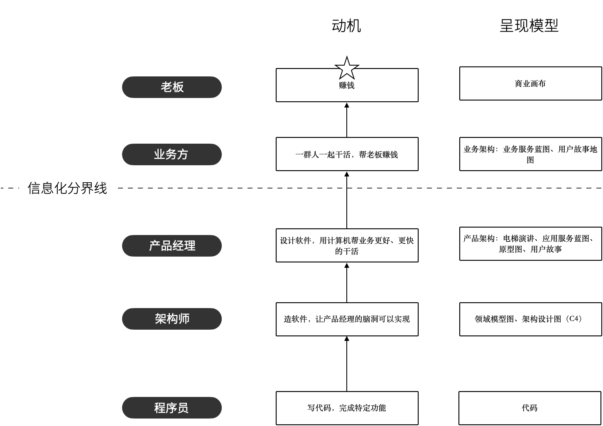

# 第 11 章 写在最后

## 认知提高的收益是什么？

有朋友在群里问，在软件工程的范畴下，认知提高的收益最大的一类是什么？

不同人和角色对这个问题的答案不同，不过重合程度比较高的是模型思维。

对于业务分析师的角色来说，可以通过模型来理解业务，并提炼出业务中最根本和精炼的部分；对于架构师或者开发角色来说，可以利用模型简化复杂系统。

业务分析师可以使用用户故事、服务蓝图、电梯演讲、原型图这些作为模型，这些都算是一种模型。用户故事描述的是一个业务主体的行为和职责，而服务蓝图描述的是参与到业务中的各个单位职责的传递，电梯演讲可以作为产品定位的一种方式，原型图可以做快速的交互验证。

架构师可以使用领域模型、数据库模型、时序图、C4架构模型等各种各样的模型来描述复杂软件，甚至 UML 中各种各样的图形都可以在必要时拿来使用。

使用模型提高认知能力，带来的收益是抽象、提炼能力，抓住问题的关键和提炼复杂系统的关键要素。不这样做，就无法站在全局视野下了解整个系统，并对其复杂度进行分割，降低团队成员的认知负担。

## 认知管理框架

## 成为情绪的主人

我们常常会遇到过不少厉害的人，有一种人厉害到令人害怕 —— 可以随意操控情绪。

他们会将狠话笑着说出来，也会在喝完酒后以戏言的形式说出想说的话。他们不仅会轻松把我自己的情绪，也会开动情绪的武器感染他人。

他们将热情、生气、自信当做一种工具，在必要的场合和状态下释放自如，像一个天生的演员。影响别人的“超能力”都来自于对自我情绪近乎无敌的掌控。

有幸和这类人有过交流，问他们怎么做到的。

一位大佬说：“将自己和自己分离”。

什么意思呢？就是参与社会中那个“我”和真实的“我”是不一样的，想象自己的在的玩一个游戏，这个游戏的角色就是社会上的我，而玩游戏的人才是真正的那个“我”。

## 有机体

每一个成功的系统都是一个有机体，有机体是指在这个系统中，组成系统的元素能在某种契约下获得平衡。比如，人体是一个有机体，每一个细胞是系统组成的元素。

如果这些元素没有形式系统，就是一堆沙子。如果这个系统是军队就毫无战斗力，就像亮剑中的著名台词“就是5万头猪，三天也抓不完”。当军队这个系统崩溃时，再多元素也没有意义。

凯文·凯利在《失控》中提出了一个有机体的概念。对于社会性生物来说，构成的社会这个系统就像生命一样作为超级有机体。一个国家可以看做一个有机体，当国家之间进行博弈时，国家就好像出现智慧一样，国家领导群体之间的联系就像神经元之间的连接一样。

## 认识到价值的不同

什么是价值？每个人答案不同。由于对价值的认识的不同，会让我们的方向和选择造成差异。举个例子来说，软件工程师努力的将代码变成的“优美”，靠近大师描绘的那样。

但是产品经理或者老板并不买单。代码的美感如果不影响开发时间，对他们来说无所谓，但是当重构代码花费巨大时，软件工程师的努力很难得到认可。

另一个方面，一线的工作者认为，努力工作，多写一些代码，踏踏实实将业务需求满足是他们的价值；但是对于老板来说，正确的决策，制定合适的工作方法和策略从而提升整个团队的效率是价值；站在市场人员的角度，努力工作并没有价值，成单自然有价值。

货币是衡量价值的最普通的方法，薪资是衡量一个人价值最方便的方法。高学历的人比低学历的人贵，具有大厂工作经验的人比小厂的人贵。是否能设计出优美的代码，很难在面试时作为衡量价值的方法。

那么技术人员应该转变一个观念，从“我觉得我牛逼，就应该多拿钱”这种朴素的价值观，转换为经济上的评价，以及市场给予的反馈，这样提升自我价值的方向可能更准确。

## 锚点效应

人的认知会被不经意被外部环境影响，我们的个人意志和判断没有那么准确，人的认知会将收到的信息作为锚点，并影响后续的判断。

那个广为传播的故事来说。

有一天，一个老头被房子外面踢球的小孩吵到休息了，去和小孩交涉都无功而返。于是他想了一个办法，找到踢球的小孩们给他们每人一美分，告诉小孩们 你们都来这边踢球，我会给你们钱。就这样过了几天，然后老人不再给小孩们钱了，小孩觉得不给钱还踢什么球，就不再过来踢球了。

这个故事说明人的记忆非常短暂，而且非常容易受到当前的信息以及认知背景作为判断依据。鲁迅说:“*中国人*的性情是总喜欢*调和折中*的,譬如你说,这屋子太暗,须在这里开一个窗,大家一定是不允许的。但是如果你主张拆掉屋顶,他 们就来调和,愿意开窗了”。

这种效应在心理学中被叫做锚定效应，我们判断会随着说锚定的事物而发生变化。如果认识到各种效应，就可以帮我们实现很多的目标。

比如，在工作中，一个人非常负责人做了团队中很多事情，但是随着时间的推移人们都认为是他应该做的，一旦没做好就会备受批评。那么如何改变这种状态呢？只需要在特定时间内表现的比正常水平差即可，当大家慢慢接受了这种现实后，恢复到正常水平即可。

锚点效应的本质是人类大脑的可塑性，每一次信息变化，大脑的神经元连接方式就被修改，这一刻的你已经不再是上一刻的你。

庄子中也有类似的故事，这个词的原始含义是通过降低期望来安抚对方，虽然现在的含义已经概念，但是起初的故事非常有意思。

故事的起源是《庄子·齐物论》：“狙公赋芧，曰：‘朝三而暮四。’众狙皆怒。曰：‘然则朝四而暮三。’众狙皆悦。名实未亏而喜怒为用，亦因是也。”

故事的大意是，狙公养了一群猕猴，由于口粮有限，用一些橡子作为补充。每只猕猴能分到的橡子只有 7 颗，狙公对猕猴说，早上 3  颗晚上 4  颗。猕猴们非常不满意，表示抗议。狙公改口说，早上 4  颗晚上 3  颗，这样总可以吧。猕猴一听早上从 3 颗变成了 4 棵，变得开心起来。

## 永不辩解

我遇到过一个神奇的人，这个人具有一种非凡的特质，这种特质就是基本上没有看到他辩解。

一次老板埋怨他没有按时完成某项任务，实际上这项任务就没有提出来过，在这件事情上他没有辩解。在办公室，老板往往直言不讳的批评他，他也不辩解，并就批评的问题做了改进的方案。

大家都以为他不被老板重视，实际上他是公司最重要的人之一，而且也拿到了股份。他的另外一个神奇特质是到点走人，几乎不会因为别人加班而加班。

这种奇怪的特质组合让我非常纳闷，于是在一次公司团建的机会上请教了他。在他的观点里，出这样看待问题的。解释并没有用，还耽误去解决问题的时间，我们是为了解决问题，而不是先辩解再解决问题。很多人和公司遇到问题后，往往先纠结问题是谁的责任，然后耽搁了解决问题的黄金时间。

至于不会因为别人加班而不好意思走是因为世界本来就不公平，也不会在每时每刻上公平，让不加班的人等加班的人在道德上更加不公平。就和辩解一样，被误解你觉得不公平，但是口头上公不公平有时候没用，还不如先把事情解决了，最后看绩效上公不公平。如果绩效上不公平，那么你有条件做出更好的选择，为什么不去做呢。

这个世界唯一的公平就是不公平。有些人为问题辩解，追求公平，有些人寻求应对的方法，获得实际利益。

## 我们为什么会后悔？

我们为什么会懊悔，因为选择的结果没有按照期望的方向发展，并希望时光回转到选择之前的阶段。

当我们做出选择时，忘记了一项很重要的事情：选择就是选择，不是获得。人们往往会忽略已经得到的，放大还没获得的东西。在选择时，这种获得占据了大脑，将会失去的东西丢到脑后。正是这种认知偏差，让我们懊悔不以。

原本稀松平常的东西，当做出选择后，开始变得珍贵，已经得到的东西开始变得平常。钱钟书名著《围城》将婚姻比喻成围墙，在墙里的人想出来，墙外的人想进去。当有一些人从墙外进去后，发现里面并没有想象中那么美好。

一个人交了一个漂亮的女朋友，但是女生三天两头不着家，于是希望分手重新找一个持家勤快的对象，但是真当他找到后，又会怀念起前任的貌美如花。

在架构设计和软件建模中也会有类似的情况出现，做出关键决策会花费大量的时间。有时候为了应对不确定性，而将设计过于通用或抽象层次过高，导致落地时比较麻烦。当我们选择了灵活时，无意间失去了实现上的经济性。

我们总是在这种痛苦中期待、选择中循环，没有办法享受当下内心的片刻宁静。

## 商业软件的逻辑

程序员总是困在代码中，一厢情愿的以为实现产品经理提出的各种崎岖待需求就是技术高明的体现。如果我们跳出技术的思维来看待软件，将会是别有一番风景。

根据第一性原理，如果我们能找到问题的起源和最根本的地方，就能直奔主题，快速命中目标。

商业软件的逻辑是什么？是技术卓越吗？是代码整洁吗？是设计优美吗？其实都不是，商业软件这个词的前缀是商业，也就意味者赚钱，不赚钱的软件不是商业软件。

企业需要软件，是为了帮助他们节约成本以及赚更多的钱。计算机是一个伟大的发明，它提供了一个通用的平台，只需要简单的编写指令就可以实现一个“机器人”。

老板为了赚钱，它会思考商业模式，思考赚钱的逻辑；进而找到一些人来帮他干活，一起赚钱，这是业务架构。举例来说，靠卖菜赚钱是老板的商业模式，老板组织员工做蔬菜配送是业务模式。我们可以用商业画布来表达商业模式，用业务架构中的服务蓝图、用户故事地图来表达业务模式。

而计算机以及软件工程出现后，一切都变了，好的软件可以代替一大群人的工作，但是只需要一点点人开发和维护即可，更神奇的是，软件还可以复制分发。老板找到了产品经理，让他设计软件来帮助业务人员一起更高效、低成本的工作。描述产品设计的方法有电梯演讲、将 IT 系统纳入进来的服务蓝图、原型图等。

完成产品设计后，需要找到真正理解软件开发人工程师或者架构师来设计领域模型、数据库、以及系统结构。

这套链路如此长，以至于过了多年的人们尤其是工程师，只看到了要做一个软件，忘记了为什么要做这个软件。如果工程师理解软件背后的商业目标，就可以理解业务的工作模式，那么也就可以对产品经理提出的需求进行补充、质疑和评审。

有时候当产品经理的设计不那么合理时，我们可能换一种简单的交互方式，就可以避免系统的巨大成本。因为对老板和业务人员来说，软件也只是手段而非目的，但是对于产品经理和软件工程师来说，这就是他们的目的。

## 荣誉心和羞耻心的作用

几年前在一个项目上经历了一个有意思的事情，我第一天到项目上就注意到， PM 会在站会上询问每个人的任务状态，如果有人提前完成任务，会带团队故障。如果是进度落后太多，PM 会用稍大一点的声音询问原因。

起初我还没意识到其中的门道，直到后来看到老家邻居孩子骄傲的在墙上贴奖状，突然想明白这事儿。

如果一个人做的工作得到领导的肯定，并获得荣誉，那么他会再接再厉；如果一个人犯了错误，会产生羞耻心，羞耻心在秘密将要被捅破但是未被捅破的时候效果最强。

这就是为什么表扬应该公开来做，但是意见只能私底下来提的原因。

## 学会接受制约

理想的东西大家都懂，如何理解当下有哪些制约，并在制约之下把事情做好是一个挑战。

我们在各个地方都能看到某某三角。比如，项目管理铁三角是范围、时间、成本，在这些制约之下，质量就是一个可能被牺牲的内容；甚至在生活中，连装修也会构成三角：价格、质量、省心，如果想既要省心、质量好，那么价格必然会很昂贵。

理解制约，是不把别人当做傻子，尤其是不把老板当做傻子。

很多人替老板操心，按我说的做，如何如何问题不就解决了吗，老板就是不听。特别是在一些普通员工看不到制约的地方，一线员工的判断并不准确。

这些制约构成了老板或领导层的特殊考量。项目人手不足，没有充分论证就大好快上，在互联网行业非常常见。实际上，这种情况，项目的目标就不是一个完美设计的系统，而是快速抢占市场，以及获得市场曝光。

看到制约可以让行动更加靠谱一些，避免无效的挫败感。有时候在工作中遇到困难，会幻想一些解决方案，这些解决方案无法落地和执行。只有当坦然接受制约后，才能慢慢调整方案到合适的方式运行下去。

## 磨刀石思维

如何用平和的心态看待生活中的困难？

方法很简单，将外界的一些评价和信息当做反馈，将自己想象成一把利剑，外部的批评当做磨刀石。

这不是我自己为了安慰自己想出来的法子，在和很多人交流时都有类似的看法。

磨刀石有几种使用场景：

1. 方案的磨刀石。先构建一个原始版本，然后找人评审，获得打磨。

2. 演讲的磨刀石。用一个基线版本，通过不断演讲然后打磨同一个内容。

3. 做事方法的磨刀石。建立一套做事方法，不断犯错来修正。

   

## 利用他人的看法

如果大众都看中钱，清高的人会与其格格不入，而厉害的人会顺应人性，用钱来训人和用草来训马是一样的；如果大众都对公司高层的“会议精神”贯彻执行，自以为“思想独立”的人就会和公司的目标背道而驰。

只有那些装糊涂且能利用他人看法的人，才能如鱼得水，清醒的认识到他人的看法，却又不被影响。

这事儿每个公司的门道都不同，一位朋友用“和光同尘”来描述这种处世风格。比如外企，夹杂英语的说法并不觉得有什么问题，但是在国企就显得格格不入。

有时候他人的看法可能对事物有推动作用。比如，老板讲了一些理念，即使你不认同，也可以利用他的影响力做一些事情。

## 接受反直觉

反直觉的东西往往能刷新人的认知，打破固有思维。无论是工作还是生活，都能找到非常多的反直觉案例。

最著名的反直觉的知识是两个铁球同时落地，证明了运动不是力推动的，但是改变运动状态是力推动的。越了解科学，越反直觉，可以说科学就是反直觉的。

在人际关系中，越是彬彬有礼，越是难以获得亲密关系。当两个人一起做点“坏事”时，亲密关系就可能建立，这和直觉相悖，也会从小达成的教育相悖。

当软件工程师设计领域模型或者数据库时，打破多对多关系就是反直觉的。比如，一个老师可以在多个班级中任教，一个班级也有多个老师，从直觉上来看，多对多关系就是合理的。但是细致想想，一个老师在一个班级中，说的可能是行政关系，比如被这个班级所管理；一个班级有多个老师，可能说的是一个老师有不同的课程，每个班级都有多个课程，这样班级和老师产生了关系，但是这个关系是间接的。

人们会下意识的抵触反直觉的事实，这是因为人类通过建立经验来“缓存”思考的结果，清楚缓存意味着耗费更多的能量来建立新的神经元连接。这就好比，软件工程师需要删掉已经存在的一个方法，而重新编写一个方法。

那么我们可以认为，相信直觉的原因就是懒惰，为了逃避思考，人啥事儿都能做的出来。

